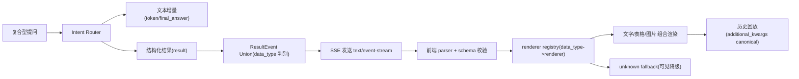

# 复合提问多模态响应契约澄清设计（SSE / Result Contract）

> 设计目标：在不重写现有 SSE 主链路的前提下，把“复合型提问（文字+表格+图片）”的响应能力冻结为可执行契约，直接可进入 `/jjk-plan`。

## 0. 结论先行（Final）
- 采用**单一结构化通道**：继续以 `event: result` + `data={data_type,data,message?}` 对外，不新增并行 `blocks` 外部协议。
- 采用**单一契约源机制**：后端 Pydantic discriminated union 生成 JSON Schema，前端类型与校验由该 schema 自动生成（唯一机制，不做镜像双写）。
- 采用**语义化强类型流式事件**：流中明确生命周期事件与内容增量事件，`result` 专注结构化内容，`token/final_answer/done/error` 保持职责分离。
- 采用**显式降级语义**：未知 `data_type` 由前端统一 fallback 可见展示 + warning；缺必填字段由后端归一为 `error` 事件（单策略冻结）。
- 采用**多结果聚合模型**：单轮 assistant 可按顺序产出多个 `result` 事件，历史回放 canonical 字段必须保存有序数组，不能只保留最后一个结果。
- 采用**SSE 可靠性最小集**：传输层补齐 `id/retry/heartbeat`，消费层支持 `Last-Event-ID` 去重/续传，部署层优先 HTTP/2。
- 采用**文档过渡策略**：短期 `REST=OAS3.1 + SSE=AsyncAPI3.0`，中期待工具链成熟后合并至 `OAS3.2 text/event-stream + itemSchema(oneOf)`。

## 1. 复合提问实现场景（图/文/表）

### 1.1 复合提问示例与多样式响应矩阵（表格）
| 场景ID | 复合提问示例 | 文本输出 | 表格输出 | 图片输出 | 成功判定 |
|---|---|---|---|---|---|
| S-01 | “对比本周待办完成率与上周，给出结论并画趋势图” | 结论摘要 + 建议 | `data_type=sql_result` 的 rows/columns | `data_type=chart_image` 或 `sql_result.chart` | 文本、表格、图至少 2 种同时可见 |
| S-02 | “盘点今天异常工单，按部门分组并给我可读图示” | 异常概览与优先级说明 | 部门统计明细表 | 分组柱状图/饼图 | 刷新后历史回放与实时展示一致 |
| S-03 | “把这个方案拆成执行步骤并配流程图” | 步骤说明与风险提示 | 步骤-责任人表 | Mermaid/流程图图片 | 未支持图类型时 fallback 卡片可见 |

### 1.2 端到端实现流程（图）


### 1.3 文本说明（文）
- 复合问答并不是“多协议”，而是“单协议下多 `data_type` 组合输出”。
- 允许同一轮出现多个 `result` 事件：例如先表格后图片，最终用 `final_answer` 汇总叙述。
- 同一轮多个 `result` 必须按 `sequence_number` 保序，历史回放也必须按相同顺序重建，不能被单字段覆盖。
- 渲染层不再硬编码分支，改成 `registry` 注册；新增类型只需注册 renderer 与 schema，不改主流程。

## 2. scope_contract
- 目标:
  - 为复合型提问冻结“可组合输出”的统一契约（文字/表格/图片）。
  - 确保实时流、刷新回放、resume 三条链路渲染一致，不出现“实时有、刷新丢”的漂移。
  - 在不重写协议的前提下完成契约收敛与演进门禁。
- 范围:
  - 后端：`app/ai/events.py`、`app/ai/protocol.py`、`app/services/chat_service.py`、`app/core/types.py`
  - 前端：`web/src/lib/backend.ts`、`web/src/hooks/useSSEStream.ts`、`web/src/components/chat/messages/ai.tsx`、`web/src/types/message.ts`
  - 契约与文档：`contracts/streaming/result-event.schema.json`、`docs/开发文档/代码解读/SSE事件协议.md`、`docs/产品文档/聊天系统需求.md`
- 边界:
  - 不修改 `/api/v1/chat/stream` 路径与 SSE 传输机制。
  - 不重构多智能体编排逻辑（只调整输出契约层）。
  - 不新增第二套对外响应协议。
- 成功标准:
  - `data_type` 全部受控枚举，新增类型必须伴随 schema + renderer + test。
  - 未知类型不静默丢弃，必须用户可见并可观测。
  - CI 能阻断 schema 与前后端类型漂移。

## 3. product_contract（PRD-Lite）
- target_users:
  - 运营/分析人员：需要一问多样式输出，快速决策。
  - 业务管理员：关心结构化结果可追踪和回放一致。
  - 研发维护者：关心协议演进稳定性与回归成本。
- core_scenarios:
  - 复合问题需要“解释文字 + 数据表 + 图示”联合回答。
  - 用户刷新页面后，历史消息仍保留完整结构化展示。
  - 前端收到未知数据类型时，仍能安全可见降级而非空白。
- business_goals (KPI):
  - `KPI-01` 结构化事件渲染成功率（非 fallback）≥ 99%。
  - `KPI-02` 未知 `data_type` 静默丢失率 = 0。
  - `KPI-03` 回放一致性（实时 vs 刷新）≥ 99.5%。
  - `KPI-04` 新增 `data_type` 的跨端联动缺陷在 CI 阶段拦截率 ≥ 95%。
- non_goals:
  - 不在本阶段引入 WebSocket 替代 SSE。
  - 不做前端可视化库大换血。
  - 不变更数据库表结构。
- acceptance_gates:
  - 契约门禁测试通过（后端 schema、前端解析、历史回放一致）。
  - OpenAPI/AsyncAPI 文档更新完成并与 schema 对齐。
  - 未知类型 fallback 在 UI 可见且日志有 warning code。
  - `id/retry/heartbeat`、断线重连去重、顺序回放测试通过。
- release_constraints:
  - 渐进发布，默认开关 `true`，支持快速回退。
  - 未完成文档与类型联动不得上线。

## 4. architecture_contract

### 4.1 模块边界
- **Contract Source**：后端定义 `ResultEvent` discriminated union（权威源）。
- **Producer**：workflow/tool 仅产出业务数据；`emit_result` 负责统一封装。
- **Transport**：`chat_service` 负责 SSE 事件归一与异常语义落点。
- **Consumer**：`backend.ts` 负责 schema 校验与事件分发，不做业务渲染。
- **Renderer**：`ai.tsx` 基于 registry 渲染多样式内容，未知类型走 fallback 组件。
- **Replay**：`additional_kwargs` 作为 canonical 结构化字段，读旧写新兼容历史字段。

### 4.2 依赖方向
- 单向：`workflow/tool -> protocol/events -> chat_service -> sse -> backend parser -> stream hook -> renderer registry`。
- 禁止：前端渲染逻辑反向驱动后端协议；禁止 workflow 直接拼接前端专有字段。

### 4.3 状态生命周期
- 生命周期：`raw_payload -> typed_result_event -> sse_result -> parsed_result -> additional_kwargs.canonical -> renderer`。
- 多模态合成规则：
  - `token/final_answer` 负责自然语言叙述；
  - `result` 负责结构化实体（表格/图片/列表）；
  - `done` 仅生命周期终态，不承载结构化主体。

### 4.4 异常语义（单策略冻结）
- 缺少 `data_type` 或 `data`（必填缺失）：
  - 后端统一转 `error` 事件并记录 `reason_code=invalid_result_payload`。
- `data_type` 未知但 payload 合法：
  - 前端统一 fallback 卡片 + warning 日志（含 `trace_id/thread_id/run_id/data_type`）。
- `data` 形状与 schema 不一致：
  - parser 拒绝 renderer 绑定，降级 fallback，主文本链路不中断。

### 4.5 传输可靠性（补漏冻结）
- SSE 帧最小要求：
  - `event:` 使用语义化事件名（如 `token/result/done/error`）。
  - `id:` 使用全局唯一 `event_id`，与 payload 内 `envelope.id` 一致。
  - `retry:` 由服务端明确给出默认重连等待值。
  - 心跳使用注释行（如 `: ping`），避免代理层断连。
- 重连与去重：
  - 前端消费层记录最近 `event_id`，重连时透传 `Last-Event-ID`。
  - 同一 `run_id` 内 `sequence_number` 单调递增；客户端按 `event_id + run_id` 去重。
- 部署要求：
  - 生产优先 HTTP/2；若仍走 HTTP/1，必须在文档中声明浏览器并发连接限制与降级影响。

### 4.6 Envelope 与内容预算（补漏冻结）
- `result` 事件统一携带 `envelope`，由 `chat_service` 在生产者缺失时补齐，字段至少包含：
  - `id`
  - `source`
  - `specversion`
  - `type`
  - `sequence_number`
  - `timestamp`
  - `thread_id`
  - `run_id`
- 大 payload 约束：
  - 图片/图表只传 URL/asset 引用，不在 SSE 内传 base64 二进制。
  - 大表格默认传预览行 + 导出链接/资产引用，避免长连接被超大 payload 拖垮。
  - fallback 摘要必须走脱敏白名单，禁止原始 payload 全量直出。

## 5. 契约源与文档策略（唯一机制）
- **唯一机制（冻结）**：`Pydantic union -> JSON Schema artifact -> TypeScript types + runtime validators` 自动生成。
- 产物建议：
  - 后端源：`app/contracts/result_event_contract.py`
  - 生成物：`contracts/streaming/result-event.schema.json`
  - 前端生成物：`web/src/types/generated/result-event.ts`
  - 校验器：`web/src/lib/validators/result-event.ts`
- 文档策略：
  - 过渡期：`REST OAS3.1` + `SSE AsyncAPI3.0`（降低工具链阻塞风险）。
  - 目标态：迁移到 `OAS3.2`，在 `text/event-stream` 下使用 `itemSchema(oneOf)` 描述事件。
- Producer 校验要求：
  - 任意 workflow/tool 产出的结构化结果在 `emit_result` 前必须通过 Pydantic `model_validate`，不能只靠 prompt 约束。
- 版本字段命名冻结：
  - `specversion`：只用于 `envelope`，表示 CloudEvents/事件封装版本。
  - `result_contract_version`：只用于 `result.data` 或等价业务契约字段，表示结构化结果 schema 版本。
  - 禁止新增或继续扩散泛化字段 `event_version`。

## 6. 回放归一（canonical 字段冻结）
- canonical 字段：`message.additional_kwargs.result_events`（有序数组）。
- 写路径（新）：只写 `additional_kwargs.result_events`。
- 读路径（兼容）：
  1) `additional_kwargs.result_events`（新）
  2) `additional_kwargs.result_event`（过渡单值）
  3) `additional_kwargs.data_type + additional_kwargs.data`（旧）
  4) `metadata` 历史兼容字段（仅读）
- 迁移语义：**读旧写新**，发布两个版本后删除第 3 层兼容读取。
- 顺序语义：
  - 单轮 assistant 下所有结构化结果按 `sequence_number` 排序后写入数组。
  - 实时展示顺序、刷新回放顺序、resume 补发顺序必须一致。

## 7. requirement_seeds（字段级需求原子）
```yaml
requirement_seeds:
  - design_item: D-01
    fr_id: FR-MULTIMODAL-RESULT-SINGLE-CHANNEL
    trigger: 任意复合提问命中结构化输出
    input_contract:
      required_fields: [data_type, data]
      optional_fields: [message, event_id, sequence_number, timestamp, result_contract_version]
      defaults:
        message: ""
    output_contract:
      required_fields: [event="result", data_type, data]
      optional_fields: [message, node, envelope]
    failure_semantics: 缺少必填字段时后端归一为 error 事件；不得透传空壳 result
    observability_fields: [trace_id, thread_id, run_id, data_type, reason_code]
    rollback_anchor: ENABLE_RESULT_TYPED_EVENT_V1=false
    acceptance_cmd_ref: bash scripts/pytest_targeted.sh tests/unit/test_chat_service_done_payload.py tests/unit/test_chat_service_turn_slice.py -q

  - design_item: D-02
    fr_id: FR-RENDER-REGISTRY-FALLBACK-VISIBLE
    trigger: 前端收到 result 事件
    input_contract:
      required_fields: [data_type, data]
      optional_fields: [message]
      defaults: {}
    output_contract:
      required_fields: [renderer_hit_or_fallback]
      optional_fields: [warning_code, fallback_payload_preview]
    failure_semantics: 未知 data_type 必须可见 fallback + warning，禁止静默丢弃
    observability_fields: [thread_id, run_id, data_type, renderer_key, fallback_used]
    rollback_anchor: ENABLE_RESULT_RENDER_REGISTRY_V1=false
    acceptance_cmd_ref: pnpm --filter web test -- --runInBand

  - design_item: D-03
    fr_id: FR-REPLAY-CANONICAL-READ-OLD-WRITE-NEW
    trigger: 历史消息加载或 resume 流恢复
    input_contract:
      required_fields: [message_id]
      optional_fields: [additional_kwargs.result_events, additional_kwargs.result_event, additional_kwargs.data_type, additional_kwargs.data, metadata]
      defaults: {}
    output_contract:
      required_fields: [render_consistent_with_realtime]
      optional_fields: [compat_source]
    failure_semantics: 缺 canonical 时仍回放文本，并展示结构化降级提示
    observability_fields: [message_id, thread_id, compat_source, data_type]
    rollback_anchor: ENABLE_RESULT_REPLAY_CANONICAL_V1=false
    acceptance_cmd_ref: bash scripts/pytest_targeted.sh tests/unit/test_multi_intent_coverage_reconcile.py -q

  - design_item: D-05
    fr_id: FR-SSE-RELIABILITY-AND-RESUME
    trigger: SSE 长连接建立、断开、重连
    input_contract:
      required_fields: [event, data, event_id, retry]
      optional_fields: [heartbeat_comment, last_event_id]
      defaults:
        retry: 5000
    output_contract:
      required_fields: [ordered_delivery_or_deduped_resume]
      optional_fields: [resume_from_event_id]
    failure_semantics: 无法续传时允许退化为整轮重放，但不得造成重复渲染与乱序
    observability_fields: [thread_id, run_id, event_id, last_event_id, reconnect_count, dedup_drop_count]
    rollback_anchor: ENABLE_SSE_RELIABILITY_V1=false
    acceptance_cmd_ref: pnpm --filter web test -- --runInBand

  - design_item: D-06
    fr_id: FR-MULTI-RESULT-AGGREGATION
    trigger: 单轮 assistant 产生 2 个及以上结构化结果
    input_contract:
      required_fields: [sequence_number, data_type, data]
      optional_fields: [message, envelope]
      defaults: {}
    output_contract:
      required_fields: [additional_kwargs.result_events]
      optional_fields: [layout_hint]
    failure_semantics: 不允许后到事件覆盖先到事件；必须保序累积
    observability_fields: [thread_id, run_id, result_count, sequence_number]
    rollback_anchor: ENABLE_RESULT_EVENTS_ARRAY_V1=false
    acceptance_cmd_ref: pnpm --filter web test -- --runInBand

  - design_item: D-07
    fr_id: FR-PAYLOAD-BUDGET-AND-REDACTION
    trigger: result 包含大表格、图片或 fallback 摘要
    input_contract:
      required_fields: [data_type, data]
      optional_fields: [asset_url, export_url, preview_rows]
      defaults: {}
    output_contract:
      required_fields: [payload_within_budget_or_externalized]
      optional_fields: [redacted_preview]
    failure_semantics: 超预算 payload 必须外置为资产引用；fallback 摘要必须脱敏
    observability_fields: [thread_id, run_id, payload_bytes, externalized, redaction_applied]
    rollback_anchor: ENABLE_RESULT_PAYLOAD_BUDGET_V1=false
    acceptance_cmd_ref: bash scripts/pytest_targeted.sh tests/unit/test_chat_service_done_payload.py -q

  - design_item: D-04
    fr_id: FR-CONTRACT-DRIFT-CI-GATE
    trigger: schema/type/renderer 任一变更
    input_contract:
      required_fields: [result-event.schema.json, generated-ts-types, parser-tests]
      optional_fields: [oas_asyncapi_docs]
      defaults: {}
    output_contract:
      required_fields: [ci_pass]
      optional_fields: [drift_report]
    failure_semantics: 任一联动缺失即 CI fail，不允许合入
    observability_fields: [commit_sha, drift_kind, failed_gate]
    rollback_anchor: ENABLE_RESULT_SCHEMA_GATE_CI=false
    acceptance_cmd_ref: make contract-check
```

## 8. implementation_seeds（轻量任务原子）
```yaml
implementation_seeds:
  - task_id: T-01
    feature_id: P1-result-contract-source
    file_paths:
      - app/ai/protocol.py
      - app/ai/events.py
      - app/services/chat_service.py
      - app/core/types.py
      - app/contracts/result_event_contract.py
      - contracts/streaming/result-event.schema.json
    symbols:
      - StreamingResultPayload
      - build_streaming_result_payload_from_fields
      - emit_result
      - _normalize_result_event_payload
      - ResultEventUnion
      - envelope_backfill
      - sse_retry_and_heartbeat
    change_type: modify
    blocked_by: []

  - task_id: T-02
    feature_id: P1-frontend-parser-and-registry
    file_paths:
      - web/src/lib/backend.ts
      - web/src/hooks/useSSEStream.ts
      - web/src/components/chat/messages/ai.tsx
      - web/src/types/message.ts
      - web/src/types/generated/result-event.ts
      - web/src/lib/validators/result-event.ts
    symbols:
      - normalizeResultEventData
      - handleStructuredResultEvent
      - AssistantMessage
      - rendererRegistry
      - resultEventsAccumulator
      - dedupByEventId
    change_type: modify
    blocked_by: [T-01]

  - task_id: T-03
    feature_id: P1-replay-canonical-migration
    file_paths:
      - web/src/lib/message-normalizer.ts
      - app/repositories/chat_repo.py
      - app/ai/workflow/multi_agent_graph.py
    symbols:
      - additional_kwargs.result_events
      - read_old_write_new
      - compat_source
      - sequence_number_sort
    change_type: modify
    blocked_by: [T-01]

  - task_id: T-04
    feature_id: P1-streaming-contract-docs
    file_paths:
      - docs/开发文档/代码解读/SSE事件协议.md
      - docs/产品文档/聊天系统需求.md
      - contracts/api/streaming-events.asyncapi.yaml
      - contracts/api/openapi.yaml
    symbols:
      - result_event_union
      - text_event_stream_itemSchema
      - asyncapi_transitional_contract
      - last_event_id_resume
      - payload_budget_rules
    change_type: modify
    blocked_by: [T-01]

  - task_id: T-05
    feature_id: P1-contract-ci-gates
    file_paths:
      - scripts/contract/check_result_contract.sh
      - .github/workflows/contract-gate.yml
      - tests/unit/test_chat_service_done_payload.py
      - tests/unit/test_chat_service_turn_slice.py
      - tests/unit/test_multi_intent_coverage_reconcile.py
      - web/e2e/todo-sse-protocol.spec.cjs
    symbols:
      - contract_drift_gate
      - unknown_data_type_fallback_test
      - replay_consistency_test
      - multi_result_ordering_test
      - sse_resume_dedup_test
      - redaction_whitelist_test
    change_type: modify
    blocked_by: [T-02, T-03, T-04]
```

## 9. execution_chain_seed
```yaml
execution_chain_seed:
  preferred_mode: parallel
  task_key: PP-20260306-composite-multimodal-result-contract
  card_seed: [T-01, T-02, T-03, T-04, T-05]
  execution_contract_hint:
    delivery_mode: staged
    execution_unit: per_pr
    commit_policy: per_pr
    stop_boundary: per_pr
```

## 10. risk_rollback_contract
```yaml
risk_rollback_contract:
  risks:
    - risk_id: R-01
      description: 合法旧事件（无 message/envelope）被误判不合法
      counterexample: 历史 result 仅含 data_type/data，在新 parser 被直接拒绝
      mitigation: parser 对 optional 字段宽松，必填仅校验 data_type/data
      rollback_anchor: ENABLE_RESULT_TYPED_EVENT_V1=false

    - risk_id: R-02
      description: 新 data_type 未注册 renderer 导致 UI 空白
      counterexample: 后端发出 chart_image，前端没有对应组件
      mitigation: fallback 卡片强制可见 + warning + CI 检查 registry 覆盖率
      rollback_anchor: ENABLE_RESULT_RENDER_REGISTRY_V1=false

    - risk_id: R-03
      description: 回放迁移期间 canonical 与历史字段并存导致显示分叉
      counterexample: 实时路径写新字段，刷新路径只读 metadata 导致卡片丢失
      mitigation: 读旧写新 + compat_source 观测 + 双版本后删除旧读取
      rollback_anchor: ENABLE_RESULT_REPLAY_CANONICAL_V1=false

    - risk_id: R-04
      description: 单轮多个结果被最后一个 payload 覆盖
      counterexample: 先到表格、后到图片，历史消息最终只剩图片
      mitigation: canonical 使用 `result_events[]` 数组并按 `sequence_number` 保序
      rollback_anchor: ENABLE_RESULT_EVENTS_ARRAY_V1=false

    - risk_id: R-05
      description: SSE 重连后重复事件导致重复渲染或乱序
      counterexample: 浏览器重连后再次收到旧 `event_id`，页面出现双卡片
      mitigation: `Last-Event-ID` + `event_id` 去重 + reconnect 测试
      rollback_anchor: ENABLE_SSE_RELIABILITY_V1=false

  rollback_flags_default:
    ENABLE_RESULT_TYPED_EVENT_V1: true
    ENABLE_RESULT_RENDER_REGISTRY_V1: true
    ENABLE_RESULT_REPLAY_CANONICAL_V1: true
    ENABLE_RESULT_EVENTS_ARRAY_V1: true
    ENABLE_SSE_RELIABILITY_V1: true
    ENABLE_RESULT_PAYLOAD_BUDGET_V1: true
    ENABLE_RESULT_SCHEMA_GATE_CI: true
```

## 11. 外部规范对齐（证据要点）
- OpenAPI 3.2 已把顺序媒体类型（含 `text/event-stream`）与 `itemSchema` 纳入规范，可用于流式事件建模。
- WHATWG/MDN 对 SSE 的 `event/data/id/retry`、注释心跳、HTTP/1 连接约束给出明确建议。
- CloudEvents v1.0 要求 `id/source/specversion/type`，可作为事件 envelope 的稳定最小集合。
- OpenAI 流式响应文档采用“typed events + lifecycle events + delta events”；Structured Outputs 强调 `strict schema`、Pydantic/Zod 与 CI 防漂移。

## 12. design_freeze_summary（唯一门禁）
```yaml
design_freeze_summary:
  design_actionable: true
  missing_blocks: []
  risk_level: medium
  risk_counterexamples_count: 5
  handoff_contract_ready: true
  product_contract_ready: true
  implementation_seed_count: 5
  semantic_frozen: true
  contract_source_decided: true
  handoff_seed_alignment_ok: true
  parallel_dependency_ready: true
  replay_canonical_field_set: true
  blocking_issues: []
```

## 13. clarify_handoff_contract（v2）
```yaml
clarify_handoff_contract:
  version: v2
  topic: "composite-query-multimodal-response-contract"
  design_source: "workdocs/归档/正文/设计/2026-03-06-composite-query-multimodal-response-design.md"
  handoff_ready: true
  required:
    product_contract_summary:
      target_users:
        - 运营/分析人员
        - 业务管理员
        - 研发维护者
      core_scenarios:
        - 复合提问一次性返回文字+表格+图片
        - 历史回放与实时链路展示一致
        - 未知 data_type 可见降级不丢失
      business_goal_metrics:
        - KPI-01 结构化渲染成功率>=99%
        - KPI-02 未知类型静默丢失率=0
        - KPI-03 回放一致性>=99.5%
        - KPI-04 CI联动缺陷拦截率>=95%
      non_goals:
        - 不替换 SSE 为 WebSocket
        - 不做可视化库替换
        - 不改数据库结构
      acceptance_gates:
        - 契约门禁测试通过
        - 文档与 schema 对齐
        - fallback 可见且有 warning
        - 断线重连去重与多结果回放保序通过
    requirement_seeds:
      - design_item: D-01
      - design_item: D-02
      - design_item: D-03
      - design_item: D-04
      - design_item: D-05
      - design_item: D-06
      - design_item: D-07
    implementation_seeds:
      - task_id: T-01
        file_paths:
          - app/ai/protocol.py
          - app/ai/events.py
          - app/services/chat_service.py
          - app/core/types.py
          - app/contracts/result_event_contract.py
          - contracts/streaming/result-event.schema.json
        symbols:
          - ResultEventUnion
          - emit_result
          - _normalize_result_event_payload
        change_type: modify
        blocked_by: []
      - task_id: T-02
        file_paths:
          - web/src/lib/backend.ts
          - web/src/hooks/useSSEStream.ts
          - web/src/components/chat/messages/ai.tsx
          - web/src/types/message.ts
          - web/src/types/generated/result-event.ts
          - web/src/lib/validators/result-event.ts
        symbols:
          - normalizeResultEventData
          - rendererRegistry
          - fallbackRenderer
          - resultEventsAccumulator
        change_type: modify
        blocked_by: [T-01]
      - task_id: T-03
        file_paths:
          - web/src/lib/message-normalizer.ts
          - app/repositories/chat_repo.py
          - app/ai/workflow/multi_agent_graph.py
        symbols:
          - additional_kwargs.result_events
          - read_old_write_new
        change_type: modify
        blocked_by: [T-01]
      - task_id: T-04
        file_paths:
          - docs/开发文档/代码解读/SSE事件协议.md
          - docs/产品文档/聊天系统需求.md
          - contracts/api/streaming-events.asyncapi.yaml
          - contracts/api/openapi.yaml
        symbols:
          - text_event_stream_itemSchema
          - asyncapi_transitional_contract
          - last_event_id_resume
        change_type: modify
        blocked_by: [T-01]
      - task_id: T-05
        file_paths:
          - scripts/contract/check_result_contract.sh
          - .github/workflows/contract-gate.yml
          - tests/unit/test_chat_service_done_payload.py
          - tests/unit/test_chat_service_turn_slice.py
          - tests/unit/test_multi_intent_coverage_reconcile.py
          - web/e2e/todo-sse-protocol.spec.cjs
        symbols:
          - contract_drift_gate
          - replay_consistency_test
          - multi_result_ordering_test
          - sse_resume_dedup_test
        change_type: modify
        blocked_by: [T-02, T-03, T-04]
    execution_chain_seed:
      preferred_mode: parallel
      task_key: PP-20260306-composite-multimodal-result-contract
      card_seed: [T-01, T-02, T-03, T-04, T-05]
      execution_contract_hint:
        delivery_mode: staged
        execution_unit: per_pr
        commit_policy: per_pr
        stop_boundary: per_pr
    alignment_contract:
      strict_match: true
      requirement_seed_ids: [D-01, D-02, D-03, D-04, D-05, D-06, D-07]
      implementation_task_ids: [T-01, T-02, T-03, T-04, T-05]
      card_seed_ids: [T-01, T-02, T-03, T-04, T-05]
  extended:
    observability_hints:
      - 统一日志键 trace_id/thread_id/run_id/data_type/reason_code/result_contract_version
      - 增加 fallback_used 指标并按 data_type 聚合
      - 记录 replay.compat_source 监控历史字段下线进度
      - 增加 reconnect_count、dedup_drop_count、heartbeat_gap_ms 指标
    risk_counterexample_map:
      - risk_id: R-01
        counterexample: 旧事件无 message 被误拒
        verify_cmd: bash scripts/pytest_targeted.sh tests/unit/test_chat_service_done_payload.py -q
      - risk_id: R-02
        counterexample: 新类型无 renderer 导致空白
        verify_cmd: pnpm --filter web test -- --runInBand
      - risk_id: R-03
        counterexample: 刷新后结构化卡片丢失
        verify_cmd: bash scripts/pytest_targeted.sh tests/unit/test_multi_intent_coverage_reconcile.py -q
      - risk_id: R-04
        counterexample: 多个结构化结果只保留最后一个
        verify_cmd: pnpm --filter web test -- --runInBand
      - risk_id: R-05
        counterexample: 重连后旧 event_id 造成重复渲染
        verify_cmd: pnpm --filter web test -- --runInBand
    assumptions:
      - 现有 SSE 主链路继续保留
      - 允许引入 schema 生成与前端类型生成脚本
      - 本轮优先保证设计合理性，不以短期补丁为导向
```

## 14. 审批记录
- design_approved: true
- approved_at: "2026-03-07 00:00 +08:00"
- approved_round: "round-2-final"
- approval_evidence: "用户明确回复：好的"

## 15. 澄清一致性校验（机读）
```yaml
clarify_consistency_check:
  clarify_phase: approval
  current_round: 2
  open_questions_count: 0
  question_mode: package
  product_contract_ready: true
  semantic_frozen: true
  contract_source_decided: true
  handoff_seed_alignment_ok: true
  parallel_dependency_ready: true
  replay_canonical_field_set: true
  fail_fast_codes: []
```

```yaml
execution_notes:
  fallback:
    brainstorming: false
    team: false
  template:
    missing: false
    source: "workdocs/_templates/jjk_clarify_templates.md"
  question_mode: "package"
  degrade_reason: ""
  alternative_tool: ""
  verification: "已完成仓库上下文扫描 + 联网与 GitHub 证据检索；2026-03-07 用户明确确认进入 /jjk-plan；2026-03-08 二次复核补齐 clarify_consistency_check 并对齐仓内 pytest 入口"
```
