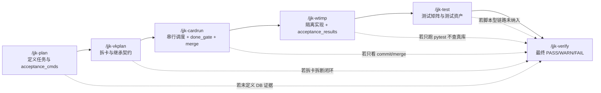

# 工程流数据库证据门禁设计

## 1. 结论先行
- 本项目的数据库验证问题，根因不在单一的 `/jjk-test` 或 `/jjk-verify`，而在 `plan -> vkplan -> cardrun -> wtimp -> test -> verify` 主链没有把“数据库证据”定义为一等契约。
- 本设计采用“六段式数据库证据门禁左移”方案：从 `/jjk-plan` 开始定义 `risk_tags + mandatory_evidence`，经 `/jjk-vkplan` 继承到卡片，在 `/jjk-cardrun` 与 `/jjk-wtimp` 落成可执行证据，再由 `/jjk-test` 补齐测试矩阵，最终由 `/jjk-verify` 依据强制证据集合给出 `PASS/WARN/FAIL`。
- 目标不是追加更多测试，而是修复工程流的责任边界：让“哪些改动必须验证 `chat_db` / `data_db` / 脚本型链路 / E2E”在规划阶段即被机器识别、在执行阶段被结构化产出、在验收阶段被机械放行。

## 2. scope_contract
- 目标:
  - 冻结工程流数据库证据门禁的唯一主链契约，避免继续依赖执行者经验决定是否验证数据库。
  - 将 `chat_db`、`data_db`、脚本型链路、API、E2E 的证据要求统一左移到规划和卡片契约层。
  - 让 `cardrun/wtimp` 不再只对 `commit_sha/merge` 负责，而是对“卡片是否满足必需证据类别”也有明确门禁。
- 范围:
  - 规划与拆解：`.cursor/commands/jjk-plan.md`、`.cursor/commands/jjk-vkplan.md`
  - 调度与执行：`.cursor/commands/jjk-cardrun.md`、`.cursor/commands/jjk-wtimp.md`
  - 测试与验收：`.cursor/commands/jjk-test.md`、`.cursor/commands/jjk-verify.md`
  - 契约校验：`scripts/check_workflow_contract.py`
  - 工作流手册与测试管理文档：`docs/开发文档/流程与工具/*`、`docs/开发文档/测试管理/*`
- 边界:
  - 本轮不改具体业务模块逻辑，不新增数据库 schema 或业务接口。
  - 本轮不引入新的外部测试平台，不新增第二条并行收口路径。
  - 本轮不以“多层 fallback”掩盖问题，优先通过工程流契约收敛根因。
- 成功标准:
  - DB 风险任务在 `implementation_plan` 中强制带有结构化 `mandatory_evidence`。
  - `vk_cards.json` 能继承并表达每张卡片的证据责任。
  - `wtimp` 回执能输出结构化 `acceptance_results`，`cardrun` done gate 能消费它。
  - `jjk-test`/`jjk-verify` 能对缺失 DB 证据的任务 fail-fast，而不是给局部通过结论。

## 3. product_contract（PRD-Lite）
- target_users:
  - 工程流维护者（维护 `jjk-*` 命令、脚本与工作流文档）
  - 执行代理维护者（依赖 `cardrun/wtimp` 稳定串行推进）
  - 测试与验收负责人（依赖测试资产与验收门禁给交付结论）
- core_scenarios:
  - 待办/聊天/持久化类改动触达 `chat_db`，必须在计划、卡片、执行、验收四层都明确“写入 + 读回 + 断言”证据。
  - 问数/权限/SQL 改写类改动触达 `data_db`，必须产出“路由正确 + SQL/结果正确 + 权限/安全正确”证据。
  - 卡片被拆分后，仍能保持端到端链路的证据闭环，不出现“每张卡局部通过、全链没人负责”的情况。
  - 验收阶段不再依赖人工口头解释“这次没测 DB 是因为……”，而是按门禁直接阻断。
- business_goals:
  - KPI-1：DB 风险任务缺少 DB 类证据仍被放行的事件数 = 0
  - KPI-2：`cardrun` 已完成卡片中 `mandatory_evidence` 缺口率 = 0
  - KPI-3：脚本型链路测试纳入矩阵覆盖率 = 100%
  - KPI-4：`PASS` 验收结论均可回溯到结构化证据集合，覆盖率 = 100%
- non_goals:
  - 本轮不改业务功能正确性，不直接优化 SQL 生成质量。
  - 本轮不替换现有 `jjk-*` 骨架，不新增新的 orchestrator。
  - 本轮不追求一次性把所有旧脚本迁成 pytest，只要求纳入追溯矩阵与执行口径。
- acceptance_gates:
  - AG-01：`/jjk-plan` 产物中 DB 风险任务必须带 `risk_tags + mandatory_evidence`
  - AG-02：`/jjk-vkplan` 产物中每张卡片必须继承证据责任，不能弱化
  - AG-03：`/jjk-cardrun` 在 `verify/merge` 前必须消费 `evidence_satisfied`
  - AG-04：`/jjk-wtimp` 的 `cardrun_dispatch` 回执必须包含分类后的 `acceptance_results`
  - AG-05：`/jjk-test` 必须将脚本型链路纳入矩阵，并区分本轮问题与历史缺口
  - AG-06：`/jjk-verify` 缺少任一必需 DB 证据时必须 `FAIL_FAST`

## 4. 问题链路图



## 5. architecture_contract

### 5.1 模块边界与职责

| 模块 | 职责 | 新责任 | 禁止事项 |
| --- | --- | --- | --- |
| `/jjk-plan` | 定义任务、验收命令、回滚点 | 定义 `risk_tags`、`mandatory_evidence`、分类 `acceptance_cmds` | 禁止 DB 风险任务只写泛化 `pytest` |
| `/jjk-vkplan` | 拆卡、继承计划契约 | 将证据责任下沉到卡片与 `vk_cards.json` | 禁止拆卡后弱化证据要求 |
| `/jjk-cardrun` | 选卡、dispatch、done gate、merge 主路径 | 在 `verify/merge` 前校验必需证据是否满足 | 禁止只凭 `commit_sha` 判卡片完成 |
| `/jjk-wtimp` | worktree 隔离执行与回执 | 输出结构化 `acceptance_results` 与 `evidence_satisfied` | 禁止用口头说明代替结构化证据 |
| `/jjk-test` | 生成测试矩阵、执行三层验证、沉淀报告 | 将脚本型链路纳入主矩阵，并输出 `Required vs Actual Evidence` | 禁止只统计 pytest 而遗漏脚本/在线证据 |
| `/jjk-verify` | 消费审查与测试证据给最终结论 | 依据 `mandatory_evidence` 放行 | 禁止对 DB 风险任务无证据直接 `PASS` |

### 5.2 依赖方向
- `mandatory_evidence` 的真理源只能来自 `/jjk-plan`，下游只能继承或细化，不能减弱。
- `/jjk-vkplan` 将任务级证据映射成卡片级证据；若一条链路被拆成多卡，必须显式指定闭环卡片。
- `/jjk-cardrun` 只能消费 `/jjk-vkplan` 生成的卡片证据契约，不能自行脑补。
- `/jjk-wtimp` 只能执行上游给定的证据命令，并结构化回传执行结果。
- `/jjk-test` 只能补齐测试矩阵与追溯缺口，不能替代 `/jjk-plan` 定义证据责任。
- `/jjk-verify` 只做最终放行，不承担重新定义验证范围的职责。

### 5.3 状态归属

| 状态对象 | 归属层 | 说明 |
| --- | --- | --- |
| `risk_tags` | `implementation_plan` | 任务风险边界真理源 |
| `mandatory_evidence` | `implementation_plan` / `vk_cards.json` | 任务级/卡片级必需证据集合 |
| `acceptance_cmds[*].kind` | `implementation_plan` | 命令分类真理源 |
| `acceptance_results` | `wtimp` 回执 / 测试报告 | 实际执行结果真理源 |
| `evidence_satisfied` | `wtimp` / `cardrun` 状态 | done gate 前是否满足必需证据 |
| `coverage_contract` | `jjk-test` 报告 | 案例、pytest、脚本型链路的一致性 |

### 5.4 错误处理责任
- 规划层错误：`PLAN_*`
- 拆卡层错误：`VKPLAN_*`
- 调度层错误：`CARDRUN_*`
- 执行层错误：`WTIMP_*`
- 测试层错误：`TEST_*`
- 验收层错误：`VERIFY_*`

原则：谁最先能发现结构性缺口，谁就必须 fail-fast，不得把问题推给更后面的环节。

## 6. 数据契约设计

### 6.1 implementation_plan 扩展字段

```yaml
implementation_tasks:
  - task_id: T-03
    feature_id: P1-todo-db-persistence
    risk_tags: [chat_db, api, scripted_flow]
    mandatory_evidence:
      - unit
      - api
      - chat_db_write_read
      - scripted_flow
    acceptance_cmds:
      - kind: unit
        cmd: "bash scripts/pytest_targeted.sh tests/unit/test_todo_nodes.py -q"
      - kind: api
        cmd: "bash scripts/pytest_targeted.sh tests/api/test_todo_api.py -q"
      - kind: chat_db
        cmd: "bash scripts/pytest_targeted.sh app/tests/test_todo_db_integration.py -q"
      - kind: scripted_flow
        cmd: "先执行 `bash scripts/repo_python.sh` 获取解释器，再以 `PYTHONPATH=.` 运行 `tests/verify_todo_db_persistence.py`"
```

### 6.2 vk_cards.json 扩展字段

```json
{
  "card_id": "C03",
  "task_ids": ["T-03"],
  "risk_tags": ["chat_db", "api", "scripted_flow"],
  "mandatory_evidence": ["unit", "api", "chat_db_write_read", "scripted_flow"],
  "cross_card_closure": {
    "required": false,
    "closure_owner": null
  }
}
```

### 6.3 wtimp dispatch 回执扩展字段

```json
{
  "executor": "wtimp",
  "executor_mode": "cardrun_dispatch",
  "card_id": "C03",
  "ws_file": "workstreams/WS-03.md",
  "commit_sha": "abc123",
  "merge_sha": null,
  "changed_files": ["app/repositories/todo_repository.py"],
  "acceptance_results": [
    {"kind": "unit", "cmd": "...", "exit_code": 0, "summary": "3 passed"},
    {"kind": "api", "cmd": "...", "exit_code": 0, "summary": "4 passed"},
    {"kind": "chat_db", "cmd": "...", "exit_code": 0, "summary": "write-read assert passed"},
    {"kind": "scripted_flow", "cmd": "...", "exit_code": 0, "summary": "verify_todo_db_persistence passed"}
  ],
  "evidence_satisfied": true
}
```

## 7. 六段式门禁规则

### 7.1 `/jjk-plan`

| 规则 | 说明 |
| --- | --- |
| 新增 `risk_tags` | 自动/人工标记任务风险边界 |
| 新增 `mandatory_evidence` | DB 风险任务必须包含 DB 类证据 |
| `acceptance_cmds` 分类化 | 每条命令带 `kind`，禁止只有模糊 `pytest` |
| DB 风险 fail-fast | 命中 `chat_db/data_db` 却无对应证据时阻断 |

建议错误码：`PLAN_RISK_TAGS_MISSING`、`PLAN_DB_EVIDENCE_MISSING`、`PLAN_EVIDENCE_KIND_INVALID`

### 7.2 `/jjk-vkplan`

| 规则 | 说明 |
| --- | --- |
| 继承 `risk_tags/mandatory_evidence` | 不得在拆卡时削弱 |
| 新增 `cross_card_closure` | 端到端链路被拆分时必须声明闭环卡 |
| 校验 `evidence_mapping_missing=[]` | coverage 校验不再只看 task_id |
| Gate 卡继承证据责任 | 门禁/编排类卡片也需说明证据来源 |

建议错误码：`VKPLAN_EVIDENCE_MAPPING_BROKEN`、`VKPLAN_DB_CHAIN_SPLIT_UNCLOSED`、`VKPLAN_CARD_EVIDENCE_INSUFFICIENT`

### 7.3 `/jjk-cardrun`

| 规则 | 说明 |
| --- | --- |
| dispatch 前校验 `mandatory_evidence` | 卡片没有证据契约不得派发 |
| done gate 消费 `acceptance_results` | 不再只看 `commit_sha` |
| merge 前检查 `evidence_satisfied=true` | 证据未满足不得进入 merge |
| 卡片证据缺口立即阻断 | 不允许“先 merge 后补测” |

建议错误码：`CARDRUN_EVIDENCE_CONTRACT_MISSING`、`CARDRUN_DB_EVIDENCE_UNSATISFIED`、`CARDRUN_SCRIPTED_FLOW_MISSING`

### 7.4 `/jjk-wtimp`

| 规则 | 说明 |
| --- | --- |
| 严格执行分类后的 `acceptance_cmds` | 命令结果写入 `acceptance_results` |
| 输出 `evidence_satisfied` | 供 cardrun/test/verify 消费 |
| DB 风险最低证据标准 | `chat_db` 至少写读断言；`data_db` 至少路由/SQL/结果断言 |
| `cardrun_dispatch` 只回执，不 merge | 保持唯一 merge 主路径 |

建议错误码：`WTIMP_DB_ASSERTION_MISSING`、`WTIMP_ANALYTICS_ROUTE_UNVERIFIED`、`WTIMP_ACCEPTANCE_KIND_MISMATCH`

### 7.5 `/jjk-test`

| 规则 | 说明 |
| --- | --- |
| 基于 `mandatory_evidence` 生成测试矩阵 | 输出 `Required vs Actual Evidence` |
| 将脚本型链路纳入矩阵 | 不再作为手工孤岛 |
| 区分本轮缺口与历史缺口 | 避免把历史问题混入本轮阻断 |
| 对 DB 风险任务补数据层验证 | 不是只跑 API/unit |

建议错误码：`TEST_EVIDENCE_COVERAGE_GAP`、`TEST_SCRIPTED_FLOW_UNTRACKED`、`TEST_DB_CHAIN_INCOMPLETE`

### 7.6 `/jjk-verify`

| 规则 | 说明 |
| --- | --- |
| `PASS` 需满足全部 `mandatory_evidence` | 不是“有测试就 PASS” |
| DB 风险任务缺 DB 证据必须 fail-fast | `WARN` 不足以放行 |
| 报告中明确列出缺失证据类别 | 提供下一步补证据命令 |
| UAT 仅补自动证据不足，不补规划缺口 | 不再用交互式 UAT 掩盖 DB 缺口 |

建议错误码：`VERIFY_MANDATORY_EVIDENCE_MISSING`、`VERIFY_CHAT_DB_UNPROVEN`、`VERIFY_DATA_DB_UNPROVEN`

## 8. 失败码总表

| 层级 | 新失败码 |
| --- | --- |
| Plan | `PLAN_RISK_TAGS_MISSING` / `PLAN_DB_EVIDENCE_MISSING` / `PLAN_EVIDENCE_KIND_INVALID` |
| VKPlan | `VKPLAN_EVIDENCE_MAPPING_BROKEN` / `VKPLAN_DB_CHAIN_SPLIT_UNCLOSED` / `VKPLAN_CARD_EVIDENCE_INSUFFICIENT` |
| CardRun | `CARDRUN_EVIDENCE_CONTRACT_MISSING` / `CARDRUN_DB_EVIDENCE_UNSATISFIED` / `CARDRUN_SCRIPTED_FLOW_MISSING` |
| WTImp | `WTIMP_DB_ASSERTION_MISSING` / `WTIMP_ANALYTICS_ROUTE_UNVERIFIED` / `WTIMP_ACCEPTANCE_KIND_MISMATCH` |
| Test | `TEST_EVIDENCE_COVERAGE_GAP` / `TEST_SCRIPTED_FLOW_UNTRACKED` / `TEST_DB_CHAIN_INCOMPLETE` |
| Verify | `VERIFY_MANDATORY_EVIDENCE_MISSING` / `VERIFY_CHAT_DB_UNPROVEN` / `VERIFY_DATA_DB_UNPROVEN` |

## 9. 测试资产治理策略

### 9.1 当前问题
- 文档与脚本追溯存在显著缺口：`docs/开发文档/测试管理/测试用例库.md` 已确认存在大批“实际脚本未被文档引用”的情况。
- 脚本型链路测试（例如 `tests/verify_todo_db_persistence.py`、`tests/test_ask_data_flow.py`）承载真实 DB 验证能力，但未稳定纳入主矩阵。
- E2E 受 `auth.setup` 稳定性影响，当前容易导致“局部 pytest 通过、全链闭环缺失”。

### 9.2 收敛原则
1. 稳定脚本逐步迁移为 pytest。
2. 未迁移脚本必须以 `scripted_flow` 类别纳入矩阵与回执。
3. `jjk-test` 报告必须显式列出“本轮执行了哪些 scripted_flow”。
4. `jjk-verify` 对 DB 风险任务不得接受“脚本存在但未执行”作为通过依据。

## 10. 分阶段落地

| 阶段 | 目标 | 产物 |
| --- | --- | --- |
| Phase A | 增加计划/卡片/回执的数据契约 | `.cursor/commands/*`、`scripts/check_workflow_contract.py` |
| Phase B | `cardrun/wtimp` 真实消费与产出证据 | `wt-flow` / `wtimp dispatch bridge` / 单测 |
| Phase C | `jjk-test` 脚本型链路矩阵化 | 测试报告模板、脚本注册表、测试用例库 |
| Phase D | `jjk-verify` 放行收口 | 验收模板、错误码、工作流文档 |

## 11. 风险与回退

| 风险 | 说明 | 缓解策略 |
| --- | --- | --- |
| 旧计划未带新字段 | 历史 `implementation_plan` 无法直接消费 | 提供兼容读取，但在新执行链中明确报缺口 |
| 卡片过细导致闭环卡稀释 | 端到端证据无人负责 | 引入 `cross_card_closure` 明示责任 |
| 脚本型链路不稳定 | 容易成为噪音 | 先纳入矩阵，再逐步迁移到 pytest |
| E2E 前置不稳 | 影响全链闭环 | 先保 DB/API/脚本证据，再并行治理 `auth.setup` |

回退原则：若新证据契约阻断过多旧链路，可临时允许“兼容读取、严格写入”，但不得回退到“无证据也可 PASS”的旧语义。

## 12. 最终设计结论
- 本项目数据库验证不完整的根因，已经定位为工程流主链缺少数据库证据契约，而不是单一测试命令缺失。
- 最优修复路径不是在末端追加更多测试，而是把 `risk_tags + mandatory_evidence + acceptance_results` 贯穿六段主链，形成单一证据真理源。
- 设计冻结后，后续实施必须围绕“契约左移、卡片继承、执行结构化回执、测试矩阵收敛、验收机械放行”五条主线展开，禁止回到经验驱动与口头补证据模式。
