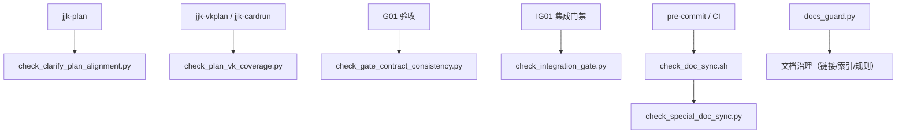

# 工程减法体检报告（v2：依赖驱动退役版）

**日期**: 2026-03-06  
**分支**: `master`  
**适用前提**: 项目未上线，优先保证设计合理性与流程可演进性。  
**口径升级**: 从“文件删除清单”升级为“依赖驱动退役清单（先迁移入口，再删除实现）”。

---

## 0. 结论先行

1. 原报告可作为“减法动机稿”，但**不可直接执行**。  
2. `3.1 立即执行` 中直接删除 5 个门禁脚本，会破坏当前命令契约与门禁链路，风险等级应从“低”上调为 **高**。  
3. 正确做法应为：**分层分类（硬门禁/流程门禁/包装层/历史产物）+ 迁移优先 + 可观测退役**。  
4. 本次建议的 `v2` 执行后，仍可实现减法目标，但不牺牲主干稳定性与流程完整性。

---

## 1. 四段式架构结论（改动前门禁）

### 1.1 模块边界

- `scripts/check_*.py` 属于**流程/门禁层**，不是普通工具脚本。
- `docs/内部参考/任务拆解/**` 属于**任务产物层**（计划态、作用域态、运行态混合沉淀）。
- `scripts/docs_guard.py` 属于**文档治理层**，与计划承接/覆盖率/集成门禁属于不同职责域。

### 1.2 依赖方向

- 上游（命令/技能/任务卡片） -> 门禁脚本 -> 状态与报告产物（单向依赖）。
- 删除门禁脚本会反向破坏上游流程契约，属于架构级断链而非局部优化。

### 1.3 状态归属

- `vk_cards.json`、`parallel_plan.md`：计划态。
- `_active_task.json`：作用域态（任务真理源）。
- `.state/**`：运行态（会话、幂等、账本、尝试证据）。
- 三态不建议合并为单文件，否则会引入职责耦合与冲突写入。

### 1.4 错误处理责任

- 报告应定义 **NO-GO 阻断条件**：入口未迁移完成、调用链未清零、验证未通过时禁止删除。
- 所有退役动作必须包含回退路径（恢复 wrapper / 恢复脚本 / 恢复文档入口）。

---

## 2. 事实快照（核验基线）

| 项目 | 核验值 | 说明 |
|---|---:|---|
| 任务拆解目录数 | 8 | 含 `_templates`、活跃任务目录等 |
| 任务 JSON 文件数 | 33 | `docs/内部参考/任务拆解/**.json` |
| `.state` 文件数 | 7 | 当前活跃任务为主 |
| `scripts/` 顶层普通文件 | 50 | 不含目录递归 |
| `scripts/` 顶层符号链接 | 16 | 主要指向 `scripts/db` 与 `scripts/data` |
| `.cursor/scripts` 顶层文件 | 10 | 与 `scripts/` 对应实体基本一致 |
| `consumption_report.json` 实例数 | 1 | 过程产物 |
| `gate_contract_report.json` 实例数 | 1 | 过程产物 |
| `vktodo_create_result.json` 实例数 | 2 | 过程产物 |
| `vksync_status.json` 实例数 | 1 | 过程产物 |

---

## 3. 核验纠偏（对原报告关键结论的更正）

| 原结论 | 核验结果 | 更正建议 |
|---|---|---|
| `check_special_doc_sync.py` 未在 hooks/CI 使用 | 实际被 `check_doc_sync.sh` 调用，且 pre-commit + CI 都调用该脚本 | 列为“硬门禁”，禁止删除 |
| 5 个门禁脚本“零使用，可直接删除” | 4 个脚本虽不在 CI/hook 直接调用，但在命令协议、技能、任务卡片中为必做校验 | 列为“流程门禁”，先迁移入口再退役 |
| `docs_guard.py` 可覆盖其它门禁脚本能力 | `docs_guard.py`主要负责文档治理，不覆盖 plan 承接、消费覆盖、集成门禁语义 | 禁止以 `docs_guard.py` 替代流程门禁 |
| `attempts` 目录可直接“只保留最新1次” | 现有清理口径会误删整块内联证据语义 | 改为“按 `task-runner-state.json` 的 `card_id + 时间窗` 裁剪 `gate_results/merge_results`” |
| `coder4-idempotency.json` 可删 | 该文件是内核默认幂等状态文件 | 禁止删除；仅允许做 schema 收敛 |

---

## 4. 脚本分层与退役策略（v2）

### 4.1 分层分类

| 分层 | 脚本 | 当前角色 | 退役策略 |
|---|---|---|---|
| L0 硬门禁（不可删） | `check_special_doc_sync.py` | pre-commit / CI 间接强制门禁 | 保留 |
| L1 流程门禁（先迁移） | `check_clarify_plan_alignment.py` `check_plan_vk_coverage.py` `check_gate_contract_consistency.py` `check_integration_gate.py` | 命令链路契约校验 | 先抽象统一入口，再软退役 |
| L2 包装层（可收敛） | `coder4_scope_guard.py` | `set_active_task.py` 薄包装入口 | 可合并，但需保留兼容壳 |
| L3 运行保障（谨慎） | `coder4_external_backup.sh` `coder4_external_restore.sh` | 回滚演练与仓外恢复 | 可合并为单入口，但必须保持参数兼容 |
| L4 观测脚本（按启用状态） | `codex_app_monitor.py` `codex_turn_supervisor.py` | 运行观测 | 先确认 cron/手工使用，再决定归档 |

### 4.2 依赖示意图

---

## 5. 过程文件治理（不直接全删）

### 5.1 过程文件分级

| 文件类型 | 建议 | 理由 |
|---|---|---|
| `consumption_report.json` | 保留最近活跃任务；已完成任务可归档/TTL 清理 | 与 `jjk-vkplan` 输出契约绑定 |
| `gate_contract_report.json` | 与上同 | 门禁证据，适合按任务生命周期管理 |
| `vktodo_create_result.json` | 与上同 | 落卡过程证据 |
| `vksync_status.json` | 与上同 | 同步状态快照，可选但有排障价值 |

### 5.2 内联证据清理改法（安全版）

- 禁止整体清空 `task-runner-state.json` 的 `gate_results/merge_results`。
- 改为按 `card_id` 与时间窗做键级保留策略（例如仅保留最近 20 次）。
- `task-ledger.jsonl` 与 `coder4-idempotency.json` 不纳入删除候选。

---

## 6. 可执行门禁（NO-GO）

| 阶段 | 放行条件（全部满足） | NO-GO（任一命中即阻断） |
|---|---|---|
| 脚本退役前 | 调用链清零（命令/技能/文档/任务卡片）；统一入口已上线；dry-run 通过 | 仍有任一入口直接引用旧脚本 |
| 过程文件清理前 | 任务状态 `done/archived`；产物非审计必需；备份可回放 | 当前活跃任务或近 14 天仍有写入 |
| 状态文件治理前 | 明确 schema 与回放策略；读写方兼容验证通过 | 运行态脚本仍依赖旧字段/旧路径 |

---

## 7. 分阶段执行计划（建议）

### Phase 0（当天）：只修正报告，不删脚本

1. 将“立即删除 5 脚本”改为“分层退役策略”。  
2. 补齐每个候选脚本的 `owner/trigger/failure_impact/replacement`。  
3. 输出退役计划的验收口径与回退口径。

### Phase 1（1~2 天）：统一门禁入口

1. 新建统一入口（示例：`scripts/check_workflow_contract.py`），内部代理旧脚本。  
2. 更新 `.cursor/commands/*`、`.agents/skills/*`、任务模板引用到新入口。  
3. 保留旧脚本 wrapper（打印 deprecation 警告）。

### Phase 2（3~7 天）：观测 + 软退役

1. 连续观测 1~2 周，确认无旧入口调用。  
2. 仅在“零引用 + 零调用 + 验收通过”后删除旧实现。  
3. 清理过程文件改为“按任务生命周期归档/TTL”。

---

## 8. 风险收益重估

| 动作 | 收益 | 风险 | 结论 |
|---|---|---|---|
| 直接删除 5 门禁脚本 | 表面减少文件数 | 破坏流程契约与执行链 | 不可执行 |
| 先统一入口再退役 | 中高收益 | 中低风险 | 推荐 |
| 过程文件生命周期清理 | 中收益 | 低风险 | 推荐 |
| 运行态文件（idempotency/ledger）删除 | 低收益 | 高风险 | 禁止 |

---

## 9. 交付物与下一步

### 9.1 本次新增文档

- `workdocs/归档/治理专题/工程减法治理/工程减法体检报告_2026-03-06_v2.md`

### 9.2 下一步建议

1. 以 `v2` 为准回写原报告，避免团队继续执行高风险删除命令。  
2. 立项一个小卡：`门禁脚本统一入口 + wrapper 兼容退役`。  
3. 在 `docs/内部参考/任务拆解/README.md` 增加“过程产物生命周期”规范段落。  

---

**结论复述**：减法要做，但要从“删文件”升级为“退役依赖”。在当前仓库状态下，`v2` 路径能实现瘦身，同时不牺牲主干能力与架构完整性。
