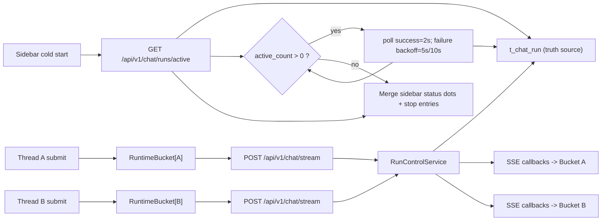

# 聊天多会话并发设计冻结（2026-03-06）

## 0. 设计冻结声明
- 本文档为单方案冻结稿（不保留 A/B 并列决策），目标是作为 `$jjk-plan` 的唯一输入基线。
- 本轮优先级：**设计合理性 > 实现速度**。
- 适用范围：单页面单用户多会话后台并发（不同 `thread_id` 可并发运行）；不含离线 token 回放。

---

## 1. `scope_contract`
```yaml
scope_contract:
  topic: chat-multi-session-concurrency
  objective:
    - 同一用户可并发运行多个会话 run（按 thread_id 隔离）
    - 停止动作仅影响目标 run，不影响其他会话
    - 页面刷新后可恢复“正在运行的会话”可见状态与可操作性
  in_scope:
    - 前端流状态从单实例升级为按 thread_id 分桶的 RuntimeBucket 注册表
    - 后端新增 active runs 查询面（按 user 过滤）
    - 引入用户并发上限与同线程冲突门禁
    - 补齐并发/隔离/恢复测试矩阵
  out_of_scope:
    - 离线 token 事件回放
    - 多窗格同屏并发编辑
    - LangGraph 业务节点编排改造
  boundaries:
    - 跨 worker 一致性以 DB 为准，不以进程内缓存为准
    - 前端并发门禁仅做 UX，不作为安全边界
  success_criteria:
    - 并发正确性: A/B 两会话并发提交均完成且消息无串写
    - 停止隔离: 停止 B 时 A 保持 running
    - 刷新恢复: 首屏加载后 1s 内恢复侧边栏运行态状态点
    - 停留同步: 页面停留期间（active_count>0）运行态更新延迟 P95 < 3s
```

---

## 2. product_contract（PRD-Lite）
```yaml
product_contract:
  target_users:
    - 需要并行处理多个问题流的重度聊天用户
    - 需要在长耗时会话中临时切换其他任务的业务用户
  core_scenarios:
    - 场景S1: 会话A生成中，用户切换到会话B发起新问题，A/B并行执行
    - 场景S2: 用户仅停止会话B，避免误停会话A
    - 场景S3: 刷新页面后继续识别并操作运行中的会话
    - 场景S4: 页面停留期间，若存在 active run，侧边栏状态自动同步更新
  business_goals:
    - metric: 多会话并发完成率
      target: ">=99.0%"
      window: 7d
    - metric: 跨会话误停率
      target: "=0"
      window: 30d
    - metric: 刷新后运行态恢复时延P95
      target: "<1s"
      window: 7d
    - metric: 页面停留时运行态同步延迟P95
      target: "<3s"
      window: 7d
  non_goals:
    - 不提供离线 token 逐条回放能力
    - 不提供多窗口实时协同状态同步
    - 不新增复杂抢占调度算法
    - P0 不为 `t_chat_message` 新增 `run_id` 字段，消息层不建立 run 硬关联
  acceptance_gates:
    - MSC-CL-001: A/B 并发提交后均完成且状态分离
    - MSC-CL-002: 仅停止目标会话
    - MSC-CL-003: 刷新后恢复 active 状态点与 stop 可用
    - MSC-CL-004: 同线程重复提交返回 409 active_run_exists
    - MSC-CL-005: 达并发上限返回 429
    - MSC-CL-006: cancel 缺失 thread_id 返回 400
    - MSC-CL-007: cancel thread_id 不匹配返回 400
    - MSC-CL-008: active_count>0 时侧边栏状态自动更新
    - MSC-CL-009: 多 worker 场景 active 列表一致且不漏报
  release_constraints:
    - 功能开关默认 true，支持 5 分钟内回滚
    - 多 worker 压测样本 >= 10,000 查询，漏报率必须为 0
```

补充镜像（供 `/jjk-plan` 校验脚本读取）：
- target_users: 重度聊天并行任务用户；长耗时会话切换用户
- core_scenarios: 会话A运行中并发提交会话B；仅停止目标会话；刷新后恢复运行态；页面停留期间 active 会话状态自动同步
- business_goals: 多会话并发完成率>=99.0%；跨会话误停率=0；刷新恢复时延P95<1s；停留同步延迟P95<3s
- non_goals: 离线 token 回放；多窗格同屏；调度算法重构；P0 不为 t_chat_message 新增 run_id 字段
- acceptance_gates: MSC-CL-001；MSC-CL-002；MSC-CL-003；MSC-CL-004；MSC-CL-005；MSC-CL-006；MSC-CL-007；MSC-CL-008；MSC-CL-009

---

## 3. `architecture_contract`

### 3.1 四段式架构结论
| 维度 | 冻结结论 |
|---|---|
| 模块边界 | 前端 `RuntimeBucketRegistry`（展示与交互）/ 后端 `RunControlService`（生命周期与门禁）/ `t_chat_run`（一致性真理源）三层解耦。 |
| 依赖方向 | `UI -> API -> Service -> DB` 单向依赖；禁止 UI 直接依赖内部 run 内存态。 |
| 状态归属 | 跨请求、跨 worker 的 active 列表状态归属 DB；单请求流式取消判停归属内存态。 |
| 消息归属 | P0 运行态真理源为 `t_chat_run`；`t_chat_message` 仅存消息内容，不承担 run 生命周期与 active 判定。 |
| 错误责任 | 后端负责 4xx/5xx 语义裁决与日志上下文；前端仅负责可读提示与重试引导。 |

### 3.2 端到端数据流


### 3.3 生命周期与并发门禁
| 主题 | 冻结规则 |
|---|---|
| run 状态机 | `running -> stopping -> stopped/completed/failed` |
| 同线程提交 | 若同 `thread_id` 已有 active run，返回 `409 active_run_exists`，不做隐式替换 |
| 用户并发上限 | 默认 3（`MAX_PARALLEL_STREAMS_PER_USER`，范围 1-10），超限返回 `429` |
| active 列表刷新 | 冷启动拉取后，`active_count>0` 时成功固定 2 秒轮询；失败后退避到 5 秒、10 秒；任意一次成功立即恢复 2 秒；`active_count=0` 且本地无 streaming 线程时停止轮询；若本地线程仍在 streaming，则保留本地 running 快照继续轮询；仅连续 3 次失败时显示轻提示 |
| 侧边栏状态列 | 仅当 `status=running` 时显示旋转小圆圈（`running`）；后台线程收到用户尚未查看的新回复时显示蓝色实心点（`unread`）；当前线程已读且不在运行时不显示任何圆圈（`none`）；`status=stopping` 不得继续显示 spinner；新线程在 `init` 返回 `thread_id` 后必须立即插入侧边栏，先用本地首问摘要占位标题承载 `running` 状态；`unread` 仅保留当前页面会话，不跨刷新持久化 |
| poll_hint_seconds 策略 | 健康态返回 `2`；失败退避态返回 `5` 或 `10`；由后端决定，前端不硬编码 |
| active 接口范围 | P0 固定返回当前用户全部 active runs；不做分页，不接受 `limit` |
| active 查询来源 | 每次直接查询 `t_chat_run`；禁用缓存与内存快照兜底 |
| active 查询过滤 | 固定 `user_id=current_user.id` 且 `status in (running, stopping)` |
| active 查询执行 | 服务层以 `last_activity_at 非空优先 -> effective_activity_time -> updated_at -> run_id` 做最终排序；不做分页 |
| active 索引策略 | P0 新增 `idx_chat_run_user_status_updated(user_id, status, updated_at DESC)`，同时支撑 active 列表与并发计数 |
| active 接口顶层字段 | `items`、`active_count`、`poll_hint_seconds`、`server_time` |
| active 接口 item 字段 | `run_id`、`thread_id`、`status`、`updated_at`、`last_activity_at` |
| active 接口排序 | `last_activity_at 非空优先` -> `effective_activity_time DESC` -> `updated_at DESC` -> `run_id DESC` |
| last_activity_at 策略 | 持久化在 `t_chat_run`；关键事件立即写；流式事件最多每 2 秒落库一次；读取时为空可回退 `updated_at` |
| active 接口状态枚举 | `status` 仅允许 `running`、`stopping` |
| active 接口禁止返回 | 不返回 `messages`、`prompt`、`user_id`、`error_detail` |
| cancel 成功响应 | 必须返回最新 `run_id`、`thread_id`、`status`、`accepted`、`idempotent`；`hard cancel` 成功时目标 run 直接收口为 `stopped` |
| cancel 失败错误码 | 固定为 `400`、`403`、`404` |
| 停止幂等 | 目标 run 已处于 `stopping/stopped/completed/failed` 时，返回 `accepted=true,idempotent=true` |
| 桶清理策略 | 终态保留 30 秒后清理，最多保留 10 个 bucket，超限按 LRU 清理非运行态 |


### 3.3.1 `/chat/runs/active` 响应契约（P0 冻结）
```yaml
active_runs_response_contract:
  request_scope: current_user_all_active_runs
  request_query_params: []
  query_source:
    table: t_chat_run
    mode: direct_db_query_per_request
    cache: disabled
    memory_snapshot_fallback: forbidden
  query_filter:
    user_id: current_user.id
    statuses: [running, stopping]
  query_execution:
    pagination: forbidden
    fetch_mode: fetch_all_filtered_rows
    final_sort_owner: service_layer
    effective_activity_time: coalesce(last_activity_at, updated_at)
    last_activity_present_first: true
    final_sort_order:
      - last_activity_at IS NOT NULL DESC
      - effective_activity_time DESC
      - updated_at DESC
      - run_id DESC
    rationale: per_user_active_upper_bound_is_3
  index_strategy:
    required_indexes:
      - name: idx_chat_run_user_status_updated
        columns: [user_id, status, updated_at DESC]
        purpose: [active_runs_lookup, parallel_limit_count]
  pagination:
    enabled: false
    rationale: per_user_active_upper_bound_is_3
  top_level_required_fields:
    - items
    - active_count
    - poll_hint_seconds
    - server_time
  poll_hint_semantics:
    healthy_seconds: 2
    failure_backoff_seconds: [5, 10]
    ownership: server_driven
  item_required_fields:
    - run_id
    - thread_id
    - status
    - updated_at
    - last_activity_at
  item_sort_order:
    - last_activity_at IS NOT NULL DESC
    - effective_activity_time DESC
    - updated_at DESC
    - run_id DESC
  item_allowed_statuses:
    - running
    - stopping
  excluded_fields:
    - messages
    - prompt
    - user_id
    - error_detail
  rationale:
    - P0 固定返回当前用户全部 active runs，不做分页，也不接受 `limit`
    - 当前用户并发上限固定为 `3`，响应体规模天然受控
    - 每次请求直接查询 `t_chat_run`，不走缓存，不以内存快照兜底
    - 查询过滤条件固定为 `current_user.id + active statuses`，不向前端暴露额外筛选语义
    - 由于每用户 active run 上限为 `3`，最终排序放在 service 层完成即可，避免为 `last_activity_at` 增加额外表达式索引复杂度
    - `idx_chat_run_user_status_updated` 同时支撑 active 列表读取与并发上限计数，减少重复索引
    - `poll_hint_seconds` 由后端下发，避免前端硬编码轮询节奏
    - P0 正常返回 `2`；失败退避时返回 `5` 或 `10`
    - `last_activity_at` 用于判断 run 是否长时间无活动，不要求等同于 token 时间
    - active 接口只服务运行态恢复与同步，不承担消息内容查询
    - 默认按最近活动优先排序，保证用户先看到“最近还在动”的会话
    - `updated_at` 与 `run_id` 作为次级排序键，避免列表抖动
    - terminal 状态（`completed`、`failed`、`stopped`）不进入 active 列表，避免前端把终态误识别为可 stop
```

### 3.3.2 `last_activity_at` 持久化策略（P0 冻结）
```yaml
last_activity_persistence_contract:
  truth_source: t_chat_run.last_activity_at
  read_semantics:
    primary: last_activity_at
    fallback: updated_at
  write_policy:
    immediate_events:
      - create_run_success
      - first_visible_output
      - interrupt
      - result
      - final_answer
      - cancel_accepted
      - completed
      - failed
      - stopped
    throttled_events:
      - token_stream
      - visible_status_progress
    throttle_rule:
      max_db_write_frequency: once_per_2_seconds_per_run
      in_memory_heartbeat: allowed
  excluded_events:
    - active_runs_query
    - normal_list_read
    - background_cleanup_scan
  rationale:
    - 保留用户可感知活动心跳，支撑排序、黄灯提示与刷新后恢复
    - 避免 token 级高频写库把 `t_chat_run` 变成写热点
    - 兼容过渡期数据：读取时允许回退到 `updated_at`
```

### 3.4 异常语义（单策略冻结）
| 错误码 | 触发条件 | 前端语义 |
|---|---|---|
| 400 | `thread_id` 缺失或与 run 不匹配 | “停止请求参数不合法，请刷新后重试” |
| 403 | run 不属于当前用户 | “无权限停止该会话” |
| 404 | run 不存在 | “会话已结束或不存在” |
| 409 | 同线程重复提交 | “当前会话仍在运行，请先停止或等待完成” |
| 429 | 用户并发数超限 | “当前运行会话数已达上限，请稍后重试” |
| 503 | active runs 查询不可用 | “运行态暂不可用，请稍后重试” |


### 3.4.1 `/chat/runs/{run_id}/cancel` 响应契约（P0 冻结）
```yaml
cancel_run_response_contract:
  request_required_fields:
    - run_id
    - thread_id
  request_server_fixed_fields:
    reason: user_cancelled
    cancel_mode: hard
  client_excluded_fields:
    - reason
    - cancel_mode
  success_required_fields:
    - accepted
    - idempotent
    - run_id
    - thread_id
    - status
  failure_status_codes:
    - 400
    - 403
    - 404
  semantics:
    - 产品语义收敛为单一“用户取消”动作；客户端不暴露自定义 reason 与 cancel_mode
    - 成功响应必须返回最新 `thread_id` 与最新 `status`，供前端立即更新目标会话运行态
    - `hard cancel` 成功时直接返回 `stopped`；`stopping` 仅保留给兼容/恢复中的内部态，不再作为前端 spinner 展示依据
    - terminal 状态与 stopping 状态走幂等成功响应，不返回 `409`
    - 失败语义固定为参数不合法 `400`、权限不足 `403`、目标不存在 `404`
```

### 3.5 契约源唯一化（强制）
```yaml
contract_source_decision:
  single_source_of_truth: workdocs/归档/设计/2026-03-06-chat-multi-session-concurrency-design.md
  downstream_artifacts:
    - clarify_handoff_contract (v2)
    - implementation_plan (由 $jjk-plan 产出)
  rule:
    - 设计变更必须先修改本 design.md，再更新下游镜像
    - 禁止多处并存“可选契约”
```

### 3.6 回放归一字段（强制）
```yaml
replay_canonical_contract:
  canonical_message_field: additional_kwargs
  legacy_compatible_fields:
    - metadata
  migration_semantics:
    - read: [additional_kwargs, metadata]
    - write: [additional_kwargs]
  enforcement:
    - 新增结构化结果统一写入 additional_kwargs
    - 读取时若 additional_kwargs 缺失，则降级读 metadata
```

### 3.7 消息持久化边界（P0 冻结）
```yaml
message_persistence_boundary:
  p0_decision:
    - run_id 的持久化真理源为 t_chat_run
    - 前端内存仅缓存实时运行态，不作为跨刷新真理源
    - t_chat_message 本轮不新增 run_id 字段
    - 消息层暂不建立 run-to-message 硬关联
  rationale:
    - 本轮目标是并发运行态恢复、停止隔离与多 worker 一致性
    - 上述目标仅依赖 t_chat_run + /chat/runs/active 即可成立
    - 将 run_id 注入消息表属于审计/回放增强，不是 P0 阻断项
  future_upgrade:
    - 若后续需要 run 级审计、回放、精确消息追溯，可在 P1/P2 为 t_chat_message 增加 nullable run_id
```

---

## 4. `requirement_seeds`（字段级需求原子）
```yaml
requirement_seeds:
  - seed_id: RS-001
    title: 会话级并发提交
    trigger: 会话A流式中切换到会话B提交
    input_fields: [user_id, thread_id, prompt]
    output_fields: [run_id, thread_id, status]
    failure_semantics: [409 active_run_exists, 429 parallel_limit_exceeded]
  - seed_id: RS-002
    title: 活跃会话恢复与停留同步
    trigger: 页面冷启动后 active_count>0 时周期拉取
    input_fields: [jwt_token, poll_interval_seconds]
    request_scope: current_user_all_active_runs
    pagination: disabled
    query_contract:
      source_table: t_chat_run
      source_mode: direct_db_query_per_request
      cache: disabled
      filter_fields: [user_id, status]
      allowed_statuses: [running, stopping]
      final_sort_order:
        - last_activity_at IS NOT NULL DESC
        - coalesce(last_activity_at, updated_at) DESC
        - updated_at DESC
        - run_id DESC
    output_fields:
      - items.run_id
      - items.thread_id
      - items.status
      - items.updated_at
      - items.last_activity_at
      - active_count
      - poll_hint_seconds
      - server_time
    failure_semantics: [503 active_runs_unavailable, poll_backoff_5s_10s, show_soft_notice_after_3_failures]
    freshness_contract:
      source_field: items.last_activity_at
      fallback_field: items.updated_at
      stale_hint_threshold_seconds: 60
  - seed_id: RS-003
    title: 停止隔离
    trigger: 用户点击 stop
    input_fields: [run_id, thread_id]
    server_fixed_fields:
      reason: user_cancelled
      cancel_mode: hard
    output_fields: [accepted, idempotent, run_id, thread_id, status]
    failure_semantics: [400 thread_id_missing_or_mismatch, 403 forbidden, 404 run_not_found]
    failure_status_codes: [400, 403, 404]
  - seed_id: RS-004
    title: 同线程冲突阻断
    trigger: create_run 前校验
    input_fields: [user_id, thread_id]
    output_fields: [status_code, error_code, active_run_id]
    failure_semantics: [409 active_run_exists]
  - seed_id: RS-005
    title: 用户并发上限
    trigger: create_run 前校验 active_count
    input_fields: [user_id]
    output_fields: [status_code, error_code, active_count]
    failure_semantics: [429 parallel_limit_exceeded]
  - seed_id: RS-006
    title: 结构化结果回放归一
    trigger: SSE result/final_answer 落库与前端渲染
    input_fields: [message.additional_kwargs, message.metadata]
    output_fields: [canonical_payload]
    failure_semantics: [fallback_read_metadata]
```

---

## 5. `implementation_seeds`（轻量任务原子）
```yaml
implementation_seeds:
  - task_id: T-01
    title: StreamContext 升级为会话级 API
    file_paths:
      - web/src/providers/StreamContext.tsx
    symbols: [StreamContextValue]
    change_type: modify
    blocked_by: []

  - task_id: T-02
    title: useSSEStream 引入 RuntimeBucketRegistry 与 active 条件轮询
    file_paths:
      - web/src/hooks/useSSEStream.ts
    symbols: [useSSEStream]
    change_type: modify
    blocked_by: [T-01]

  - task_id: T-03
    title: 前端 cancel 接口强制传递 thread_id
    file_paths:
      - web/src/lib/backend.ts
      - web/src/hooks/useSSEStream.ts
    symbols: [cancelRun, stop]
    change_type: modify
    blocked_by: [T-02]

  - task_id: T-04
    title: 新增 active runs API
    file_paths:
      - app/api/v1/endpoints/chat_api.py
    symbols: [list_active_runs, CancelRunRequest]
    change_type: modify
    blocked_by: []

  - task_id: T-05
    title: RunControlService 增加 active 查询与并发门禁
    file_paths:
      - app/services/run_control_service.py
    symbols: [list_active_runs_by_user, create_run, cancel_run]
    change_type: modify
    blocked_by: [T-04]

  - task_id: T-06
    title: chat_run 增加 last_activity_at 与 active 查询索引
    file_paths:
      - app/models/chat_run.py
      - alembic/versions/<revision>_add_last_activity_at_and_active_index_to_chat_run.py
    symbols: [ChatRun.last_activity_at, ChatRun.__table_args__]
    change_type: modify
    blocked_by: [T-05]

  - task_id: T-07
    title: 后端单测与 API 测试补齐
    file_paths:
      - tests/unit/test_run_control_service.py
      - tests/api/test_chat_api.py
    symbols: [test_active_runs, test_parallel_limit, test_cancel_thread_mismatch]
    change_type: modify
    blocked_by: [T-05, T-06]

  - task_id: T-08
    title: 前端 E2E 并发与隔离用例
    file_paths:
      - web/e2e/chat-multi-session-concurrency.spec.cjs
    symbols: [MSC-CL-001, MSC-CL-002, MSC-CL-003]
    change_type: add
    blocked_by: [T-02, T-03, T-04, T-05]
```

---

## 6. `execution_chain_seed`
```yaml
execution_chain_seed:
  preferred_mode: parallel
  task_key: PP-20260306-chat-multi-session-concurrency
  card_seed: [T-01, T-02, T-03, T-04, T-05, T-06, T-07, T-08]
  execution_contract_hint:
    delivery_mode: staged
    execution_unit: per_pr
    commit_policy: per_pr
    stop_boundary: per_pr
```

并行依赖拓扑（可恢复顺序）：
```text
T-01 -> T-02 -> T-03
T-04 -> T-05 -> T-06 -> T-07
T-02,T-03,T-04,T-05 -> T-08
```

---

## 7. `risk_rollback_contract`
```yaml
risk_rollback_contract:
  rollback_anchors:
    - key: ENABLE_CHAT_MULTI_SESSION_CONCURRENCY
      default: true
      rollback_value: false
      impact: 前端退回单会话发送门禁
    - key: ENABLE_ACTIVE_RUNS_QUERY
      default: true
      rollback_value: false
      impact: 关闭活跃会话状态点与跨会话 stop 入口
    - key: ENABLE_PER_USER_PARALLEL_GATE
      default: true
      rollback_value: false
      impact: 关闭并发上限与同线程冲突门禁
    - key: ENABLE_THREAD_ID_MATCH_CHECK
      default: true
      rollback_value: false
      impact: cancel 接口回退为仅 user 权限校验（降级路径）

  key_risks:
    - risk_id: RK-001
      title: 并发 TOCTOU 竞争导致超限
      mitigation: 用户级互斥 + 同事务计数与创建
      observability: [user_id, active_count, rejected_reason, trace_id]

    - risk_id: RK-002
      title: 多 worker 活跃态不一致
      mitigation: /runs/active 强制 DB 查询，不以内存快照兜底；查询固定 user_id+active_status 过滤，并补齐 user/status/updated_at 索引
      observability: [run_state_mismatch, worker_id, trace_id, active_runs_query_latency_ms, active_runs_result_count]

    - risk_id: RK-003
      title: 跨会话误停
      mitigation: 前端 stop 绑定 currentThreadId + 后端 thread_id 匹配校验
      observability: [run_id, thread_id, requester_user_id, mismatch_count]

    - risk_id: RK-004
      title: RuntimeBucket 内存膨胀
      mitigation: 终态 30s 清理 + 上限 10 + LRU 清理
      observability: [bucket_count, active_bucket_count, cleanup_count]

    - risk_id: RK-005
      title: 页面停留时运行态不同步
      mitigation: active_count>0 条件轮询（success=2s, failure backoff=5s/10s）+ active=0 自动停轮询 + 连续 3 次失败后轻提示
      observability: [active_poll_latency_ms, active_poll_error_rate, stale_badge_count, active_poll_consecutive_failures]
```

---

## 8. 验收矩阵与最小命令

| 验收ID | 场景 | 断言 | 命令 |
|---|---|---|---|
| MSC-CL-001 | A/B 会话并发提交 | 双会话完成且消息不串写 | `pnpm --dir web exec playwright test web/e2e --grep "MSC-CL-001"` |
| MSC-CL-002 | 停止 B 不影响 A | B 停止、A 继续输出 | `pnpm --dir web exec playwright test web/e2e --grep "MSC-CL-002"` |
| MSC-CL-003 | 刷新后恢复运行态 | 旋转运行图标与 stop 可恢复 | `pnpm --dir web exec playwright test web/e2e --grep "MSC-CL-003"` |
| MSC-CL-004 | 同线程重复提交 | 返回 409 active_run_exists | `pytest tests/api/test_chat_api.py -k "active_run_exists"` |
| MSC-CL-005 | 用户并发超限 | 返回 429 | `pytest tests/unit/test_run_control_service.py -k "parallel_limit"` |
| MSC-CL-006 | cancel 缺失 thread_id | 返回 400 | `pytest tests/api/test_chat_api.py -k "missing_thread_id"` |
| MSC-CL-007 | cancel thread_id 不匹配 | 返回 400 | `pytest tests/api/test_chat_api.py -k "thread_mismatch"` |
| MSC-CL-008 | 停留期间 active 自动同步 | active_count>0 时侧边栏运行图标可更新；active 消失后未读蓝点可自动出现，进入线程后清除 | `pnpm --dir web exec playwright test web/e2e --grep "MSC-CL-008"` |
| MSC-CL-009 | 多 worker 一致性 | active 列表不漏报 | `pytest tests/api/test_chat_api.py -k "multi_worker_active_runs"` |
| MSC-CL-010 | active 空窗保留本地 running | active 接口短暂空窗时侧边栏 running 图标不丢失，直至本地流结束 | `pnpm --dir web exec playwright test web/e2e --grep "MSC-CL-010"` |
| MSC-CL-011 | 新线程立即入栏 | 新线程收到 `init` 后立即出现在侧边栏并显示 `running` | `pnpm --dir web exec playwright test web/e2e --grep "MSC-CL-011"` |

---

## 9. 设计冻结回执（机读）
```yaml
design_freeze_summary:
  design_actionable: true
  missing_blocks: []
  risk_level: medium
  risk_counterexamples_count: 5
  handoff_contract_ready: true
  product_contract_ready: true
  implementation_seed_count: 8
  semantic_frozen: true
  contract_source_decided: true
  handoff_seed_alignment_ok: true
  parallel_dependency_ready: true
  replay_canonical_field_set: true
  blocking_issues: []
```

---

## 10. 承接契约（机读，`clarify_handoff_contract` v2）
```yaml
clarify_handoff_contract:
  version: v2
  topic: chat-multi-session-concurrency
  design_source: workdocs/归档/设计/2026-03-06-chat-multi-session-concurrency-design.md
  handoff_ready: true

  required:
    product_contract_summary:
      target_users:
        - 重度聊天并行任务用户
        - 长耗时会话切换用户
      core_scenarios:
        - 会话A运行中并发提交会话B
        - 仅停止目标会话
        - 刷新后恢复运行态
        - 页面停留期间 active 会话状态自动同步
      business_goal_metrics:
        - 多会话并发完成率>=99.0%
        - 跨会话误停率=0
        - 刷新恢复时延P95<1s
        - 停留同步延迟P95<3s
      non_goals:
        - 离线 token 回放
        - 多窗格同屏
        - 调度算法重构
      acceptance_gates:
        - MSC-CL-001
        - MSC-CL-002
        - MSC-CL-003
        - MSC-CL-004
        - MSC-CL-005
        - MSC-CL-006
        - MSC-CL-007
        - MSC-CL-008
        - MSC-CL-009

    requirement_seeds:
      - seed_id: RS-001
      - seed_id: RS-002
      - seed_id: RS-003
      - seed_id: RS-004
      - seed_id: RS-005
      - seed_id: RS-006

    implementation_seeds:
      - task_id: T-01
        blocked_by: []
      - task_id: T-02
        blocked_by: [T-01]
      - task_id: T-03
        blocked_by: [T-02]
      - task_id: T-04
        blocked_by: []
      - task_id: T-05
        blocked_by: [T-04]
      - task_id: T-06
        blocked_by: [T-05]
      - task_id: T-07
        blocked_by: [T-05, T-06]
      - task_id: T-08
        blocked_by: [T-02, T-03, T-04, T-05]

    execution_chain_seed:
      preferred_mode: parallel
      task_key: PP-20260306-chat-multi-session-concurrency
      card_seed: [T-01, T-02, T-03, T-04, T-05, T-06, T-07, T-08]
      execution_contract_hint:
        delivery_mode: staged
        execution_unit: per_pr
        commit_policy: per_pr
        stop_boundary: per_pr

    alignment_contract:
      strict_match: true
      requirement_seed_ids: [RS-001, RS-002, RS-003, RS-004, RS-005, RS-006]
      implementation_task_ids: [T-01, T-02, T-03, T-04, T-05, T-06, T-07, T-08]
      card_seed_ids: [T-01, T-02, T-03, T-04, T-05, T-06, T-07, T-08]

  extended:
    observability_hints:
      - run_state_mismatch
      - missing_thread_id_rejected_count
      - active_count
      - parallel_limit_reject_count
      - active_runs_query_latency_ms
      - active_runs_result_count
      - active_poll_latency_ms
      - active_poll_consecutive_failures
    risk_counterexample_map:
      - risk_id: RK-001
        counterexample: 两个并发请求同时通过计数检查
      - risk_id: RK-002
        counterexample: 多 worker 场景下一个 worker 内存态缺失 active run
      - risk_id: RK-003
        counterexample: 传错 thread_id 仍成功停止非目标 run
      - risk_id: RK-004
        counterexample: 长会话导致 bucket 不回收
      - risk_id: RK-005
        counterexample: 页面停留 30s 内侧边栏状态未跟随服务端 active 变化
    assumptions:
      - 当前数据库支持用户级并发门禁所需锁语义
      - 前端可在 Sidebar 与 ChatInput 共用 thread 上下文
      - 运行态恢复要求会话级即时可见，不要求 token 级回放
      - `/chat/runs/active` 固定按 `user_id + active statuses` 直查 `t_chat_run`，并由服务层按 `last_activity_at 非空优先 -> effective_activity_time -> updated_at -> run_id` 排序
      - `last_activity_at` 持久化在 `t_chat_run`，并采用关键事件立即写 + 流式 2 秒节流写
      - P0 为 `t_chat_run` 新增 `idx_chat_run_user_status_updated(user_id, status, updated_at DESC)`
      - P0 不修改 `t_chat_message` 表结构，run 与消息的硬关联留待 P1/P2 评估
```

---

## 11. `clarify_consistency_check`（机读）
```yaml
clarify_consistency_check:
  clarify_phase: approval
  current_round: 3
  question_mode: package
  open_questions_count: 0
  product_contract_ready: true
  semantic_frozen: true
  contract_source_decided: true
  handoff_seed_alignment_ok: true
  parallel_dependency_ready: true
  replay_canonical_field_set: true
  fail_fast_codes: []
```

---

## 12. 审批记录
```yaml
approval_record:
  design_approved: true
  approved_at: 2026-03-08T13:40:19+08:00
  approved_round: v2-freeze-2026-03-08
  approval_evidence: 用户明确回复"确认"
  approval_mode: approved
  go_no_go: GO
```

补充镜像（供 `/jjk-plan` 校验脚本读取）：
- design_approved: true
- approved_at: 2026-03-08T13:40:19+08:00
- approved_round: v2-freeze-2026-03-08
- approval_evidence: 用户明确回复"确认"

---

## 13. 执行备注
```yaml
execution_notes:
  fallback:
    brainstorming: false
    team: false
  template:
    missing: false
    source: "workdocs/_templates/jjk_clarify_templates.md"
  question_mode: "package"
  degrade_reason: ""
  alternative_tool: ""
  verification: "jjk-clarify 审批已通过，可进入 $jjk-plan"
```
