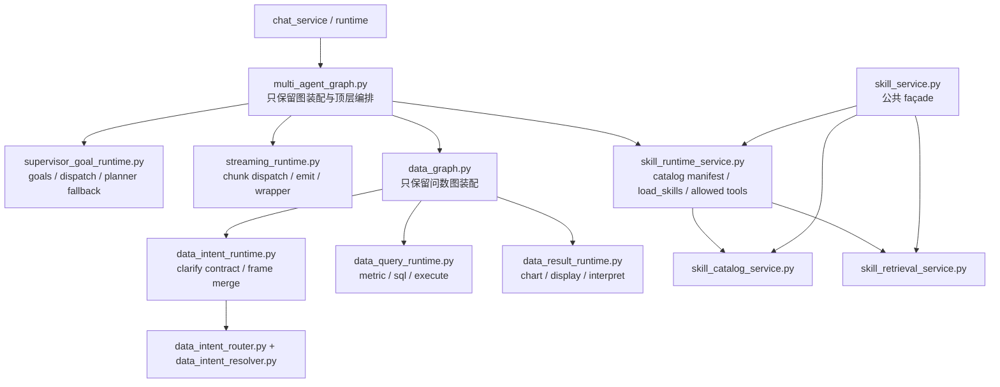

# AI 核心热点模块重构（阶段一）技术设计

> 设计目标：把聊天主图、问数核心、技能运行时三个超大热点入口收口成“薄壳入口 + 清晰子 owner”结构，先解决后续开发默认回流热点文件的问题。
> 需求真理源：`workdocs/需求/2026-03-13_ai-hotspot-module-refactor/requirements.md`

## 0. 设计结论

本次主方案是：保留 [multi_agent_graph.py](/Users/jijingkun/bojxAI/fastapi/app/ai/workflow/multi_agent_graph.py)、[data_graph.py](/Users/jijingkun/bojxAI/fastapi/app/ai/workflow/data_graph.py)、[skill_service.py](/Users/jijingkun/bojxAI/fastapi/app/services/skill_service.py) 作为单一入口 owner，但把它们各自内部的混装职责沿现有缝继续外移。三者最终都只保留“入口装配与薄壳编排”职责，不再同时承担编排、主语义判定、展示转换、运行时恢复、治理策略等多类逻辑。

本次不选两类方案。第一类是“大爆炸重写”，例如一次性把多智能体主图、问数图和技能服务全部改成另一套工作流/服务风格；这会把行为等价风险一次性放大。第二类是“只加门禁不拆代码”，例如继续依赖 `lean-guard` 和 review 提醒，而不真正拆职责；这只会让热点文件不再暴涨，但不会改变后续需求默认回流热点入口的开发路径。

最大收益是：后续需求能先命中明确 owner，再改动一跳依赖，而不是先钻进 7k/4k/3k 的大文件找落点。最大代价是：阶段一会引入若干新的内部模块，并同步改造测试和调用方；整个变更集不一定大幅缩行，但三个热点入口本身必须显著瘦身。

## 1. best_practice_review

| 来源 | 采用点 | 不采用点 | why_this_repo_differs |
|---|---|---|---|
| FastAPI 官方：[Bigger Applications - Multiple Files](https://fastapi.tiangolo.com/tutorial/bigger-applications/) | 大应用按职责拆模块，入口文件只保留装配与路由角色 | 不把聊天、问数、技能三块入口一次性拆成大量平行目录树 | 仓库已有大量稳定入口和测试，阶段一更适合先把热点入口瘦成薄壳，而不是全面重命名 |
| LangGraph 官方：[Use Subgraphs](https://docs.langchain.com/oss/python/langgraph/use-subgraphs) | 复杂流程通过父图/子图或局部 runtime 边界通信，父图只保留顶层编排 | 不把现有主图立刻拆成多个 LangGraph 子图并同时改写全部状态模型 | 当前主风险不是“图数量不够”，而是主图承担了过多非图职责；先把 streaming、goal runtime、skill runtime 脱离主图更稳 |
| LangChain 官方：[Multi-agent](https://docs.langchain.com/oss/python/langchain/multi-agent) | 多智能体系统应让专门子模块处理明确子任务，并最小化共享上下文 | 不新增额外 meta-agent 或额外 supervisor 来“管理”现有复杂度 | 当前需要的是收口 owner，而不是再叠一层 agent 复杂度 |
| Pylint 官方：[too-many-lines](https://pylint.pycqa.org/en/latest/user_guide/messages/convention/too-many-lines.html) | 把超长模块视为结构问题，而不是格式问题 | 不用“注释整理”或“移动少量 helper”来假装完成治理 | 三个目标文件都已经远超阈值，必须拆职责，不是修表面 |
| Pylint 官方：[too-many-public-methods](https://pylint.pycqa.org/en/latest/user_guide/messages/refactor/too-many-public-methods.html) | 把公开方法过多视为单一职责被破坏的明显信号 | 不继续接受 `SkillService` 作为单类统管所有技能职责 | 91 个方法已经不是“服务类大一点”，而是 God Service |
| Pylint 官方：[too-many-statements](https://pylint.pycqa.org/en/latest/user_guide/messages/refactor/too-many-statements.html) | 长函数要按职责拆分，而不是继续堆条件分支 | 不接受把 `analyze_data_intent`、`create_multi_agent_graph`、流式分发等继续只做局部整理 | 当前多个核心函数已经形成“局部上帝函数” |

### 决策权衡

1. 采用“薄壳入口 + 内部 owner 模块”而不是彻底删除入口文件，因为运行时、测试和调用方已经围绕这三个入口组织，阶段一更适合瘦身而不是换入口。
2. 采用“沿现有缝继续外移”的策略，而不是新造一套体系，因为仓内已经有 `context_engineering`、`session_intent_kernel`、`tool_observation_normalizer`、`data_intent_router` 等可复用落点。
3. 不把这次设计做成纯静态治理任务，因为用户接下来要改的是真实代码，不是只加一层 lint 和规则说明。

## 2. 四段式架构结论

### 2.1 module_boundaries

- 当前问题：
  - [multi_agent_graph.py](/Users/jijingkun/bojxAI/fastapi/app/ai/workflow/multi_agent_graph.py) 同时承担主图装配、goal 分解、router contract guard、streaming 分发、外部 observation 归一、skill runtime 接线。
  - [data_graph.py](/Users/jijingkun/bojxAI/fastapi/app/ai/workflow/data_graph.py) 同时承担语义抽取、澄清、SQL 生成/执行、图表生成、结果解释。
  - [skill_service.py](/Users/jijingkun/bojxAI/fastapi/app/services/skill_service.py) 同时承担定义治理、版本与绑定治理、检索排序、catalog/runtime、会话加载。
- 最终决策：
  - `multi_agent_graph.py` 保留为 **Supervisor 图唯一入口 owner**，只负责 graph assembly、节点 wiring、顶层路由衔接；其内部非图职责拆到：
    - `app/ai/workflow/streaming_runtime.py`
    - `app/ai/workflow/supervisor_goal_runtime.py`
    - `app/services/skill_runtime_service.py`
  - `data_graph.py` 保留为 **Data Graph 唯一入口 owner**，只负责 state graph 装配、节点声明、条件路由；其内部职责拆到：
    - `app/ai/workflow/data_intent_runtime.py`
    - `app/ai/workflow/data_query_runtime.py`
    - `app/ai/workflow/data_result_runtime.py`
  - `skill_service.py` 保留为 **技能公共入口 owner**，但只做稳定 API façade；具体职责拆到：
    - `app/services/skill_catalog_service.py`
    - `app/services/skill_retrieval_service.py`
    - `app/services/skill_runtime_service.py`
- 为什么这么改：
  - 这样既能缩掉热点文件里的混装逻辑，又不需要在阶段一把所有入口和调用方全部推倒重来。
  - 入口文件继续存在，但它们不再拥有“上帝职责”。
- 禁止动作：
  - 不再在三个热点入口里新增新的业务词表、主语义抽取、检索排序或会话 runtime 细节。
  - 不再把“先放这里以后再拆”作为默认落点。

### 2.2 dependency_direction

- 当前问题：
  - 现在的依赖方向是“哪个文件拿到最多状态，就往哪个文件继续加”，导致热点入口像黑洞一样吸入新职责。
  - `data_graph.py` 已经有现成的 `app/ai/router/data_intent_router.py` 与 `data_intent_resolver.py`，却仍保留重复的 workflow 内文本抽取逻辑。
  - `multi_agent_graph.py` 已有 `context_engineering.py`、`tool_observation_normalizer.py`、`session_intent_kernel.py` 等外移成果，但主图仍然持有大量局部 owner。
- 最终决策：
  - 依赖方向冻结为：
    - graph 入口 -> contract/runtime 模块 -> service/repository/util
    - 语义判定 -> `intent/router/resolver` 层
    - 技能 runtime -> runtime/retrieval/catalog service
  - `data_graph.py` 不再直接新增文本语义抽取 helper，改为消费 `data_intent_router + data_intent_resolver` 输出的结构化 contract。
  - `multi_agent_graph.py` 只消费 `supervisor_goal_runtime`、`streaming_runtime` 和 `skill_runtime_service`，不再继续下沉它们的内部细节。
  - `skill_service.py` 作为公共 façade 只向下依赖三个专门服务，不允许三个专门服务再反向依赖它。
- 为什么这么改：
  - 先冻结依赖方向，后续实现才不会拆着拆着又回流到旧热点入口。
- 禁止动作：
  - 不再让 workflow 层新增自然语言主语义识别。
  - 不再让 service façade 和内部 owner 双向互相调用。

### 2.3 state_ownership

- 当前问题：
  - 主图里的 streaming context、goal 分解中间态、skill runtime registry 既存在于 graph 入口，也存在于各类 helper，owner 不清。
  - 问数的 metric/time/dimension/chart 等执行槽位一边在 workflow 中做自由文本抽取，一边又有 router/resolver 在做结构化合同。
  - 技能的 catalog、visible skill ids、loaded registry、allowed tool registry 在单个大类里混着管理。
- 最终决策：
  - `multi_agent_graph.py` 只拥有 supervisor conversation state 与 routing transient state；streaming 过程态 owner 下沉到 `streaming_runtime.py`，不再散落在主图。
  - `data_intent_runtime.py` 成为问数“当前轮语义合同”的 owner；`data_query_runtime.py` 成为 SQL 执行链 owner；`data_result_runtime.py` 成为结果展示与图表合同 owner。
  - `skill_catalog_service.py` 负责 definition/version/binding/catalog metadata 真理源；`skill_retrieval_service.py` 负责候选召回与排序；`skill_runtime_service.py` 负责 manifest、load_skills、allowed tool registry 与会话 runtime payload。
  - `skill_service.py` 仅保留公共入口与共享常量，不再持有三类状态本身。
- 为什么这么改：
  - 状态归谁，决定后续改动落在哪；owner 不清，热点文件就会无限长胖。
- 禁止动作：
  - 不再同时保留“workflow 内自由文本抽取结果”和“router/resolver 结构化合同”两份主语义真相。
  - 不再让技能治理状态和技能会话运行态在同一类里混放。

### 2.4 error_handling

- 当前问题：
  - `multi_agent_graph.py` 里存在大量 `fallback/legacy/compat` 痕迹；错误恢复责任没有被收口到边界模块。
  - `data_graph.py` 的澄清、空结果恢复、字段兼容、图表回退都堆在主流程中。
  - `skill_service.py` 的治理、检索、runtime 各自的失败语义混在同一个类方法集合里。
- 最终决策：
  - `streaming_runtime.py` 统一承担流式分发、emit 和 chunk 解释错误；`multi_agent_graph.py` 只消费结构化 route decision。
  - `supervisor_goal_runtime.py` 统一承担 planner fallback 分类、历史窗口装配和 data supplement reconcile；主图只消费最终 goals/dispatch queue。
  - `data_intent_runtime.py` 统一输出 `clarify_contract` 与 `reason_code`；`data_query_runtime.py` 负责 SQL 生成/执行/空结果恢复；`data_result_runtime.py` 负责图表与展示降级。
  - `skill_retrieval_service.py` 负责检索降级和观测；`skill_runtime_service.py` 负责 session load/registry 的结构化失败返回；`skill_catalog_service.py` 负责版本/绑定治理失败语义。
- 为什么这么改：
  - 错误处理是边界职责，不是入口文件该无限吸收的兜底逻辑。
- 禁止动作：
  - 不再新增 speculative fallback。
  - 不再把“看起来更安全”的恢复逻辑直接堆回热点入口。

## 3. 技术流程图



- 这张图在帮助设计和实现阶段回答一个问题：三个旧热点入口以后各自只剩什么、真正的子 owner 落在哪。

## 4. module_change_plan

| module | current_problem | target_change | why_this_way | affected_paths | owner |
|---|---|---|---|---|---|
| `app/ai/workflow/multi_agent_graph.py` | 混装 graph assembly、goal runtime、streaming runtime、skill runtime | 缩成 supervisor graph 薄壳，只保留 graph 构建、节点 wiring、顶层 orchestration | 保留稳定入口，同时把非图职责抽出 | `app/ai/workflow/multi_agent_graph.py`, `app/core/runtime.py`, `tests/unit/test_langgraph_agent_migration.py`, `tests/unit/test_multi_agent_graph_runtime_registry.py` | supervisor graph owner |
| `app/ai/workflow/streaming_runtime.py` | 现有 streaming helper 仍埋在主图里，测试集中依赖热点文件私有函数 | 新建统一 streaming runtime 模块，承接 chunk dispatch、emit、wrapper 异常收口 | 这部分是最典型的局部 runtime owner，最适合先拆 | `app/ai/workflow/streaming_runtime.py`, `tests/unit/test_multi_agent_streaming_helpers.py`, `tests/unit/test_message_utils.py` | streaming runtime owner |
| `app/ai/workflow/supervisor_goal_runtime.py` | decompose_goals、dispatch queue、planner fallback、历史窗口装配仍在主图里 | 新建 goal runtime 模块，承接多目标拆分与 reconcile 逻辑 | 这部分属于 supervisor 运行时合同，不该继续埋在图入口 | `app/ai/workflow/supervisor_goal_runtime.py`, `tests/unit/test_intent_plan_model_primary.py`, `tests/unit/test_multi_intent_queue_flow.py`, `tests/unit/test_planner_*` | goal runtime owner |
| `app/services/skill_runtime_service.py` | skill catalog manifest / load_skills / allowed tool registry 与管理治理混装 | 新建 skill runtime service，专管会话运行态与工具可见性 | 技能运行时和技能治理不是一回事，必须分 owner | `app/services/skill_runtime_service.py`, `app/ai/workflow/multi_agent_graph.py`, `app/tests/test_skill_loader_tool.py`, `app/tests/test_skill_runtime_replay.py` | skill runtime owner |
| `app/ai/workflow/data_graph.py` | workflow 内重复做文本语义、SQL、图表、解释 | 缩成 data graph 薄壳，只保留图装配、节点/边、薄包装节点调用 | 保留稳定入口，利于行为等价回归 | `app/ai/workflow/data_graph.py`, `tests/unit/test_data_graph_*`, `tests/unit/test_router_result_v2_replay.py` | data graph owner |
| `app/ai/workflow/data_intent_runtime.py` | 问数语义合同和 workflow 内自由文本抽取混装 | 新建 intent runtime，负责 session/handoff frame merge、clarify contract、结构化输入整理 | 现有 `app/ai/router/*` 已具备语义模块，workflow 应转为消费方 | `app/ai/workflow/data_intent_runtime.py`, `app/ai/router/data_intent_router.py`, `app/ai/router/data_intent_resolver.py`, `tests/unit/test_data_graph_clarify_guard.py`, `tests/unit/test_data_intent_router_shadow_compare.py` | data intent owner |
| `app/ai/workflow/data_query_runtime.py` | SQL 生成、执行、空结果恢复和安全校验都挤在 data_graph | 新建 query runtime，承接 metric/training/schema/sql_generate/sql_execute 主链 | 问数查询链本身是单独能力 owner | `app/ai/workflow/data_query_runtime.py`, `tests/unit/test_data_graph_semantic_guard.py`, `tests/api/test_data_chat.py`, `app/tests/test_data_agent.py` | data query owner |
| `app/ai/workflow/data_result_runtime.py` | 图表语义、display_sql、结果解释与执行链混装 | 新建 result runtime，承接 chart payload、display names、interpretation | 结果展示和查询执行需要分 owner，后续才好单独演进 | `app/ai/workflow/data_result_runtime.py`, `tests/unit/test_data_graph_semantic_guard.py`, `docs/产品文档/问数助手需求.md` | data result owner |
| `app/services/skill_service.py` | God Service，91 方法统管治理、检索、runtime | 缩成公共 façade，只保留稳定常量与对外入口分发 | 当前 API、graph、测试大量引用 `SkillService`，阶段一保留公共入口最稳 | `app/services/skill_service.py`, `app/api/v1/endpoints/skill_admin_api.py`, `app/api/v1/endpoints/user_skill_api.py`, `tests/unit/test_skill_service.py`, `tests/api/test_skill_admin_api.py`, `tests/api/test_user_skill_api.py` | skill public façade owner |
| `app/services/skill_catalog_service.py` | version/binding/admin metadata 与 retrieval/runtime 混装 | 新建 catalog service，承接 definition/version/binding/admin 读模型 | 技能治理需要独立 owner，避免再次和会话 runtime 混装 | `app/services/skill_catalog_service.py`, `app/services/skill_bootstrap_service.py`, `tests/api/test_skill_admin_api.py`, `tests/unit/test_user_service_skill_bootstrap.py` | skill catalog owner |
| `app/services/skill_retrieval_service.py` | 混合召回、融合排序、日志构建与 catalog/runtime 混装 | 新建 retrieval service，承接 vector/lexical merge、policy filter、retrieval log | 检索排序是独立能力，便于后续离线评测和性能治理 | `app/services/skill_retrieval_service.py`, `tests/unit/test_skill_retrieval_log.py`, `tests/verify_skill_fix.py`, `tests/unit/test_multi_agent_skill_workflow.py` | skill retrieval owner |

## 5. change_map

```yaml
change_map:
  new_paths:
    - path: app/ai/workflow/streaming_runtime.py
      purpose: 承接 multi_agent_graph 的流式分发与 wrapper 运行时
    - path: app/ai/workflow/supervisor_goal_runtime.py
      purpose: 承接多目标拆分、planner fallback、dispatch queue
    - path: app/ai/workflow/data_intent_runtime.py
      purpose: 承接问数语义合同与澄清 owner
    - path: app/ai/workflow/data_query_runtime.py
      purpose: 承接问数 SQL 生成、执行与恢复
    - path: app/ai/workflow/data_result_runtime.py
      purpose: 承接问数图表、展示与解释
    - path: app/services/skill_catalog_service.py
      purpose: 承接技能定义/版本/绑定/管理治理
    - path: app/services/skill_retrieval_service.py
      purpose: 承接技能召回、融合排序与观测
    - path: app/services/skill_runtime_service.py
      purpose: 承接技能 manifest、session load、allowed tools
  modified_paths:
    - path: app/ai/workflow/multi_agent_graph.py
      purpose: 缩成 supervisor graph 薄壳
    - path: app/ai/workflow/data_graph.py
      purpose: 缩成 data graph 薄壳
    - path: app/services/skill_service.py
      purpose: 缩成技能公共 façade
    - path: app/ai/router/data_intent_router.py
      purpose: 接回 workflow 中重复的语义抽取职责
    - path: app/ai/router/data_intent_resolver.py
      purpose: 接回 workflow 中重复的结构化解析职责
    - path: app/services/skill_bootstrap_service.py
      purpose: 改为依赖 catalog/runtime owner，而不是 God Service 细节
    - path: app/api/v1/endpoints/skill_admin_api.py
      purpose: 保持公共入口不变，同时调用新 façade/owner
    - path: app/api/v1/endpoints/user_skill_api.py
      purpose: 保持公共入口不变，同时调用新 façade/owner
    - path: docs/开发文档/架构设计/AI模块设计*.md
      purpose: 同步 owner 边界与目录结构
  deleted_paths: []
  replaced_responsibilities:
    - old_path: app/ai/workflow/multi_agent_graph.py::streaming helper cluster
      replaced_by: app/ai/workflow/streaming_runtime.py
    - old_path: app/ai/workflow/multi_agent_graph.py::goal decomposition / planner fallback cluster
      replaced_by: app/ai/workflow/supervisor_goal_runtime.py
    - old_path: app/ai/workflow/data_graph.py::workflow lexical extraction cluster
      replaced_by: app/ai/router/data_intent_router.py + app/ai/router/data_intent_resolver.py + app/ai/workflow/data_intent_runtime.py
    - old_path: app/ai/workflow/data_graph.py::sql/query/execute cluster
      replaced_by: app/ai/workflow/data_query_runtime.py
    - old_path: app/ai/workflow/data_graph.py::chart/display/interpret cluster
      replaced_by: app/ai/workflow/data_result_runtime.py
    - old_path: app/services/skill_service.py::catalog/version/binding/admin cluster
      replaced_by: app/services/skill_catalog_service.py
    - old_path: app/services/skill_service.py::retrieval cluster
      replaced_by: app/services/skill_retrieval_service.py
    - old_path: app/services/skill_service.py::session runtime cluster
      replaced_by: app/services/skill_runtime_service.py
```

## 6. deletion_plan

```yaml
deletion_plan:
  - path_or_symbol: app/ai/workflow/multi_agent_graph.py::_dispatch_values_mode_chunk + _dispatch_messages_mode_chunk + _run_streaming_dispatch_loop + _execute_streaming_wrapper
    current_responsibility: 主图内联流式分发与 wrapper 异常处理
    remove_reason: 属于 streaming runtime owner，不属于 graph assembly
    replaced_by: app/ai/workflow/streaming_runtime.py
    cleanup_timing: implementation

  - path_or_symbol: app/ai/workflow/multi_agent_graph.py::_build_decomposed_goals_for_query + _resolve_decomposed_goals_for_query + _load_recent_persisted_user_visible_messages
    current_responsibility: 主图内联 goal 分解、历史窗口装配与 reconcile
    remove_reason: 属于 supervisor goal runtime owner，不属于 graph assembly
    replaced_by: app/ai/workflow/supervisor_goal_runtime.py
    cleanup_timing: implementation

  - path_or_symbol: app/ai/workflow/data_graph.py::_extract_metric_from_text + _extract_time_from_text + _extract_chart_type_from_text + _extract_dimensions_from_text + _extract_org_level_from_text + _extract_context_from_text
    current_responsibility: workflow 层自然语言主语义抽取
    remove_reason: 与现有 router/resolver 重复，且违反语义判定边界
    replaced_by: app/ai/router/data_intent_router.py + app/ai/router/data_intent_resolver.py + app/ai/workflow/data_intent_runtime.py
    cleanup_timing: implementation

  - path_or_symbol: app/ai/workflow/data_graph.py::analyze_data_intent / metric_resolve / sql_generate / sql_execute 内部超长实现体
    current_responsibility: data graph 薄壳与查询/结果 owner 混装
    remove_reason: 入口文件只应保留薄包装节点，内部实现应落到专门 runtime
    replaced_by: app/ai/workflow/data_intent_runtime.py + app/ai/workflow/data_query_runtime.py + app/ai/workflow/data_result_runtime.py
    cleanup_timing: implementation

  - path_or_symbol: app/services/skill_service.py::_search_skills_internal + _fetch_vector_candidates + _fetch_lexical_candidates + _merge_candidates + _apply_policy_filters
    current_responsibility: 技能检索与融合排序
    remove_reason: 检索排序属于独立 owner，继续留在 God Service 会阻碍后续观测和调优
    replaced_by: app/services/skill_retrieval_service.py
    cleanup_timing: implementation

  - path_or_symbol: app/services/skill_service.py::publish_skill_version / rollback_skill_version / bind_user_skill / rollback_user_skill_binding / list_admin_skills / get_admin_skill
    current_responsibility: 技能定义、版本、绑定与管理治理
    remove_reason: 属于 catalog governance owner，不应与 runtime/retrieval 混装
    replaced_by: app/services/skill_catalog_service.py
    cleanup_timing: implementation

  - path_or_symbol: app/services/skill_service.py::build_skill_catalog_manifest / validate_visible_skill_ids / load_skills_for_session / build_allowed_tool_registry_from_loaded_registry
    current_responsibility: 技能会话 runtime 与 tool visibility
    remove_reason: 属于 session runtime owner，不应与 catalog/retrieval 混装
    replaced_by: app/services/skill_runtime_service.py
    cleanup_timing: implementation
```

## 7. db_migration_contract

```yaml
db_migration_contract:
  db_migration_required: false
  db_change_scope: none
  db_migration_mode: none
  release_migration_required: false
  db_rollback_strategy: none
```

## 8. shrink_contract

```yaml
shrink_contract:
  obsolete_paths:
    - app/ai/workflow/multi_agent_graph.py::streaming helper cluster
    - app/ai/workflow/multi_agent_graph.py::goal runtime cluster
    - app/ai/workflow/data_graph.py::workflow lexical extraction cluster
    - app/ai/workflow/data_graph.py::query/result monolith cluster
    - app/services/skill_service.py::catalog/retrieval/runtime monolith cluster
  retained_paths:
    - path: app/ai/workflow/multi_agent_graph.py
      reason: 保留为 supervisor graph 单一入口 owner，但只保留 graph assembly 与顶层 orchestration
      expiry_condition: 当 runtime/bootstrap 调用方不再直接依赖该入口文件名称时，可进一步下沉为 package `__init__` 入口
    - path: app/ai/workflow/data_graph.py
      reason: 保留为 data graph 单一入口 owner，但只保留 graph assembly、路由与薄包装节点
      expiry_condition: 当问数图入口稳定改为 package 级 factory 时，可进一步下沉为 package `__init__`
    - path: app/services/skill_service.py
      reason: 保留为技能公共 façade，承接 API handler、测试与 graph 的稳定入口
      expiry_condition: 当外部调用方已统一切换到 focused services，且 façade 不再提供独立价值时删除
  single_entry_owner:
    multi_agent_graph: app/ai/workflow/multi_agent_graph.py
    data_graph: app/ai/workflow/data_graph.py
    skill_api_surface: app/services/skill_service.py
  line_budget:
    scope: whole_change_set
    expectation: shrink
    added_paths:
      - app/ai/workflow/streaming_runtime.py
      - app/ai/workflow/supervisor_goal_runtime.py
      - app/ai/workflow/data_intent_runtime.py
      - app/ai/workflow/data_query_runtime.py
      - app/ai/workflow/data_result_runtime.py
      - app/services/skill_catalog_service.py
      - app/services/skill_retrieval_service.py
      - app/services/skill_runtime_service.py
    deleted_paths:
      - multi_agent_graph.py::streaming/goal clusters
      - data_graph.py::workflow lexical/query/result clusters
      - skill_service.py::catalog/retrieval/runtime clusters
    reason: 会新增若干子 owner 文件，但整体目标是显著缩短三大热点入口并删除重复职责，不接受“热点不减、只是搬家”
```

## 9. implementation_seeds

```yaml
implementation_seeds:
  - task_id: T-01
    feature_id: RF-01
    blocked_by: []
    file_paths:
      - app/ai/workflow/streaming_runtime.py
      - app/ai/workflow/multi_agent_graph.py
      - tests/unit/test_multi_agent_streaming_helpers.py
      - tests/unit/test_message_utils.py
    symbols:
      - StreamingContext
      - chunk dispatch helpers
      - streaming wrapper
    change_type: refactor

  - task_id: T-02
    feature_id: RF-02
    blocked_by: [T-01]
    file_paths:
      - app/ai/workflow/supervisor_goal_runtime.py
      - app/ai/workflow/multi_agent_graph.py
      - tests/unit/test_intent_plan_model_primary.py
      - tests/unit/test_multi_intent_queue_flow.py
      - tests/unit/test_planner_reason_codes.py
    symbols:
      - decompose_goals runtime
      - persisted history window builder
      - planner fallback classifier
    change_type: refactor

  - task_id: T-03
    feature_id: RF-03
    blocked_by: []
    file_paths:
      - app/ai/workflow/data_intent_runtime.py
      - app/ai/router/data_intent_router.py
      - app/ai/router/data_intent_resolver.py
      - app/ai/workflow/data_graph.py
      - tests/unit/test_data_graph_clarify_guard.py
      - tests/unit/test_data_intent_router_shadow_compare.py
    symbols:
      - analyze_data_intent owner split
      - clarify contract owner
      - lexical extraction retirement
    change_type: refactor

  - task_id: T-04
    feature_id: RF-04
    blocked_by: [T-03]
    file_paths:
      - app/ai/workflow/data_query_runtime.py
      - app/ai/workflow/data_result_runtime.py
      - app/ai/workflow/data_graph.py
      - tests/unit/test_data_graph_semantic_guard.py
      - tests/api/test_data_chat.py
      - app/tests/test_data_agent.py
    symbols:
      - metric resolve
      - sql generate/execute
      - chart/display/interpret
    change_type: refactor

  - task_id: T-05
    feature_id: RF-05
    blocked_by: []
    file_paths:
      - app/services/skill_catalog_service.py
      - app/services/skill_retrieval_service.py
      - app/services/skill_runtime_service.py
      - app/services/skill_service.py
      - app/services/skill_bootstrap_service.py
      - app/api/v1/endpoints/skill_admin_api.py
      - app/api/v1/endpoints/user_skill_api.py
    symbols:
      - catalog governance split
      - retrieval split
      - runtime split
      - SkillService façade
    change_type: refactor

  - task_id: T-06
    feature_id: RF-06
    blocked_by: [T-01, T-02, T-03, T-04, T-05]
    file_paths:
      - docs/开发文档/架构设计/AI模块设计.md
      - docs/开发文档/架构设计/AI模块设计_多智能体与状态契约.md
      - docs/开发文档/架构设计/AI模块设计_问数语义层与结果增强.md
      - docs/产品文档/问数助手需求.md
      - docs/产品文档/技能系统需求.md
      - tests/unit/test_skill_service.py
      - python3 scripts/ci/check_lean_budget.py --cached --strict
    symbols:
      - owner boundary docs
      - hotspot regression tests
      - lean guard evidence
    change_type: refactor_verify
```

## 10. execution_chain_seed

```yaml
execution_chain_seed:
  preferred_mode: core
  task_key: ai-hotspot-module-refactor-phase1
  card_seed: [T-01, T-02, T-03, T-04, T-05, T-06]
  execution_contract_hint:
    delivery_mode: staged
    execution_unit: per_task
    commit_policy: single_commit
    stop_boundary: per_task
```

## 11. design_freeze_summary

```yaml
design_freeze_summary:
  design_actionable: true
  missing_blocks: []
  risk_level: high
  handoff_contract_ready: true
  implementation_seed_count: 6
  freeze_decisions:
    - 三个热点入口保留，但都必须瘦成薄壳 owner
    - workflow 层不再继续承担主语义文本抽取
    - skill_service 改为公共 façade，catalog/retrieval/runtime 必须拆 owner
    - 阶段一以行为等价为前提，不顺手修改产品语义
```

## 12. clarify_consistency_check

```yaml
clarify_consistency_check:
  ok: true
  missing_or_ambiguous_requirements: []
  design_conflicts: []
  next_action: jjk-plan
```

## 13. clarify_handoff_contract

```yaml
clarify_handoff_contract:
  version: v1
  topic: "ai_hotspot_module_refactor_phase1"
  design_source: workdocs/设计/2026-03-13_ai-hotspot-module-refactor/design.md
  handoff_ready: true
  required:
    product_contract_summary:
      target_users:
        - 后续实现聊天/问数/技能需求的开发者
        - 代码评审者与验收者
      core_scenarios:
        - 热点入口不再吸入新职责
        - 日常改动能落到单一 owner
        - 重构后关键产品语义保持稳定
      business_goal_metrics:
        - 三大热点入口显著瘦身
        - 常规改动爆炸半径下降
        - owner / obsolete_paths / retained_paths 可明确追溯
      non_goals:
        - 不新增产品能力
        - 不大爆炸重写整套 AI 架构
        - 不顺手改变稳定产品合同
      acceptance_gates:
        - 聊天 interrupt/resume 与流式协议不漂移
        - 问数澄清/查询/图表语义不漂移
        - 技能检索/加载/runtime replay 不漂移
        - Lean Guard 通过
    requirement_seeds:
      - design_item: D-01
        fr_id: FR-01
        trigger: 触达聊天、问数、技能三类热点入口时
        input_contract:
          required_fields: [触发能力, 当前痛点, 受影响链路]
          optional_fields: [历史热点位置, 既有坏味道记录]
          defaults: {}
        output_contract:
          required_fields: [single_entry_owner, module_boundary, affected_paths]
        failure_semantics: owner 边界说不清则禁止进入实现
        observability_fields: [owner, affected_paths, retained_paths]
        rollback_anchor: 保留现有入口文件名与 graph/service 公共入口
        acceptance_cmd_ref: T-06.acceptance_cmds[0]

      - design_item: D-02
        fr_id: FR-02
        trigger: 混装职责准备从热点入口外移时
        input_contract:
          required_fields: [待外移职责, 新_owner, 旧入口状态]
          optional_fields: [暂留理由, 过渡风险]
          defaults: {}
        output_contract:
          required_fields: [obsolete_paths, retained_paths, expiry_condition]
        failure_semantics: 新 owner 落地但旧职责未收口则判定失败
        observability_fields: [obsolete_paths, retained_paths, cleanup_timing]
        rollback_anchor: 入口薄壳仍保留，内部 owner 可逐步回退
        acceptance_cmd_ref: T-06.acceptance_cmds[1]

      - design_item: D-03
        fr_id: FR-03
        trigger: 重构切片影响聊天/问数/技能既有行为时
        input_contract:
          required_fields: [现有产品合同, 回归场景种子]
          optional_fields: [历史缺陷样本]
          defaults: {}
        output_contract:
          required_fields: [protected_contracts, regression_scope]
        failure_semantics: 未批准的产品语义漂移视为失败
        observability_fields: [regression_scope, protected_contracts, drift_findings]
        rollback_anchor: 保留现有入口与合同字段，先保行为等价
        acceptance_cmd_ref: T-06.acceptance_cmds[2]

      - design_item: D-04
        fr_id: FR-07
        trigger: 整体改造过大，需要切分阶段时
        input_contract:
          required_fields: [phase_definition, per_phase_scope]
          optional_fields: [rollback_anchor]
          defaults: {}
        output_contract:
          required_fields: [task_sequence, protected_contracts]
        failure_semantics: 若只能大爆炸重写则需重新收敛阶段范围
        observability_fields: [phase_definition, task_sequence]
        rollback_anchor: 按阶段回滚到上一轮薄壳+内部 owner 结构
        acceptance_cmd_ref: T-06.acceptance_cmds[3]
    implementation_seeds:
      - task_id: T-01
        feature_id: RF-01
        blocked_by: []
        file_paths: [app/ai/workflow/streaming_runtime.py, app/ai/workflow/multi_agent_graph.py]
        symbols: [StreamingContext, wrapper, chunk dispatch]
        change_type: refactor
      - task_id: T-02
        feature_id: RF-02
        blocked_by: [T-01]
        file_paths: [app/ai/workflow/supervisor_goal_runtime.py, app/ai/workflow/multi_agent_graph.py]
        symbols: [decompose_goals runtime, planner fallback]
        change_type: refactor
      - task_id: T-03
        feature_id: RF-03
        blocked_by: []
        file_paths: [app/ai/workflow/data_intent_runtime.py, app/ai/workflow/data_graph.py, app/ai/router/data_intent_router.py]
        symbols: [analyze_data_intent, clarify contract]
        change_type: refactor
      - task_id: T-04
        feature_id: RF-04
        blocked_by: [T-03]
        file_paths: [app/ai/workflow/data_query_runtime.py, app/ai/workflow/data_result_runtime.py, app/ai/workflow/data_graph.py]
        symbols: [sql chain, result chain]
        change_type: refactor
      - task_id: T-05
        feature_id: RF-05
        blocked_by: []
        file_paths: [app/services/skill_catalog_service.py, app/services/skill_retrieval_service.py, app/services/skill_runtime_service.py, app/services/skill_service.py]
        symbols: [catalog governance, retrieval, runtime, SkillService façade]
        change_type: refactor
      - task_id: T-06
        feature_id: RF-06
        blocked_by: [T-01, T-02, T-03, T-04, T-05]
        file_paths: [docs/开发文档/架构设计/AI模块设计.md, tests/unit/test_skill_service.py]
        symbols: [owner docs, regression suite, lean guard]
        change_type: refactor_verify
```

## 14. Doc Sync Flags

- api_doc_required: false
- publish_design_doc: false
