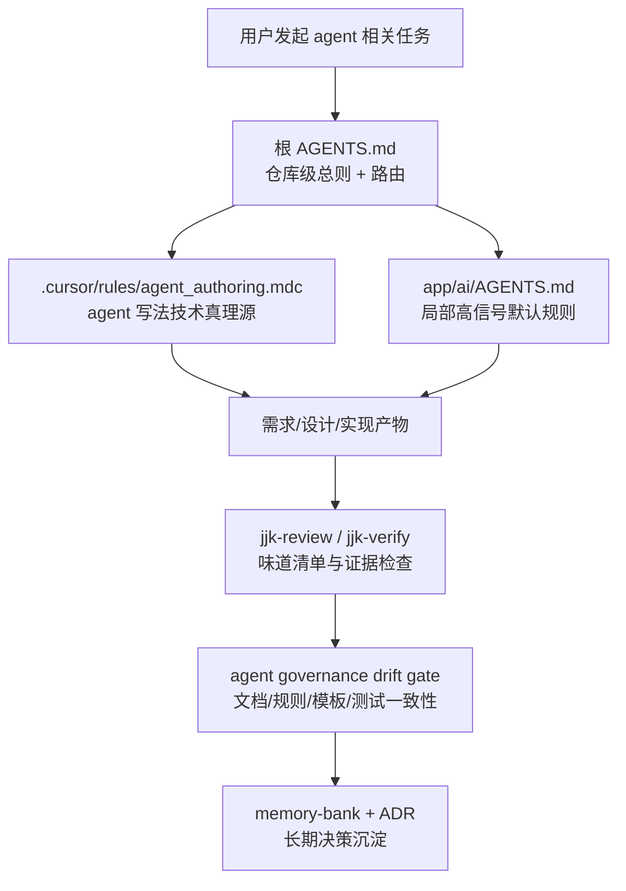

# Codex Agent 写法治理（阶段一）技术设计

> 设计目标：把“以后 Codex 在本仓库怎么写 agent”收口为一套仓库内可加载、可审查、可阻断的规则装配方案，而不是继续靠口头提醒和经验性 review。
> 需求真理源：`workdocs/需求/2026-03-13_codex-agent-governance-and-refactor/requirements.md`

## 0. 设计结论

本次主方案是：保留根 `AGENTS.md` 的高信号总则定位，不把 agent 写法细则继续堆进去；同时新增一套 `agent authoring rule pack`，由 `app/ai/AGENTS.md` 提供局部高信号约束，由 `.cursor/rules/agent_authoring.mdc` 提供技术真理源，再通过 review/verify 模板和轻量自动门禁把坏味道变成可阻断项。

本次不选两类方案。第一类是不做结构化治理，只靠团队记住“别再写复杂 agent”；这会继续回到人盯人。第二类是把所有 agent 规范塞回根 `AGENTS.md`；这会重新把常驻上下文堆胖，和仓库已有的 `AGENTS.md -> Layer2 -> PLANS.md` 分层冲突。

最大收益是：Codex 在 agent 相关需求、设计、实现、审查阶段都会默认读到同一套规则，且 review/verify/CI 能用同一组坏味道 ID 阻断明显退化。最大代价是：要多维护一个专项规则文件、一个局部 `AGENTS.md` 和一组文档/测试门禁，但这比继续放任坏模式回流更便宜。

## 1. best_practice_review

| 来源 | 采用点 | 不采用点 | 适配原因 |
|---|---|---|---|
| OpenAI: [A practical guide to building agents](https://cdn.openai.com/business-guides-and-resources/a-practical-guide-to-building-agents.pdf) | 先单 agent / 简单 workflow，再证明复杂度必要性 | 不把“多 agent 更高级”当默认起点 | 仓库当前最大问题不是能力上限，而是默认过度设计 |
| OpenAI: [Custom instructions with AGENTS.md](https://developers.openai.com/codex/guides/agents-md) | 规则分层、靠近工作目录、根规则保持高信号 | 不把所有专项约束继续塞回根 `AGENTS.md` | 仓库已经在 2026-03-11 完成一次 `AGENTS.md` 与 `PLANS.md` 收口，不能逆行 |
| OpenAI: [Using PLANS.md for multi-hour problem solving](https://developers.openai.com/cookbook/articles/codex_exec_plans) | 长流程规则放 `PLANS.md`，常驻规则只保留高频路由 | 不新增第二份“agent 专项 PLANS”平行长文 | 当前只治理默认写法，不需要再造一个长流程载体 |
| OpenAI Agents SDK: [Output types](https://openai.github.io/openai-agents-python/output/) | 用结构化 contract 约束 agent 间数据流和下游消费 | 不接受自由文本 handoff 继续承载主语义 | 用户抱怨的根因之一就是代码过度依赖自由文本和关键词兜底 |
| OpenAI Agents JS: [Guardrails](https://openai.github.io/openai-agents-js/guides/guardrails) | 关键词/规则只承担 guardrail 角色，不承担主行为控制 | 不让 guardrail 继续扮演主语义路由器 | 这和仓库现有“语义判定边界固定”规则一致 |
| Anthropic: [Building effective agents](https://www.anthropic.com/research/building-effective-agents/) | 能用 workflow 解决的问题，先别上复杂自治结构 | 不引入额外 meta-agent / 审批 agent 来监管 Codex | 当前更需要 repo-native 规则装配，而不是再加一层智能体 |
| Anthropic: [Demystifying evals for AI agents](https://www.anthropic.com/engineering/demystifying-evals-for-ai-agents) | 真实任务样本从 20~50 个起步，围绕高频失败模式补齐 | 不把“跑过一个示例”当作治理生效 | 本次治理对象是默认写法，不是单点功能正确性 |

### 决策权衡

1. 采用“仓库级路由 + 局部高信号 + Layer2 细则 + 门禁”的组合，而不是单一规则文件，因为单层规则无法同时兼顾高信号加载和技术细节。
2. 不新增外部审批服务或专门的 meta-review agent，因为它会把“防止过度设计”再变成一层过度设计。
3. 不把所有 agent 规则塞进 `/jjk-*` 命令或 skill，因为命令是阶段性提示，不适合承载仓库级长期默认值。

## 2. 四段式架构结论

### 2.1 module_boundaries

- 当前问题：
  - Codex 的 agent 写法约束散落在根 `AGENTS.md`、`.cursor/rules/core.mdc`、个别测试、review 经验和人脑记忆里。
  - `docs/开发文档/规范/多智能体开发规范.md` 当前更像历史架构概览，不像“以后怎么写 agent”的稳定规则文档。
- 最终决策：
  - 根 `AGENTS.md` 继续只做仓库级总则与路由。
  - `app/ai/AGENTS.md` 新增为 agent 代码工作区的局部高信号入口。
  - `.cursor/rules/agent_authoring.mdc` 新增为 agent 写法治理的 Layer2 技术真理源。
  - `docs/开发文档/规范/多智能体开发规范.md` 收口为给人看的稳定规则摘要，并把运行态架构说明显式让位给 `docs/开发文档/架构设计/AI模块设计.md`。
  - review / verify 模板与门禁测试只负责“发现和阻断”，不再自行发明规则。
- 为什么这么改：
  - 这样既能保证未来 Codex 在 agent 任务里读到更贴近代码的规则，又不会把仓库根规则重新堆胖。
- 禁止动作：
  - 不再把 agent 写法细则继续扩写到根 `AGENTS.md`。
  - 不再把“怎么写 agent”的长期规则只留在单次 review 评论里。

### 2.2 dependency_direction

- 当前问题：
  - 现在很多治理靠人工先发现问题，再在 review 里临时总结；依赖方向是反的。
- 最终决策：
  - 依赖方向冻结为：`requirements -> design -> repo rules -> local AGENTS -> review/verify checklists -> tests/workflow gate -> memory/ADR`。
  - 自动门禁和 review 只消费已冻结的 smell ID 与 contract，不反向定义新的默认口径。
- 为什么这么改：
  - 先定义，再阻断，才能让 Codex 的默认行为稳定下来，而不是每次任务里重新谈判。
- 禁止动作：
  - 不再允许“实现写完了，再由 review 倒推规则”。
  - 不再新增一份平行“agent 流程手册”绕开现有 `AGENTS.md / Layer2 / PLANS.md` 分层。

### 2.3 state_ownership

- 当前问题：
  - “Codex 是否遵守 agent 写法治理”目前没有唯一状态载体，既没有专项规则 owner，也没有统一坏味道 ID。
- 最终决策：
  - 仓库级默认治理 owner：`AGENTS.md`
  - agent 专项技术细则 owner：`.cursor/rules/agent_authoring.mdc`
  - agent 代码局部入口 owner：`app/ai/AGENTS.md`
  - 人类可读稳定说明 owner：`docs/开发文档/规范/多智能体开发规范.md`
  - 长期决策索引 owner：`memory-bank.md`
  - 完整决策正文 owner：`docs/内部参考/决策记录.md`
  - 自动镜像 owner：`scripts/sync_rules_to_cc.py` 生成 `CLAUDE.md` 与 skill mirror，禁止手改生成物
- 为什么这么改：
  - 这样每一层都只有一个责任，不会再出现规则、解释、门禁、回顾交叉污染。
- 禁止动作：
  - 不再让同一条 agent 规则同时由根 `AGENTS.md`、命令文档、review 评论、口头约定四边重复承载。

### 2.4 error_handling

- 当前问题：
  - 明显坏味道现在更多依赖人工指出，阻断责任不清。
- 最终决策：
  - 需求/设计阶段：必须给出最佳实践依据、复杂度升级证据和例外条件。
  - 局部与 Layer2 规则：定义 smell ID、默认做法和允许例外。
  - review：发现 `multi_decider_stack`、`keyword_primary_routing`、`dual_truth_design`、`speculative_fallback`、`missing_eval_evidence` 等味道时直接给 findings。
  - verify：验证是否提供真实任务样本、是否有复杂度升级证据、是否命中了局部规则。
  - 自动门禁：冻结规则文件、模板、文档和味道 ID 是否漂移。
- 为什么这么改：
  - 能自动阻断的先自动阻断，灰区再留给人工 review。
- 禁止动作：
  - 不再把“坏味道是否成立”只当主观意见。
  - 不再让关键词主路由、无证据复杂升级这类明确违规只靠人提醒。

## 3. 技术流程图



- 这张图在帮助需求设计者、reviewer 和后续实现者理解：这次不是新增一个“管 Codex 的 agent”，而是把治理规则装配到现有仓库分层和门禁链路里。

## 4. module_change_plan

| module | current_problem | target_change | why_this_way | affected_paths | owner |
|---|---|---|---|---|---|
| 仓库级规则入口 | 根 `AGENTS.md` 只有全局门禁，没有 agent 专项路由入口 | 在不增胖的前提下新增一条 agent 治理路由，指向专项 Layer2 规则与局部 `AGENTS.md` | 让 agent 任务默认能命中正确规则入口，又不破坏 2026-03-11 的收口决策 | `AGENTS.md`, `CLAUDE.md`(generated) | repo governance |
| agent 局部高信号规则 | 当前 `app/ai/**` 没有更近一层的规则文件 | 新增 `app/ai/AGENTS.md`，只保留 5~7 条高信号 agent 写法规则 | 官方建议把更具体的规则放到更靠近代码的位置 | `app/ai/AGENTS.md` | AI architecture |
| agent 技术真理源 | 现在只有 `core.mdc` 的通用约束，没有 agent 专项细则 | 新增 `.cursor/rules/agent_authoring.mdc`，承载 smell ID、复杂度升级条件、contract-first 约束和 eval 要求 | 避免根规则和命令文档重复；让后续 review/test 都能引用同一来源 | `.cursor/rules/agent_authoring.mdc` | AI architecture |
| 人类可读稳定规范 | `docs/开发文档/规范/多智能体开发规范.md` 现在更像旧架构介绍，不利于指导“以后怎么写” | 收口为稳定规则摘要：原则、坏味道、例外条件、指向运行态架构真理源 | 把“怎么写 agent”和“系统现在怎么跑”分开 | `docs/开发文档/规范/多智能体开发规范.md`, `docs/开发文档/架构设计/AI模块设计.md`, `docs/README.md` | docs governance |
| 审查与验收模板 | 当前 review / verify 虽能找问题，但没有统一的 agent 坏味道口径 | 在 review / verify 命令与模板中新增 agent smell checklist 与证据项 | 让“默认简单、结构化 contract、关键词只做 guardrail、评测先行”能在审查阶段稳定落地 | `.cursor/commands/jjk-review.md`, `.cursor/commands/jjk-verify.md`, `.agents/skills/jjk-review/SKILL.md`(generated), `.agents/skills/jjk-verify/SKILL.md`(generated), `workdocs/_templates/jjk_review_templates.md`, `workdocs/_templates/jjk_verify_templates.md` | review / verify owner |
| 自动门禁 | 目前没有专门检查 agent 治理文档和规则是否漂移的自动门禁 | 新增轻量 drift gate：冻结规则文件、关键文档和 smell ID 标记；必要时加一个独立 workflow | 不依赖运行态代码也能在规则变更时阻断明显退化 | `tests/unit/test_agent_governance_contract_docs.py`, `.github/workflows/agent-governance-gate.yml` | contract / CI owner |
| 长期决策沉淀 | 规则变了，但长期默认口径可能不写回决策索引 | 在实现完成后补写 `memory-bank.md` 与 `docs/内部参考/决策记录.md` | 这是长期有效默认做法，不能只停留在 workdocs | `memory-bank.md`, `docs/内部参考/决策记录.md` | repo governance |

## 5. change_map

```yaml
change_map:
  new_paths:
    - path: app/ai/AGENTS.md
      purpose: app/ai 局部高信号 agent 写法入口
    - path: .cursor/rules/agent_authoring.mdc
      purpose: agent 写法治理技术真理源
    - path: tests/unit/test_agent_governance_contract_docs.py
      purpose: 冻结规则/模板/文档漂移
    - path: .github/workflows/agent-governance-gate.yml
      purpose: 在只改规则/文档时也能触发 agent 治理门禁
  modified_paths:
    - path: AGENTS.md
      purpose: 增加 agent 专项路由入口，不增加细则负担
    - path: docs/README.md
      purpose: 对人类协作者公开新的规则承载分层
    - path: docs/开发文档/规范/多智能体开发规范.md
      purpose: 从旧架构概览收口为稳定规则摘要
    - path: .cursor/commands/jjk-review.md
      purpose: review 阶段显式检查 agent 坏味道
    - path: .cursor/commands/jjk-verify.md
      purpose: verify 阶段显式检查证据与例外条件
    - path: workdocs/_templates/jjk_review_templates.md
      purpose: agent review findings 模板化
    - path: workdocs/_templates/jjk_verify_templates.md
      purpose: agent verify evidence 模板化
    - path: memory-bank.md
      purpose: 记录长期默认做法
    - path: docs/内部参考/决策记录.md
      purpose: 记录为什么采用这套治理装配
    - path: CLAUDE.md
      purpose: AGENTS 自动镜像
    - path: .agents/skills/jjk-review/SKILL.md
      purpose: 命令镜像同步
    - path: .agents/skills/jjk-verify/SKILL.md
      purpose: 命令镜像同步
  deleted_paths: []
  replaced_responsibilities:
    - old_path: docs/开发文档/规范/多智能体开发规范.md
      replaced_by: docs/开发文档/架构设计/AI模块设计.md
      note: 旧文中的运行态架构叙事移交给 AI 模块设计；规范文只保留“以后怎么写 agent”
    - old_path: 人工 review 临时总结 agent 坏味道
      replaced_by: .cursor/rules/agent_authoring.mdc
      note: 坏味道 ID 与阻断口径收敛到专项规则文件，不再靠临时命名
```

## 6. deletion_plan

```yaml
deletion_plan:
  - path_or_symbol: docs/开发文档/规范/多智能体开发规范.md::架构设计/智能体定义/状态管理/节点详解/工具集成/安全机制/事件协议/扩展能力/API规范
    current_responsibility: 在“规范文档”里承载运行态架构说明
    remove_reason: 这些内容属于运行态架构与代码解读，不属于“以后怎么写 agent”的稳定规则
    replaced_by: docs/开发文档/架构设计/AI模块设计.md
    cleanup_timing: implementation
  - path_or_symbol: 根 AGENTS.md 中未来可能新增的 agent 细则长清单
    current_responsibility: 把 agent 专项治理继续堆在仓库级常驻规则里
    remove_reason: 与 2026-03-11 的 AGENTS/PLANS 分层决策冲突，会放大默认上下文噪音
    replaced_by: .cursor/rules/agent_authoring.mdc + app/ai/AGENTS.md
    cleanup_timing: implementation
  - path_or_symbol: 仅靠 review 评论临时总结的 agent 坏味道口径
    current_responsibility: 灰度、口头化地提醒过度流程、关键词主路由等问题
    remove_reason: 没有唯一 owner，无法稳定复用和阻断
    replaced_by: .cursor/rules/agent_authoring.mdc + jjk-review/jjk-verify 模板
    cleanup_timing: implementation
```

## 7. db_migration_contract

```yaml
db_migration_contract:
  db_migration_required: false
  db_change_scope: none
  db_migration_mode: none
  release_migration_required: false
  db_rollback_strategy: none
```

## 8. shrink_contract

```yaml
shrink_contract:
  obsolete_paths:
    - docs/开发文档/规范/多智能体开发规范.md::旧架构概览章节
    - review-only agent governance（无单一 owner 的口头口径）
    - 根 AGENTS.md 继续吸纳 agent 细则的扩写路径
  retained_paths:
    - path: AGENTS.md
      reason: 保留仓库级高信号总则与路由职责，不承载 agent 细则
    - path: .cursor/rules/core.mdc
      reason: 保留通用语义边界、精简优先和 lean 合同，不迁走仓库级共性原则
    - path: PLANS.md
      reason: 长流程规则继续只在实现/测试/验收阶段生效
    - path: tests/unit/test_semantic_keyword_boundary_gate.py
      reason: 现有显式边界测试继续保留，作为 agent 治理的已存在硬门禁之一
    - path: docs/开发文档/架构设计/AI模块设计.md
      reason: 继续作为运行态架构真理源，不与规范文档混写
  single_entry_owner: .cursor/rules/agent_authoring.mdc
  line_budget:
    scope: whole_change_set
    expectation: neutral
    added_paths:
      - app/ai/AGENTS.md
      - .cursor/rules/agent_authoring.mdc
      - tests/unit/test_agent_governance_contract_docs.py
      - .github/workflows/agent-governance-gate.yml
    deleted_paths:
      - docs/开发文档/规范/多智能体开发规范.md::旧架构概览章节
    reason: 阶段一需要新增专项规则与门禁文件，但会同步缩掉错误承载位置，避免形成第二套平行治理系统
```

## 9. implementation_seeds

```yaml
implementation_seeds:
  - task_id: T-01
    feature_id: GOV-01
    blocked_by: []
    file_paths:
      - AGENTS.md
      - app/ai/AGENTS.md
      - .cursor/rules/agent_authoring.mdc
      - CLAUDE.md
    symbols:
      - agent authoring route
      - local ai governance
      - smell ids
    change_type: create_modify

  - task_id: T-02
    feature_id: GOV-02
    blocked_by: [T-01]
    file_paths:
      - docs/README.md
      - docs/开发文档/规范/多智能体开发规范.md
      - docs/开发文档/架构设计/AI模块设计.md
    symbols:
      - ai collaboration layering
      - agent authoring summary
      - runtime architecture source link
    change_type: modify_refactor

  - task_id: T-03
    feature_id: GOV-03
    blocked_by: [T-01]
    file_paths:
      - .cursor/commands/jjk-review.md
      - .cursor/commands/jjk-verify.md
      - .agents/skills/jjk-review/SKILL.md
      - .agents/skills/jjk-verify/SKILL.md
      - workdocs/_templates/jjk_review_templates.md
      - workdocs/_templates/jjk_verify_templates.md
    symbols:
      - agent smell checklist
      - complexity evidence gate
      - eval evidence gate
    change_type: modify

  - task_id: T-04
    feature_id: GOV-04
    blocked_by: [T-01, T-03]
    file_paths:
      - tests/unit/test_agent_governance_contract_docs.py
      - .github/workflows/agent-governance-gate.yml
    symbols:
      - governance marker freeze
      - workflow trigger contract
    change_type: create

  - task_id: T-05
    feature_id: GOV-05
    blocked_by: [T-01, T-02, T-03, T-04]
    file_paths:
      - memory-bank.md
      - docs/内部参考/决策记录.md
    symbols:
      - active decision index
      - adr body
    change_type: modify
```

## 10. execution_chain_seed

```yaml
execution_chain_seed:
  preferred_mode: core
  task_key: codex-agent-governance-phase1
  card_seed: [T-01, T-02, T-03, T-04, T-05]
  execution_contract_hint:
    delivery_mode: staged
    execution_unit: per_task
    commit_policy: single_commit
    stop_boundary: per_task
```

## 11. design_freeze_summary

```yaml
design_freeze_summary:
  design_actionable: true
  missing_blocks: []
  risk_level: medium
  handoff_contract_ready: true
  implementation_seed_count: 5
  selected_main_scheme: repo_route_plus_local_ai_rules_plus_gate_bundle
  explicitly_not_selected:
    - giant_root_agents_only
    - review_comments_only
    - meta_agent_reviewer
```

## 12. clarify_consistency_check

```yaml
clarify_consistency_check:
  ok: true
  missing_or_ambiguous_requirements: []
  design_conflicts: []
  next_action: jjk-plan
```

## 13. clarify_handoff_contract

```yaml
clarify_handoff_contract:
  version: v2
  topic: "codex-agent-governance-phase1"
  design_source: workdocs/设计/2026-03-13_codex-agent-governance-and-refactor/design.md
  handoff_ready: true
  required:
    product_contract_summary:
      target_users:
        - AI 协作者
        - 评审者
        - 需求与设计人员
      core_scenarios:
        - 新 agent 需求进入需求/设计阶段
        - agent 相关实现进入 review/verify 阶段
        - 规则/文档变更需要自动门禁阻断漂移
      business_goal_metrics:
        - 默认复杂度升级必须提供证据
        - 关键词主语义路由默认阻断
        - 每次 agent 设计或规则调整都有真实任务样本
      non_goals:
        - 本阶段不重构项目现有 agent 运行态
        - 本阶段不调整数据库、接口或模型配置
      acceptance_gates:
        - 规则分层清楚
        - 局部规则可加载
        - 审查模板有统一味道 ID
        - 自动门禁能冻结关键标记
    requirement_seeds:
      - design_item: D-01
        fr_id: FR-01
        trigger: 新的 agent 需求或 agent 实现任务开始
        input_contract:
          required_fields: [目标问题, 使用场景, 是否必须多_agent, 是否涉及语义路由]
          optional_fields: [历史失败案例, 现有痛点样本]
          defaults: {}
        output_contract:
          required_fields: [默认设计原则, 禁止模式, 复杂度升级条件]
        failure_semantics: 缺少明确默认规则时不得直接进入设计或实现
        observability_fields: [agent_governance_rule_loaded, smell_ids]
        rollback_anchor: 删除局部入口或回退专项规则文件
        acceptance_cmd_ref: T-01/T-03/T-04

      - design_item: D-02
        fr_id: FR-02
        trigger: 需求或设计阶段需要给出最佳实践判断
        input_contract:
          required_fields: [需求目标, 影响范围]
          optional_fields: [候选方案, 已知坏味道]
          defaults: {}
        output_contract:
          required_fields: [best_practice_review, adopted_practices, rejected_practices]
        failure_semantics: 没有最佳实践依据时不能把方案升格为长期默认做法
        observability_fields: [best_practice_sources, design_freeze_summary]
        rollback_anchor: 删除无依据复杂规则，回到单方案设计
        acceptance_cmd_ref: T-02/T-03

      - design_item: D-03
        fr_id: FR-03
        trigger: 候选方案引入额外决策层、额外 agent 或新增 fallback
        input_contract:
          required_fields: [简单方案说明, 复杂方案说明, 升级理由]
          optional_fields: [历史对照, 试验结果]
          defaults: {}
        output_contract:
          required_fields: [complexity_upgrade_evidence, reject_condition]
        failure_semantics: 无证据复杂升级直接退回简单方案
        observability_fields: [complexity_gate_status, smell_ids]
        rollback_anchor: 移除新增决策层提案
        acceptance_cmd_ref: T-03/T-04

      - design_item: D-04
        fr_id: FR-04
        trigger: 方案出现关键词/正则/substring 参与主语义判定
        input_contract:
          required_fields: [候选规则, 所在层级, 作用说明]
          optional_fields: [格式抽取样例, 安全校验样例]
          defaults: {}
        output_contract:
          required_fields: [smell_id, allow_or_block, replacement_path]
        failure_semantics: 关键词或正则承担主语义决策时必须阻断
        observability_fields: [smell_ids, reason_code]
        rollback_anchor: 规则降级回 guardrail/extraction only
        acceptance_cmd_ref: T-01/T-03/T-04

      - design_item: D-05
        fr_id: FR-05
        trigger: 需要决定规则放在哪一层时
        input_contract:
          required_fields: [仓库级规则入口, 目录级覆盖点, 长流程入口]
          optional_fields: [历史规则痛点, 试点目录]
          defaults: {}
        output_contract:
          required_fields: [rule_placement, owner, sync_path]
        failure_semantics: 若继续混在单一长文中，视为设计未收口
        observability_fields: [rule_layer, owner]
        rollback_anchor: 撤回新增平行规则载体
        acceptance_cmd_ref: T-01/T-02/T-05

      - design_item: D-06
        fr_id: FR-06
        trigger: agent 相关规则、设计或实现发生变化
        input_contract:
          required_fields: [真实任务样本, 关键失败模式, 预期行为]
          optional_fields: [复杂度对照, 历史回归 case]
          defaults: {}
        output_contract:
          required_fields: [eval_seed_requirement, gate_checkpoints]
        failure_semantics: 没有真实任务样本时不得宣称治理生效
        observability_fields: [eval_case_count, evidence_status]
        rollback_anchor: 移除无证据结论
        acceptance_cmd_ref: T-03/T-04

      - design_item: D-07
        fr_id: FR-07
        trigger: review/verify 需要统一坏味道口径
        input_contract:
          required_fields: [坏味道清单, 审查问题单]
          optional_fields: [反例, 正例]
          defaults: {}
        output_contract:
          required_fields: [smell_ids, block_conditions, exception_conditions]
        failure_semantics: 无统一口径时不得声称规则已稳定
        observability_fields: [smell_ids, checklist_version]
        rollback_anchor: 回退到上一版口径并补 ADR
        acceptance_cmd_ref: T-03/T-04/T-05
    implementation_seeds:
      - task_id: T-01
        feature_id: GOV-01
        blocked_by: []
        file_paths: [AGENTS.md, app/ai/AGENTS.md, .cursor/rules/agent_authoring.mdc, CLAUDE.md]
        symbols: [agent_authoring_route, local_ai_governance, smell_ids]
        change_type: create_modify
      - task_id: T-02
        feature_id: GOV-02
        blocked_by: [T-01]
        file_paths: [docs/README.md, docs/开发文档/规范/多智能体开发规范.md, docs/开发文档/架构设计/AI模块设计.md]
        symbols: [agent_authoring_summary, runtime_architecture_source_link]
        change_type: modify_refactor
      - task_id: T-03
        feature_id: GOV-03
        blocked_by: [T-01]
        file_paths: [.cursor/commands/jjk-review.md, .cursor/commands/jjk-verify.md, workdocs/_templates/jjk_review_templates.md, workdocs/_templates/jjk_verify_templates.md]
        symbols: [agent_smell_checklist, eval_evidence_gate]
        change_type: modify
      - task_id: T-04
        feature_id: GOV-04
        blocked_by: [T-01, T-03]
        file_paths: [tests/unit/test_agent_governance_contract_docs.py, .github/workflows/agent-governance-gate.yml]
        symbols: [governance_marker_freeze]
        change_type: create
      - task_id: T-05
        feature_id: GOV-05
        blocked_by: [T-01, T-02, T-03, T-04]
        file_paths: [memory-bank.md, docs/内部参考/决策记录.md]
        symbols: [active_decision_index, adr_entry]
        change_type: modify
```

## 14. Doc Sync Flags

- api_doc_required: false
- publish_design_doc: false
