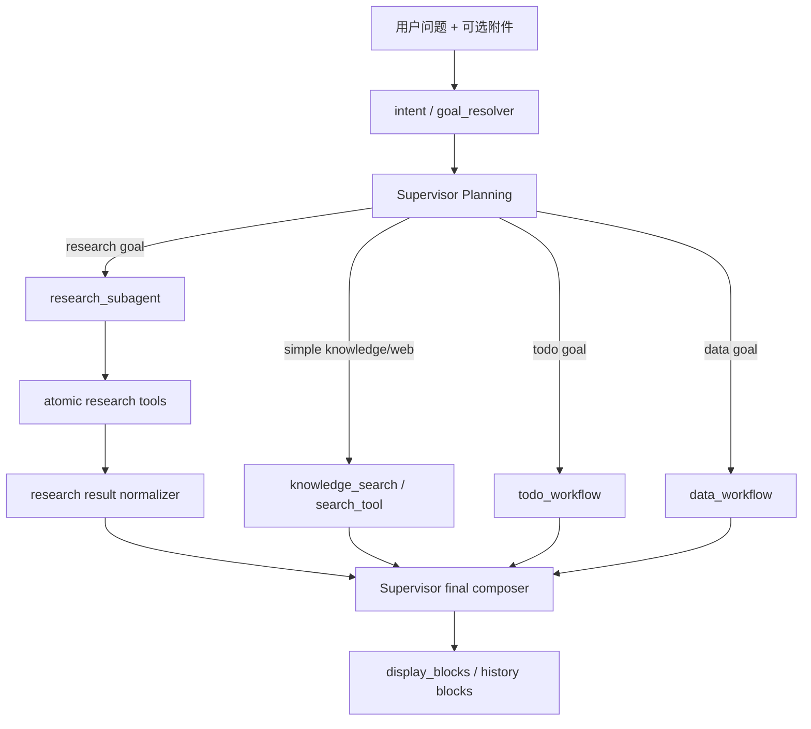
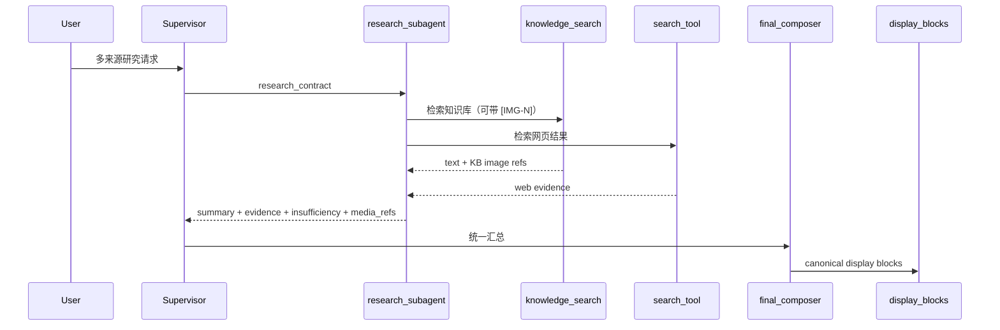

# 统一 `research_subagent` 一期技术设计

> 设计目标：在不改动主会话 owner、不误伤 `todo/data` workflow 的前提下，为 `knowledge + web` 多来源研究任务引入一个统一的 `research_subagent` 执行单元，隔离研究过程上下文，并保持知识库图文展示能力不退化。
> 需求真理源：`workdocs/需求/2026-03-13_research-subagent-phase1/requirements.md`

## 0. 设计结论

本次主方案是：保留 `supervisor` 作为唯一主会话 owner，不新增第二个对话 owner；同时新增一个统一的、**无跨轮状态**的 `research_subagent` 执行单元，专门承接 `knowledge + web` 的多来源研究任务。`knowledge_search` 和 `search_tool` 继续保留为 atomic tool，单点查询仍走简单路径；只有“对比、归纳、证据汇总、跨来源结论”这类 research 目标，才升级到 `research_subagent`。

本次不选三类方案。第一类是不做 subagent，只继续让 `knowledge_research/web_research` 作为 Supervisor 直连 tool；这无法真正隔离上下文，也会继续让 research contract 和主图编排耦在一起。第二类是把 `todo` 或核心 `data` 一起 agent 化；这会把有局部状态机的业务流程硬塞进 stateless 模式，方向是错的。第三类是一期直接拆成 `knowledge/web/attachment` 三个 research 代理；项目未上线，这样会先把路由和治理面扩散。

最大收益是：research 过程中的网页噪声、知识库长段摘要和中间比较笔记不再回灌主会话，Supervisor 只消费结构化研究结果。最大代价是：需要新增一层 research contract 和一个执行单元，并把附件 planning、图片展示和 result contract 明确收口，但这比继续让研究逻辑散落在 Supervisor 里更便宜。

## 1. best_practice_review

| 来源 | 采用点 | 不采用点 | 适配原因 |
|---|---|---|---|
| LangChain: [Subagents](https://docs.langchain.com/oss/python/langchain/multi-agent/subagents) | 采用“manager 保持主控制权，subagent 负责 bounded subtask；通过 context isolation 避免主会话膨胀” | 不把所有外部能力都上升为 subagent | 当前最需要隔离的是 research 上下文，不是所有工具调用 |
| LangChain: [Multi-agent](https://docs.langchain.com/oss/python/langchain/multi-agent) | 采用“不同模式解决不同问题：tool 适合原子调用，subagent 适合有独立上下文的专家任务” | 不把 handoff 当默认模式 | 本需求要求主会话 owner 不变，handoff 不是合适抽象 |
| LangGraph: [Use subgraphs](https://docs.langchain.com/oss/python/langgraph/use-subgraphs) | 采用“有局部状态机、确认/重试/流程边界的能力保留为 workflow/subgraph” | 不把 `todo/data` 改成 stateless subagent | `todo/data` 本质上仍是有状态流程，不应为统一概念而误抽象 |
| OpenAI Agents SDK: [Multi-agent orchestration](https://openai.github.io/openai-agents-python/multi_agent/) | 采用 manager + specialized executor 的分工方式，manager 负责最终答复 | 不引入“研究代理接管会话”的 handoff 模式 | 用户看到的仍应是主助手完成研究，不是上下文 owner 切换 |
| OpenAI Agents SDK: [Handoffs](https://openai.github.io/openai-agents-python/handoffs/) | 采用 handoff 作为反例边界：只有需要接管对话时才适用 | 不采用 handoff 作为 research 首批落地方式 | research 一期只需要隔离执行，不需要接管会话 |
| OpenAI Agents SDK: [Sessions](https://openai.github.io/openai-agents-python/sessions/) | 采用“主会话状态应有单一 owner”原则 | 不给 research_subagent 持久化跨轮会话状态 | 仓库现有状态契约已经冻结主会话 owner 为 supervisor |

### 决策权衡

1. 采用“统一 `research_subagent` + 保留 atomic tool”的双层结构，而不是直接删除 `knowledge_search/search_tool`，因为单点查询仍然需要最短路径。
2. 采用“goal/intention 层判 research，planning 层只消费结构化 bucket”，而不是在 `multi_agent_graph` 或 `attachment_planning` 里新增关键词路由；这符合仓库现有语义边界约束。
3. 采用“复用现有 `display_blocks` / `kb_images` canonical 展示链路”，而不是为 research 结果新发明一套图片协议；这样风险最低，也最符合现有前后端契约。

## 2. 四段式架构结论

### 2.1 module_boundaries

- 当前问题：
  - `knowledge_research` / `web_research` 目前作为 Supervisor 直连 tool 暴露，research 逻辑仍附着在主图工具面上，边界不够清晰。
  - `attachment_planning` 当前会因为“附件数量多 / document probe 命中”直接选 `research_subagent`，这与“附件 route-agnostic”冲突。
  - `build_research_result_payload` 当前只承载 `summary/evidence/insufficiency`，知识库图片引用在 research 模式下会丢失。
- 最终决策：
  - `supervisor` 继续负责主会话、planning、最终答复和错误收口。
  - 新增统一 `research_subagent` 执行单元，职责只包括：接收 research contract、在隔离上下文里调用 `knowledge_search/search_tool`、产出结构化研究结果。
  - `knowledge_search`、`search_tool`、`read_uploaded_file` 等仍是 atomic tool，不变成 subagent。
  - `todo_graph`、`data_graph` 继续是 workflow/subgraph，不纳入 research 一期改造范围。
  - `attachment_planning` 只负责“附件角色与候选路由”，不再单独根据附件数量替 research 做最终决策。
- 为什么这么改：
  - 这样能把研究任务和业务流程明确拆开，既减少 Supervisor 污染，又不把状态机误改成 stateless 模式。
- 禁止动作：
  - 不再让 `knowledge_research` / `web_research` 以平级 Supervisor research tool 的形式长期保留为首选执行入口。
  - 不再让附件本身决定是否走 research。
  - 不再让 research 执行单元接管主会话或直接承担最终答复 owner。

### 2.2 dependency_direction

- 当前问题：
  - 现在 research 路径是 `supervisor -> direct research tool`，而 attachment route 则掺杂了附件数量与文档探针启发式，依赖方向容易漂。
- 最终决策：
  - 依赖方向冻结为：`intent/goal_resolver -> supervisor planning -> research_subagent -> atomic research tools -> research result normalizer -> supervisor final composer -> display blocks pipeline`。
  - `attachment_planning` 只消费 `goal buckets + attachments facts + todo context`，不反向定义 research 语义。
  - `chat_service` / `message_display_blocks` 继续只消费 canonical display 输入，不感知 research 内部执行细节。
- 为什么这么改：
  - 研究语义必须在 intent/resolver 层决定；planning 负责路由；展示链路只负责渲染，不再混入业务判断。
- 禁止动作：
  - 不再在 `app/services/**`、`app/api/**`、`multi_agent_graph` 里新增 research 关键词主路由。
  - 不再让展示层根据 research 内部实现猜测媒体展示行为。

### 2.3 state_ownership

- 当前问题：
  - research 目前虽然概念上是 stateless，但其结果合同和媒体能力没有独立 owner，导致展示契约容易回退成“纯文本总结”。
- 最终决策：
  - 主会话状态 owner 仍然是 `supervisor`：`messages/session_frame/attachment_manifest/attachment_planning/decomposed_goals/final_answer` 不变。
  - `research_subagent` 只拥有**单次调用**的隔离执行上下文，不持久化跨轮状态。
  - 附件事实 owner 仍然是 `supervisor planning contract`，只在本轮 route 决策时投影给 `research_subagent`。
  - 最终图文展示 owner 仍然是 canonical `display_blocks` 链路；research 只返回媒体引用，不拥有最终渲染协议。
- 为什么这么改：
  - 这能避免“研究结果 = 新的消息展示真理源”，从而保持现有 display pipeline 的稳定性。
- 禁止动作：
  - 不给 `research_subagent` 增加跨轮持久化字段。
  - 不给 research 结果新增第二套平行展示 owner。

### 2.4 error_handling

- 当前问题：
  - research 失败时，当前路径更像工具失败，要么直接吐错误文本，要么只剩摘要，不足项和媒体信息都不完整。
- 最终决策：
  - `research_subagent` 失败、证据不足或源不可用时，只返回结构化 `insufficiency`，由 `supervisor` 决定是否给用户结果性降级提示、是否继续组合其他结果。
  - 图片引用解析失败时，优先保留文本结论和证据，不允许静默吞掉整条 research 结果。
  - `attachment_planning` 若路由信息不足，回退到 `supervisor` 继续 planning，不替用户做强行 research 决策。
- 为什么这么改：
  - 研究失败属于局部执行失败，不应直接升级为主会话失控。
- 禁止动作：
  - 不把 research 失败伪装成“已完成研究”。
  - 不把 research 的原始网页 / 原始 KB 噪声直接塞进最终答复兜底。

## 3. 技术图



- 这张图在帮助设计者和实现者理解：一期不是再造一条平行聊天主链，而是在现有主链中插入一个**受 Supervisor 控制的 research 执行单元**。



- 这张图在帮助大家看清图文链路的关键点：**研究过程被隔离，但最终展示仍然回到现有 canonical blocks owner。**

## 4. module_change_plan

| module | current_problem | target_change | why_this_way | affected_paths | owner |
|---|---|---|---|---|---|
| `app/ai/intent/goal_resolver.py` | 现有 goal bucket 只有 `general/data/todo/chart/external`，无法稳定表达 research 任务 | 新增 `research` bucket / kind 的判定出口，放在 intent/resolver 层，而不是编排层 | 符合仓库“语义边界固定”规则，避免在 orchestration 层补关键词 | `app/ai/intent/goal_resolver.py`, `tests/unit/*goal*` | intent owner |
| `app/ai/agents/research_subagent.py` | 当前没有统一 research 执行单元，knowledge/web research 还是散落 tool | 新增统一 research_subagent factory / executor，内部统一消费 research contract | 一期只要一个 stateless 执行单元，减少平行 research surface | `app/ai/agents/research_subagent.py` | AI architecture |
| `app/ai/workflow/multi_agent_graph.py` | Supervisor 直接暴露 `knowledge_research/web_research`，research 边界不清晰 | 移除 research 直连 surface，改为挂一个统一 `research_subagent` 入口；保留 `knowledge_search/search_tool` 原子入口 | 保留简单路径，同时把复杂 research 与主图解耦 | `app/ai/workflow/multi_agent_graph.py`, `tests/unit/test_research_dispatch_contract.py` | supervisor owner |
| `app/ai/workflow/attachment_planning.py` | 当前会因附件数/文档探针直接判 research，和 route-agnostic 需求冲突 | 改成目标驱动：只有 goal bucket 命中 research 或 mixed research item 时才选 research | 附件只是工件，不是 research owner | `app/ai/workflow/attachment_planning.py`, `tests/unit/*attachment*` | planning owner |
| `app/ai/protocol.py` | `build_research_result_payload` 缺少媒体引用能力 | 扩展 research result contract，增加 `summary_markdown` / `media_refs` 一类能力字段，保持 `summary/evidence/insufficiency` 主体不变 | 研究结果既要干净，又要保住图文能力 | `app/ai/protocol.py`, `tests/unit/*protocol*` | protocol owner |
| `app/ai/tools/ragflow_tool.py` | `knowledge_research` 当前只保留摘要和计数，图片信息在 research 模式下丢失 | 下沉为原子 research helper 或被统一 research_subagent 复用；保留 `knowledge_search` 作为 atomic tool | 复用现有知识库检索和 KB 图片生成逻辑，避免重写 | `app/ai/tools/ragflow_tool.py` | KB owner |
| `app/ai/tools/chatTools.py` | `web_research` 还是 Supervisor 平级 tool | 下沉为统一 research_subagent 的原子 web source provider | 让 research surface 统一 | `app/ai/tools/chatTools.py` | web tool owner |
| `app/services/chat_service.py` / `app/core/message_display_blocks.py` / `app/repositories/chat_repo.py` | 当前 display pipeline 已经稳定，但 research 还没对接媒体引用 | 保持 canonical owner 不变，只新增 research media -> existing display pipeline 的适配 | 避免再发明第二套图文展示协议 | `app/services/chat_service.py`, `app/core/message_display_blocks.py`, `app/repositories/chat_repo.py` | streaming/display owner |

## 5. change_map

```yaml
change_map:
  new_paths:
    - path: app/ai/agents/research_subagent.py
      purpose: 统一 stateless research 执行单元
  modified_paths:
    - path: app/ai/intent/goal_resolver.py
      purpose: 新增 research 语义出口，保持语义判定留在 intent 层
    - path: app/ai/workflow/multi_agent_graph.py
      purpose: 把 research 从 Supervisor 直连 tool surface 收口到统一执行入口
    - path: app/ai/workflow/attachment_planning.py
      purpose: 让附件 route 改为目标驱动，而不是附件数量驱动
    - path: app/ai/protocol.py
      purpose: 扩展 research result contract，补足媒体引用能力
    - path: app/ai/tools/ragflow_tool.py
      purpose: 保留 atomic knowledge_search，同时为统一 research 执行提供底层素材
    - path: app/ai/tools/chatTools.py
      purpose: 保留 atomic web search，同时为统一 research 执行提供底层素材
    - path: app/services/chat_service.py
      purpose: 复用现有 display_blocks 收口 research 媒体输出
    - path: app/core/message_display_blocks.py
      purpose: 继续作为最终展示唯一 owner
    - path: app/repositories/chat_repo.py
      purpose: 继续作为 history canonical blocks 持久化 owner
    - path: docs/开发文档/架构设计/AI模块设计.md
      purpose: 回填 stable architecture 决策
    - path: docs/产品文档/聊天系统需求.md
      purpose: 回填 stable product contract
  deleted_paths:
    - path: Supervisor 直连 `knowledge_research` / `web_research` 作为首选 research surface
      purpose: 避免 research surface 分裂
  replaced_responsibilities:
    - old_path: app/ai/tools/ragflow_tool.py::knowledge_research
      replaced_by: app/ai/agents/research_subagent.py
      note: 旧函数可保留为内部 helper，但不再作为 Supervisor 首选 research surface
    - old_path: app/ai/tools/chatTools.py::web_research
      replaced_by: app/ai/agents/research_subagent.py
      note: 同上，统一进 research_subagent 的 source provider
```

## 6. deletion_plan

```yaml
deletion_plan:
  - path_or_symbol: app/ai/workflow/multi_agent_graph.py::_get_supervisor_tool_entries 中直挂的 knowledge_research/web_research
    current_responsibility: Supervisor 直接执行 research 任务
    remove_reason: research surface 分裂，无法把复杂 research 和简单查询明确分层
    replaced_by: app/ai/agents/research_subagent.py + 单一 research tool entry
    cleanup_timing: implementation
  - path_or_symbol: app/ai/workflow/attachment_planning.py::基于附件数量或 document_probe 直接选 research_subagent 的分支
    current_responsibility: 让附件事实替代真实用户目标做路由决策
    remove_reason: 与“附件 route-agnostic、主会话目标驱动”冲突
    replaced_by: goal-led planning route
    cleanup_timing: implementation
  - path_or_symbol: app/ai/protocol.py::仅有 summary/evidence/insufficiency 的 research payload
    current_responsibility: 传递 research 摘要
    remove_reason: 无法承载图文 research 的媒体引用，不满足体验约束
    replaced_by: research payload v2（含 media_refs / summary_markdown）
    cleanup_timing: implementation
```

## 7. db_migration_contract

```yaml
db_migration_contract:
  db_migration_required: false
  db_change_scope: none
  db_migration_mode: none
  release_migration_required: false
  db_rollback_strategy: none
```

## 8. shrink_contract

```yaml
shrink_contract:
  obsolete_paths:
    - multi_agent_graph Supervisor 直连双 research tool surface
    - attachment_planning 按附件数量/文档探针直接 research 路由
    - research 结果只回纯文本摘要的旧 contract
  retained_paths:
    - path: app/ai/tools/ragflow_tool.py::knowledge_search
      reason: 保留单点知识库直查的 atomic tool 路径
    - path: app/ai/tools/chatTools.py::search_tool
      reason: 保留单点联网搜索的 atomic tool 路径
    - path: app/ai/workflow/todo_graph.py
      reason: 继续作为有状态 workflow，不参与一期 research 改造
    - path: app/ai/workflow/data_graph.py
      reason: 继续作为有状态 workflow，不参与一期 research 改造
    - path: app/services/chat_service.py
      reason: display_blocks 的 live 收口 owner 保持不变
    - path: app/core/message_display_blocks.py
      reason: 最终展示 canonical owner 保持不变
  single_entry_owner: app/ai/agents/research_subagent.py
  line_budget:
    scope: whole_change_set
    expectation: lean_refactor_with_small_growth
    reason: 一期需要新增统一执行单元与 contract 适配，但会同步删掉双 research surface 和错误的附件自动路由
```

## 9. implementation_seeds

```yaml
implementation_seeds:
  - task_id: T-01
    design_item: D-01-research-goal-bucket
    blocked_by: []
    file_paths:
      - app/ai/intent/goal_resolver.py
      - tests/unit/test_*goal*
    symbols:
      - infer_primary_goal_kind
      - infer_primary_goal_bucket_from_text
      - resolve_runtime_goal_specs
    change_type: modify

  - task_id: T-02
    design_item: D-02-unified-research-subagent
    blocked_by: [T-01]
    file_paths:
      - app/ai/agents/research_subagent.py
      - app/ai/protocol.py
      - app/ai/tools/ragflow_tool.py
      - app/ai/tools/chatTools.py
    symbols:
      - research_subagent executor
      - build_research_result_payload
      - knowledge_research/web_research integration
    change_type: create_modify

  - task_id: T-03
    design_item: D-03-supervisor-surface-cleanup
    blocked_by: [T-02]
    file_paths:
      - app/ai/workflow/multi_agent_graph.py
      - tests/unit/test_research_dispatch_contract.py
    symbols:
      - _get_supervisor_tool_entries
      - research tool entry
      - deliverable routing
    change_type: modify

  - task_id: T-04
    design_item: D-04-attachment-route-agnostic
    blocked_by: [T-01]
    file_paths:
      - app/ai/workflow/attachment_planning.py
      - tests/unit/test_*attachment*
    symbols:
      - build_attachment_planning_contract
      - render_attachment_planning_context
    change_type: modify

  - task_id: T-05
    design_item: D-05-research-media-preservation
    blocked_by: [T-02, T-03]
    file_paths:
      - app/services/chat_service.py
      - app/core/message_display_blocks.py
      - app/repositories/chat_repo.py
      - tests/unit/test_*display_blocks*
      - tests/unit/test_*kb_images*
    symbols:
      - compile_message_display_blocks
      - research media refs adapter
    change_type: modify

  - task_id: T-06
    design_item: D-06-doc-sync
    blocked_by: [T-01, T-02, T-03, T-04, T-05]
    file_paths:
      - docs/开发文档/架构设计/AI模块设计.md
      - docs/产品文档/聊天系统需求.md
    symbols:
      - research_subagent architecture
      - product contract sync
    change_type: modify
```

## 10. execution_chain_seed

```yaml
execution_chain_seed:
  ordered_tasks:
    - T-01
    - T-02
    - T-03
    - T-04
    - T-05
    - T-06
  checkpoints:
    - checkpoint_id: CP-01
      after: T-02
      verify_focus: research goal bucket 与 research contract 是否已成型
    - checkpoint_id: CP-02
      after: T-04
      verify_focus: attachment route 是否已从附件驱动改为目标驱动
    - checkpoint_id: CP-03
      after: T-05
      verify_focus: 知识库图文展示 live/history 是否未退化
```

## 11. clarify_handoff_contract

```yaml
clarify_handoff_contract:
  handoff_version: v1
  requirements_source: workdocs/需求/2026-03-13_research-subagent-phase1/requirements.md
  design_items:
    - design_item: D-01-research-goal-bucket
      covers:
        fr_ids: [FR-01, FR-02, FR-03]
        nfr_ids: [NFR-04]
      implementation_intent: 在 intent/resolver 层提供 research 语义出口，避免编排层新增主语义规则
    - design_item: D-02-unified-research-subagent
      covers:
        fr_ids: [FR-03, FR-04, FR-07]
        nfr_ids: [NFR-01, NFR-03, NFR-05]
      implementation_intent: 新增统一 stateless research 执行单元，收口 knowledge/web research surface
    - design_item: D-03-supervisor-surface-cleanup
      covers:
        fr_ids: [FR-02, FR-03, FR-07]
        nfr_ids: [NFR-01, NFR-03]
      implementation_intent: 保留 simple query tool surface，移除 research 双入口
    - design_item: D-04-attachment-route-agnostic
      covers:
        fr_ids: [FR-01, FR-06]
        nfr_ids: [NFR-04]
      implementation_intent: 让附件 planning 由目标驱动，不再由附件数量直接决定 research 路由
    - design_item: D-05-research-media-preservation
      covers:
        fr_ids: [FR-04, FR-05]
        nfr_ids: [NFR-02]
      implementation_intent: 复用现有 display_blocks / kb_images canonical 展示链路，保住知识库图文体验
    - design_item: D-06-doc-sync
      covers:
        fr_ids: [FR-01, FR-03, FR-05, FR-06, FR-07]
      implementation_intent: 把稳定架构与产品合同同步回真理源文档
```

