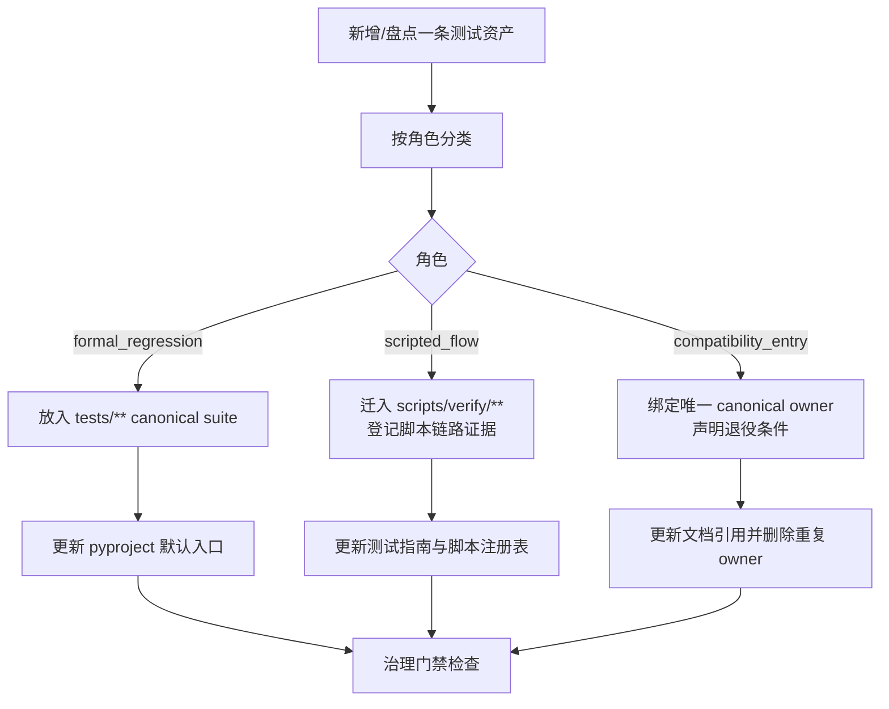

# 测试资产治理与单元测试收口技术设计

> 设计目标：把“这个仓库里的测试资产到底怎么分类、怎么承载、怎么同步文档”收口成一套可执行方案，而不是继续靠文件名、历史习惯和人工解释维持现状。
> 需求真理源：`workdocs/需求/2026-03-13_test-asset-governance-and-right-sizing/requirements.md`

## 0. 设计结论

本次主方案是：以“资产角色优先”重构测试体系。正式回归只保留在 `tests/` 下的 canonical 套件；脚本型链路验证统一迁出默认 pytest 发现路径，并由脚本链路证据注册表承接；历史兼容入口只允许薄壳存在，且必须绑定唯一 owner 和退役条件。

本次不选三类方案。第一类是继续保持现状，只在文档里解释例外；这会让 `pyproject.toml`、测试目录和文档真理源继续互相打架。第二类是只靠 `pytest` marker 或 ignore 列表做分类；这会把真实语义藏进配置细节，长期维护更脆。第三类是一次性把所有测试都大搬家；这在当前仓库规模下风险高，也不利于控制行为漂移。

最大收益是：正式回归、脚本验证、兼容入口三类资产终于各归其位，门禁结果会更可信，文档引用也能和实际入口重新对齐。最大代价是：需要做一轮目录收敛、文档改写和少量治理门禁补强，并且要接受短期内存在“迁移中”窗口，但这个窗口会有明确 owner 和退出条件。

## 1. best_practice_review

| 来源 | 采用点 | 不采用点 | 适配原因 |
|---|---|---|---|
| pytest: [Good Integration Practices](https://docs.pytest.org/en/stable/explanation/goodpractices.html) | 正式回归套件收敛到应用包外的 `tests/` 主入口；脚本与测试职责分离 | 不继续把稳定回归长期散落在 `app/tests/` 和 `tests/` 双轨承载 | 当前仓库的核心问题不是没有测试，而是正式回归与脚本验证混放 |
| pytest: [Conventions for Python test discovery](https://docs.pytest.org/en/stable/explanation/goodpractices.html#conventions-for-python-test-discovery) | 用目录和命名让“会不会被收集”一眼可见 | 不依赖大量 `--ignore`、`norecursedirs` 或文档备注去解释为什么某些 `test_*.py` 不该算正式回归 | 目录语义比配置例外更稳定，后续接手成本更低 |
| pytest: [Returning non-None value in test functions](https://docs.pytest.org/en/stable/how-to/assert.html#returning-non-none-value-in-test-functions) | 正式回归必须通过显式断言表达失败语义；返回布尔值和打印日志不算门禁 | 不接受“先跑通再人工判断”的弱测试继续占据正式回归位置 | 当前仓库已有这类资产，必须先从角色上降级或重写 |
| pytest: Good Integration Practices / import mechanisms | 将“减少 `sys.path` 魔改”作为后续收敛目标 | 不在本阶段直接切到 `--import-mode=importlib` | 当前仓库仍有多处 `sys.path.append/insert`，先做资产分层和入口收敛，再做导入模式清理更稳 |
| 仓库现有测试治理文档 | 复用 `测试用例库.md` 和 `脚本链路证据注册表.md` 作为文档承载基础 | 不新造一份平行“测试资产注册中心”文档 | 仓库已经有测试真理源，问题在于口径漂移，不在于缺一个新文档 |

### 决策权衡

1. 采用“角色分类先行，再做目录与文档收敛”，而不是先改文件再补解释，因为现在最缺的是统一判断标准。
2. 不把脚本型链路验证全部删除，因为其中有真实模型、真实数据库、真实对象存储等高价值探针；但它们必须退出正式门禁集合。
3. 不把 `app/tests/` 长期保留为与 `tests/` 同级的正式回归主入口，因为这会让新旧承载位置继续并存。
4. 不在本阶段强推 import mode 变更，因为那会把“导入机制治理”和“测试资产分类治理”混成一件事。

## 2. 四段式架构结论

### 2.1 module_boundaries

- 当前问题：
  - `pyproject.toml` 让 `app/tests` 和 `tests` 同时成为默认 pytest 入口。
  - `docs/开发文档/测试管理/测试指南与环境配置.md`、`docs/开发文档/测试管理/测试用例库.md`、产品文档中的测试追溯，以及仓库内实际文件角色并不一致。
  - 一部分脚本型资产和兼容壳文件仍占着 `test_*.py` 命名和默认发现路径。
- 最终决策：
  - 正式回归 owner：`tests/`
  - 脚本型链路验证 owner：`scripts/verify/` 与 `docs/开发文档/测试管理/脚本链路证据注册表.md`
  - 文档型测试索引 owner：`docs/开发文档/测试管理/测试用例库.md`
  - 执行说明 owner：`docs/开发文档/测试管理/测试指南与环境配置.md`
  - 历史兼容入口只做薄壳，不再拥有独立正式回归地位
- 为什么这么改：
  - 先把“谁负责什么”说清楚，后续迁移和删除才不会反复回流。
- 禁止动作：
  - 不再让脚本型验证长期伪装成默认 pytest 正式回归。
  - 不再让 `app/tests` 与 `tests` 长期作为双 canonical 正式回归入口。

### 2.2 dependency_direction

- 当前问题：
  - 现在是文件现状和历史引用在反向决定测试口径。
- 最终决策：
  - 依赖方向冻结为：`资产角色规则 -> canonical 承载位置 -> pytest/default command -> 文档追溯 -> 具体文件迁移`
  - 文档只消费 canonical 入口，不再反向赋予旧入口正式地位。
- 为什么这么改：
  - 这样设计后，迁移一个文件不会再导致多处口径失真。
- 禁止动作：
  - 不再用“这个文件以前被文档提过”作为继续保留它为正式回归的理由。
  - 不再让 ignore 列表承担主分类逻辑。

### 2.3 state_ownership

- 当前问题：
  - 一条资产是否属于正式回归、脚本验证或兼容入口，没有唯一状态 owner。
- 最终决策：
  - `formal_regression` 状态 owner：canonical pytest suite
  - `scripted_flow` 状态 owner：脚本链路证据注册表 + 独立执行命令
  - `compatibility_entry` 状态 owner：对应 canonical 入口的唯一 owner
  - `truth_source_sync` 状态 owner：测试用例库、测试指南和受影响产品文档
- 为什么这么改：
  - 同一条资产只能由一个主状态解释，评审和验收才不会出现双重口径。
- 禁止动作：
  - 不允许同一条资产同时被当成正式回归和脚本型验证。
  - 不允许兼容壳在没有退役条件时长期作为独立 owner 存活。

### 2.4 error_handling

- 当前问题：
  - 弱断言、返回布尔值、重复收集、无前置声明的联机脚本，都没有统一失败语义。
- 最终决策：
  - 正式回归失败：由断言或测试框架失败显式表达
  - 脚本型验证失败：由前置条件不满足、期望产物缺失或显式失败判定表达
  - 兼容入口失败：由 owner 漂移、重复收集或退役条件缺失表达
  - 设计完成后新增一条轻量治理门禁，静态检查测试资产角色和入口合同是否被破坏
- 为什么这么改：
  - 把失败语义收回到各自 owner，才能在 review/verify 阶段稳定复用。
- 禁止动作：
  - 不再接受“运行完了但要人工理解才知道是否失败”的正式回归。
  - 不再接受“重复入口先留着，之后再说”的无期限双轨。

## 3. 技术流程图



- 这张图在帮助实现者、评审者和后续维护者理解：这次设计不是“清理几个测试文件”，而是把测试资产从发现、执行到文档追溯的整条链路收口。

## 4. module_change_plan

| module | current_problem | target_change | why_this_way | affected_paths | owner |
|---|---|---|---|---|---|
| pytest 默认入口 | 默认收集 `app/tests` + `tests`，正式回归边界不清 | 最终把 default testpaths 收敛到 `tests`，`app/tests` 退出默认正式回归主入口 | 官方更推荐把常规测试放在应用包外；仓库当前也更适合按风险层级组织 | `pyproject.toml` | test governance |
| 正式回归承载 | `app/tests` 内混有真实回归和脚本型资产 | 将活跃正式回归按语义迁移到 `tests/unit`、`tests/api`、`tests/integration` | 让测试层级与失败语义对齐，便于门禁和追溯 | `app/tests/**`, `tests/**` | test governance |
| 脚本型链路验证 | 多个 `test_*.py` 文件实际是手工脚本或联机探针 | 迁出默认发现路径，统一改为 `scripts/verify/**` 或同级脚本承载，并保留显式命令入口 | 脚本有价值，但不应继续占用正式回归语义 | `app/tests/test_chat.py`, `app/tests/test_complex_scenario.py`, `app/tests/test_minio_connection.py`, `tests/test_ask_data_flow.py`, `tests/test_shortcuts.py`, `tests/test_todo_complex_flow.py`, `tests/test_todo_comprehensive_suite.py`, `tests/test_todo_e2e_real.py`, `tests/test_vanna_retrieval.py` | scripted flow owner |
| 兼容入口治理 | 某些薄壳文件只为旧命令或旧文档存在，但会形成重复收集 | 保留兼容壳仅作为短期过渡；文档更新后删除重复 owner | 兼容入口可以短留，但不能继续算独立测试资产 | `tests/unit/test_todo_graph_semantic_guard.py` | canonical suite owner |
| 测试真理源文档 | `测试用例库.md`、`测试指南与环境配置.md`、产品文档中的入口引用与现实漂移 | 把文档分为“正式回归入口”“脚本型验证入口”“业务用例/案例文档入口”三层，并同步受影响产品文档 | 让文档先服务判断，再服务执行，而不是继续混杂 | `docs/开发文档/测试管理/测试用例库.md`, `docs/开发文档/测试管理/测试指南与环境配置.md`, `docs/开发文档/测试管理/脚本链路证据注册表.md`, `docs/产品文档/待办助手需求.md`, `docs/产品文档/问数助手需求.md` | docs governance |
| 弱测试防回流 | 当前可以写出返回布尔值、只打印日志的“测试”并进入收集 | 在现有资产收口后增加治理门禁：阻断 `PytestReturnNotNoneWarning` 类问题，并增加静态 contract test | 先清当前问题，再补自动门禁，避免坏模式回流 | `pyproject.toml`, `tests/unit/test_test_asset_governance_contract.py` | test governance |
| 导入耦合治理 | 当前仍有多处 `sys.path.append/insert` | 本轮先登记为后续治理项，只在迁移过程中顺手减少新增长点 | 这是第二阶段问题，不和资产分类治理混在同一轮收口 | `app/tests/**`, `tests/**` | test governance |

## 5. change_map

```yaml
change_map:
  new_paths:
    - path: scripts/verify/
      purpose: 承载脚本型链路验证，退出默认 pytest 发现路径
    - path: tests/unit/test_test_asset_governance_contract.py
      purpose: 轻量检查入口约束、兼容壳和弱测试回流
  modified_paths:
    - path: pyproject.toml
      purpose: 收敛 pytest 默认入口，并在收口后补强治理门禁
    - path: docs/开发文档/测试管理/测试指南与环境配置.md
      purpose: 区分正式回归命令与脚本型验证命令
    - path: docs/开发文档/测试管理/测试用例库.md
      purpose: 按角色重写资产索引与脚本盘点口径
    - path: docs/开发文档/测试管理/脚本链路证据注册表.md
      purpose: 成为脚本型验证的 canonical 注册表
    - path: docs/产品文档/待办助手需求.md
      purpose: 从直接文件引用改为更稳定的案例入口/正式回归入口
    - path: docs/产品文档/问数助手需求.md
      purpose: 同上
    - path: app/tests/**
      purpose: 迁移正式回归，清出脚本型资产
    - path: tests/**
      purpose: 接收迁移后的 canonical 正式回归资产
  deleted_paths:
    - path: tests/unit/test_todo_graph_semantic_guard.py
      purpose: 删除重复 owner 的兼容壳
  replaced_responsibilities:
    - old_path: app/tests 作为默认正式回归主入口
      replaced_by: tests/**
      note: app/tests 从默认发现位置退场，必要的历史资产要么迁移，要么改类为脚本型验证
    - old_path: test_*.py 脚本文件
      replaced_by: scripts/verify/** or canonical tests/**
      note: 按角色拆分后分别进入脚本验证或正式回归
    - old_path: 产品文档直接指向脚本式文件
      replaced_by: 业务案例文档或 canonical suite 入口
      note: 减少文件迁移时的级联文档漂移
```

## 6. deletion_plan

```yaml
deletion_plan:
  - path_or_symbol: tests/unit/test_todo_graph_semantic_guard.py
    current_responsibility: 复用 test_todo_nodes 中的测试类，为旧命令提供兼容入口
    remove_reason: 会形成重复收集与重复 owner；同一目标应由 canonical suite owner 承担
    replaced_by: tests/unit/test_todo_nodes.py
    cleanup_timing: implementation phase 2（文档和命令引用更新后）

  - path_or_symbol: app/tests/test_chat.py
    current_responsibility: 手工聊天联机脚本，文件名与目录位置会误导为正式 pytest
    remove_reason: 资产角色属于 scripted_flow，不应继续占用正式回归命名和入口
    replaced_by: scripts/verify/chat_stream_smoke.py
    cleanup_timing: implementation phase 1

  - path_or_symbol: app/tests/test_complex_scenario.py
    current_responsibility: 手工复杂场景演练脚本
    remove_reason: 不具备稳定门禁断言，属于 scripted_flow
    replaced_by: scripts/verify/todo_complex_scenario.py
    cleanup_timing: implementation phase 1

  - path_or_symbol: app/tests/test_minio_connection.py
    current_responsibility: 真实 MinIO 联机探针
    remove_reason: 依赖真实外部服务，应由脚本链路证据注册表承接
    replaced_by: scripts/verify/minio_connection.py
    cleanup_timing: implementation phase 1

  - path_or_symbol: tests/test_vanna_retrieval.py
    current_responsibility: 真实 DB/模型检索探针
    remove_reason: 断言语义薄弱，且更符合 scripted_flow
    replaced_by: scripts/verify/vanna_retrieval.py
    cleanup_timing: implementation phase 1

  - path_or_symbol: app/tests/test_todo_multiround.py::test_intent_analysis/test_parameter_extraction/test_guardrails
    current_responsibility: 以 pytest 名义承载打印式场景验证
    remove_reason: 这三条正式回归失败语义不足，要么重写为真正 contract test，要么降级为脚本型验证
    replaced_by: tests/unit/** canonical contract tests 或 scripts/verify/todo_multiround.py
    cleanup_timing: implementation phase 2
```

## 7. db_migration_contract

```yaml
db_migration_contract:
  db_migration_required: false
  db_change_scope: none
  db_migration_mode: none
  release_migration_required: false
  db_rollback_strategy: none
```

## 8. shrink_contract

```yaml
shrink_contract:
  obsolete_paths:
    - app/tests 作为默认正式回归主入口
    - test_*.py 脚本型资产继续留在 pytest 默认发现路径
    - 重复 owner 的兼容壳测试文件
    - 产品文档直接绑定脚本式文件路径
  retained_paths:
    - path: tests/
      reason: 保留为 canonical 正式回归套件主入口
    - path: docs/开发文档/测试管理/测试用例库.md
      reason: 保留全局测试索引与风险矩阵 owner
    - path: docs/开发文档/测试管理/测试指南与环境配置.md
      reason: 保留执行说明 owner
    - path: docs/开发文档/测试管理/脚本链路证据注册表.md
      reason: 保留脚本型验证的真理源入口
    - path: scripts/verify/
      reason: 保留对真实依赖探针的承载能力
  single_entry_owner: tests/
  line_budget:
    scope: whole_change_set
    expectation: negative_or_neutral
    added_paths:
      - scripts/verify/
      - tests/unit/test_test_asset_governance_contract.py
    deleted_paths:
      - tests/unit/test_todo_graph_semantic_guard.py
      - app/tests/test_chat.py
      - app/tests/test_complex_scenario.py
      - app/tests/test_minio_connection.py
      - tests/test_vanna_retrieval.py
      - other scripted test_*.py paths after reclassification
    reason: 允许新增承载脚本验证和治理门禁的少量路径，但整体目标是减少误导性测试文件和重复入口
```

## 9. implementation_seeds

```yaml
implementation_seeds:
  - task_id: T-01
    design_item: D-01
    feature_id: TEST-GOV-01
    blocked_by: []
    file_paths:
      - docs/开发文档/测试管理/测试用例库.md
      - docs/开发文档/测试管理/测试指南与环境配置.md
      - docs/开发文档/测试管理/脚本链路证据注册表.md
      - docs/产品文档/待办助手需求.md
      - docs/产品文档/问数助手需求.md
    symbols:
      - asset roles
      - canonical suite entry
      - scripted flow registry
    change_type: modify

  - task_id: T-02
    design_item: D-02
    feature_id: TEST-GOV-02
    blocked_by: [T-01]
    file_paths:
      - app/tests/test_chat.py
      - app/tests/test_complex_scenario.py
      - app/tests/test_minio_connection.py
      - tests/test_ask_data_flow.py
      - tests/test_shortcuts.py
      - tests/test_todo_complex_flow.py
      - tests/test_todo_comprehensive_suite.py
      - tests/test_todo_e2e_real.py
      - tests/test_vanna_retrieval.py
      - scripts/verify/
    symbols:
      - scripted flow relocation
      - verify command owner
      - runtime prerequisites
    change_type: move_refactor

  - task_id: T-03
    design_item: D-03
    feature_id: TEST-GOV-03
    blocked_by: [T-01]
    file_paths:
      - app/tests/test_data_agent.py
      - app/tests/test_handoff_detection.py
      - app/tests/test_health.py
      - app/tests/test_middlewares.py
      - app/tests/test_skill_loader_tool.py
      - app/tests/test_skill_catalog_manifest.py
      - app/tests/test_skill_runtime_mode_switch.py
      - app/tests/test_skill_runtime_replay.py
      - app/tests/test_todo_db_integration.py
      - app/tests/test_todo_graph_integration.py
      - app/tests/test_user.py
      - tests/unit/
      - tests/api/
      - tests/integration/
    symbols:
      - canonical regression migration
      - suite layering
      - path ownership
    change_type: move_refactor

  - task_id: T-04
    design_item: D-04
    feature_id: TEST-GOV-04
    blocked_by: [T-01, T-03]
    file_paths:
      - tests/unit/test_todo_graph_semantic_guard.py
      - tests/unit/test_todo_nodes.py
      - app/tests/test_todo_multiround.py
      - tests/unit/
    symbols:
      - compatibility shell retirement
      - weak assertion rewrite
      - canonical owner cleanup
    change_type: delete_refactor

  - task_id: T-05
    design_item: D-05
    feature_id: TEST-GOV-05
    blocked_by: [T-02, T-03, T-04]
    file_paths:
      - pyproject.toml
      - tests/unit/test_test_asset_governance_contract.py
    symbols:
      - default testpaths
      - return-not-none guard
      - governance contract
    change_type: modify_create
```

## 10. execution_chain_seed

```yaml
execution_chain_seed:
  - stage: phase_1_classify_and_sync_docs
    goal: 先冻结资产角色和文档 owner，避免边迁移边失真
    tasks: [T-01]
    acceptance_focus:
      - 文档中能明确区分 formal_regression / scripted_flow / compatibility_entry
      - 受影响产品文档不再直接绑定问题文件为唯一入口

  - stage: phase_2_move_scripted_flows_out_of_discovery
    goal: 先把最容易误导的脚本型 test_*.py 迁出默认 pytest 入口
    tasks: [T-02]
    acceptance_focus:
      - 迁出后的脚本具备前置条件、命令、期望产物和失败判定
      - 默认 pytest 入口不再收集这些脚本

  - stage: phase_3_migrate_formal_regressions_to_canonical_suite
    goal: 把仍有价值的 app/tests 正式回归迁到 tests 分层目录
    tasks: [T-03]
    acceptance_focus:
      - 正式回归在 tests/unit|api|integration 下可定位
      - app/tests 不再作为正式回归主入口

  - stage: phase_4_remove_duplicate_and_weak_entries
    goal: 清掉重复 owner 和弱断言资产
    tasks: [T-04]
    acceptance_focus:
      - 重复兼容壳不再被收集
      - 弱断言资产要么重写成 contract test，要么降级为 scripted_flow

  - stage: phase_5_enable_governance_guard
    goal: 在收口后防止坏模式回流
    tasks: [T-05]
    acceptance_focus:
      - pytest 默认入口与文档口径一致
      - return-non-none / 重复 owner / 脚本回流有静态门禁
```

## 11. clarify_handoff_contract

```yaml
clarify_handoff_contract:
  requirement_source: workdocs/需求/2026-03-13_test-asset-governance-and-right-sizing/requirements.md
  handoff_version: v1
  design_items:
    - design_item_id: D-01
      covers:
        fr_ids: [FR-01, FR-05, FR-07]
      summary: 先定义资产角色、canonical owner 和文档同步边界
    - design_item_id: D-02
      covers:
        fr_ids: [FR-03, FR-05]
      summary: 把脚本型链路验证从默认 pytest 发现路径剥离，并交给脚本注册表管理
    - design_item_id: D-03
      covers:
        fr_ids: [FR-01, FR-06]
      summary: 将正式回归收敛到 tests canonical suite
    - design_item_id: D-04
      covers:
        fr_ids: [FR-02, FR-04]
      summary: 退役重复兼容壳，处理弱断言和重复 owner
    - design_item_id: D-05
      covers:
        fr_ids: [FR-02, FR-07]
      summary: 在收口后补上轻量治理门禁，防止坏模式回流
```

## 12. 不选方案

### 12.1 方案 A：保持双入口，只靠文档解释

- 不选原因：
  - 这会让 `pyproject.toml`、目录结构和文档继续长期分叉。
  - 新人看到 `app/tests` 和 `tests` 仍然不知道哪个才是正式回归 owner。

### 12.2 方案 B：只靠 marker / ignore 配置分类

- 不选原因：
  - 角色信息会藏在配置细节里，文件本身仍然看起来像正式回归。
  - 这会把“为什么不收这条测试”变成二次解释成本。

### 12.3 方案 C：一轮内把全部测试资产一次性重写

- 不选原因：
  - 当前仓库测试资产量大，且部分模块仍活跃迭代，一次性重写容易引入额外漂移。
  - 更合理的做法是先冻结角色和入口，再按阶段迁移。

## 13. 风险与回退

| 风险 | 影响 | 回退口径 |
|---|---|---|
| 文档先改、文件后迁期间出现短期不一致 | 执行者可能需要同时看新旧入口 | 在实现阶段按 phase 顺序推进，并在每阶段显式标记 canonical 入口 |
| `app/tests` 中部分正式回归迁移过程中出现导入问题 | 默认门禁可能临时掉用例 | 迁移按模块分批进行，每批先落目标目录再切入口 |
| 将脚本迁出默认发现路径后，团队短期不习惯新命令 | 联机验证执行率下降 | 用脚本注册表和测试指南补充明确命令，避免靠口头传播 |
| 将 `PytestReturnNotNoneWarning` 提升为门禁过早触发 | 会先拦住现有历史问题 | 先完成当前弱资产收口，再打开门禁，不提前混用 |

