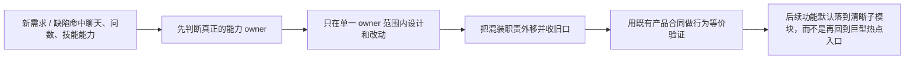

# AI 核心热点模块重构需求（阶段一）

这次要解决的不是新功能不够，而是聊天主图、问数语义层、技能运行时这三块核心能力长期把太多职责揉在了一起，已经让后续开发、排障和评审越来越慢，也越来越容易误伤其他链路。现在做，是因为项目还没上线，重构成本最低，而且仓库规则已经明确把热点文件继续长胖视为高风险。最直接受影响的是后续所有聊天、问数、技能相关需求的实现者、评审者和调试者。做完后，最终用户不应该看到产品语义变化，但团队会明显感受到：改一个能力不再顺带碰三块逻辑，定位问题更快，回归范围更小。阶段一的目标不是一次性“重写一切”，而是先把最危险的混装职责拆开，让后续设计和实现有稳定落点。

## 当前问题证据

| 热点模块 | 当前规模 | 对应阈值 | 当前问题 |
|---|---:|---:|---|
| 聊天主图 owner | 7286 行、221 个顶层定义 | 1500 行 | 同时承担编排、语义兜底、流式分发、外部结果整理、技能运行时接线 |
| 问数核心 owner | 4695 行、113 个顶层定义 | 1500 行 | 同时承担意图理解、澄清、SQL 生成、执行、图表、结果增强 |
| 技能运行时 owner | 3531 行、1 个 91 方法的大类 | 800 行 | 同时承担定义解析、版本治理、用户绑定、检索、catalog、会话加载 |

补充判断：

1. 三个热点模块都超过仓库阈值 3 倍以上，已经不是“略大”，而是持续影响开发方式的结构风险。
2. 现有文档已多次把这些热点标记为“继续跟踪、后续仍需拆职责”，说明问题不是新发现，而是一直缺一份正式的重构需求来驱动收口。
3. 当前仓库规则已经有 `lean-guard`、`touch_scope audit` 和 `single_entry_owner`，但如果没有一份明确需求，下游设计仍然容易陷入“先顺手改热点文件”的老路径。

## 业务流程图



这张图回答的是“这次重构到底想把后续开发路径改成什么样”。最关键的一步是“先判断真正的能力 owner”，因为只要 owner 还说不清，代码就会继续往旧热点里堆；最容易歧义的一步是“把混装职责外移并收旧口”，因为这不是单纯拆文件，而是必须同时处理旧入口退役问题。

## 最佳实践核验摘要（2026-03-13）

当前需求以官方或一手资料为依据，先冻结以下判断：

1. FastAPI 官方建议，应用一旦变大，就应按路由和职责拆成多个模块，而不是继续把能力堆在单文件里。[Bigger Applications - Multiple Files](https://fastapi.tiangolo.com/tutorial/bigger-applications/)
2. LangGraph 官方建议，复杂多智能体系统应把可独立演化的部分拆成 subgraph，并通过父图和子图之间的显式接口通信，而不是把所有编排和局部逻辑塞进一个大图文件。[Use Subgraphs](https://docs.langchain.com/oss/python/langgraph/use-subgraphs)
3. LangChain 官方在多智能体文档中明确建议，大多数多智能体系统应该让子代理分别处理专门子任务，并只暴露必要上下文与接口，避免中心节点无限膨胀。[Multi-agent Patterns](https://docs.langchain.com/oss/python/langchain/multi-agent)
4. Pylint 官方将“模块太长”视为直接的可维护性问题，并指出把职责拆到包或更小模块通常是唯一现实做法。[too-many-lines / C0302](https://pylint.pycqa.org/en/latest/user_guide/messages/convention/too-many-lines.html)
5. Pylint 官方将“公开方法过多”视为单一职责被破坏的明显信号，说明一个类很可能承担了过多职责。[too-many-public-methods / R0904](https://pylint.pycqa.org/en/latest/user_guide/messages/refactor/too-many-public-methods.html)
6. Pylint 官方将“语句过多”视为需要拆分函数的信号，意味着不仅文件要拆，长函数本身也要重新划清职责边界。[too-many-statements / R0915](https://pylint.pycqa.org/en/latest/user_guide/messages/refactor/too-many-statements.html)

## requirements_contract

```yaml
topic: ai_hotspot_module_refactor_phase1
problem_statement:
  - 聊天主图、问数语义层、技能运行时三个核心热点模块长期承担了过多混装职责，导致修改爆炸半径过大、问题定位困难、治理规则难以真正落地。
business_goals:
  - bg_id: BG-01
    goal: 为聊天主图、问数语义层、技能运行时建立清晰的单一 owner 边界，避免后续需求继续默认落回巨型热点入口。
  - bg_id: BG-02
    goal: 在不改变现有产品语义的前提下，显著降低后续开发、排障和评审的改动爆炸半径。
  - bg_id: BG-03
    goal: 让仓库现有的热点治理规则从“文本要求”升级为“有明确重构目标和验收口径的落地任务”。
primary_users:
  - 后续实现聊天、问数、技能需求的开发者
  - 代码评审者与验收者
  - 负责后续设计拆分的架构与需求人员
success_definition:
  - 后续变更不再默认回到三大热点入口，而是能落到明确的能力 owner。
  - 聊天流式、问数澄清与查询、技能检索与加载三类核心产品行为保持稳定，不因重构漂移。
  - 每个重构切片都能说清：新 owner 是谁、旧职责删了什么、暂留什么、何时失效。
design_source: workdocs/设计/2026-03-13_ai-hotspot-module-refactor/design.md
design_approved: false
design_approval_evidence: pending_user_review
design_freeze_summary:
  - 三个热点入口保留为薄壳 owner，不做大爆炸重写。
  - workflow 层不再继续承担问数主语义文本抽取。
  - skill_service 收口为公共 façade，catalog/retrieval/runtime 必须拆 owner。
  - 阶段一默认行为等价优先，不顺手改产品语义。
clarify_handoff_source: workdocs/设计/2026-03-13_ai-hotspot-module-refactor/design.md#clarify_handoff_contract
clarify_handoff_version: v1
implementation_plan_source: workdocs/任务拆解/2026-03-13_ai-hotspot-module-refactor/contracts/implementation_plan.md
uat_cases_source: workdocs/任务拆解/2026-03-13_ai-hotspot-module-refactor/contracts/uat_cases.md
```

## product_contract_matrix

| bg_id | 业务目标 | 当前痛点 | 用户看到的变化 | 成功判定 |
|---|---|---|---|---|
| BG-01 | 建立清晰 owner 边界 | 后续需求总是默认回到旧热点入口，谁该负责说不清 | 团队能先判断“这次到底改聊天编排、问数语义，还是技能运行时” | 设计与评审材料能明确写出每个切片的单一 owner |
| BG-02 | 降低改动爆炸半径 | 改一块逻辑经常顺带动到多块无关代码，回归范围越来越大 | 后续需求可以在更小范围内定位、改动和验证 | 日常功能改动大多可限制在单一能力切片及一跳依赖 |
| BG-03 | 让治理规则真正落地 | 现在大家知道热点文件不该继续长胖，但缺正式重构目标和验收口径 | 重构不再是“有空再说”，而是有明确范围和拒绝条件的正式任务 | 需求、设计、实现、验收能围绕同一组重构合同推进 |

## fr_contract_matrix

```yaml
- fr_id: FR-01
  scenario_id: S-01
  user_value: 后续开发者在命中聊天、问数、技能能力时，能立刻判断这次需求真正属于哪个 owner，而不是继续回到旧热点入口试探。
  trigger: 任一新需求、缺陷修复或重构任务触及聊天主图、问数语义层或技能运行时能力时。
  input_contract:
    required_fields: [触发能力, 当前痛点, 受影响链路]
    optional_fields: [历史热点位置, 既有坏味道记录]
  output_contract:
    required_fields: [单一_owner结论, 相邻职责边界, 禁止继续混装的职责]
  failure_semantics: 若 owner 边界说不清，后续设计必须视为未收敛，禁止直接进入实现。
  acceptance_story: 评审者能在不读全部旧热点代码的情况下回答“这次改动到底归谁管”。
  linked_business_goals: [BG-01, BG-02]

- fr_id: FR-02
  scenario_id: S-02
  user_value: 任何从热点入口外移的职责，都必须同时处理旧入口收口，避免“新旧双轨都在”继续拖大系统。
  trigger: 某一项混装职责准备从热点入口拆出时。
  input_contract:
    required_fields: [待外移职责, 新_owner, 旧入口状态]
    optional_fields: [暂留理由, 过渡期风险]
  output_contract:
    required_fields: [obsolete_paths, retained_paths, expiry_condition, single_entry_owner]
  failure_semantics: 若新职责已落地但旧路径仍长期保留且无失效条件，重构必须判定为不通过。
  acceptance_story: 团队能看清这次到底删了什么旧口，而不是只看到“又多了一个新模块”。
  linked_business_goals: [BG-01, BG-03]

- fr_id: FR-03
  scenario_id: S-03
  user_value: 最终用户不会因为内部拆分而看到聊天、问数、技能行为漂移。
  trigger: 任一重构切片影响聊天流式、问数澄清/查询、技能检索/加载运行时行为时。
  input_contract:
    required_fields: [现有产品合同, 回归场景种子, 期望保持稳定的行为]
    optional_fields: [历史缺陷样本, 旧链路兼容样本]
  output_contract:
    required_fields: [稳定行为清单, 回归验证范围, 不允许漂移的关键语义]
  failure_semantics: 若重构导致关键产品语义变化而需求未显式批准，则该切片必须回退为未通过。
  acceptance_story: 用户已有的聊天中断恢复、问数澄清与技能自动触发行为在重构后仍然成立。
  linked_business_goals: [BG-02]

- fr_id: FR-04
  scenario_id: S-04
  user_value: 后续常规需求和缺陷修复能在更小范围内完成，不再每次都需要横跨聊天、问数、技能三块一起排查。
  trigger: 重构完成后的后续需求或缺陷命中任一能力切片时。
  input_contract:
    required_fields: [变更目标, 所属能力, 预期影响范围]
    optional_fields: [历史跨层耦合点, 已知回归高风险点]
  output_contract:
    required_fields: [推荐变更落点, 最小回归范围, 需要观察的一跳依赖]
  failure_semantics: 若一个日常改动仍然必须反复穿透多个能力 owner 才能完成，则说明阶段一重构目标没有达成。
  acceptance_story: 评审者可以把日常改动的 review 范围压缩到单一切片和少量邻接契约。
  linked_business_goals: [BG-02]

- fr_id: FR-05
  scenario_id: S-05
  user_value: 现有热点治理规则能被这次重构真正消费，而不是继续停留在“知道要瘦身，但没有落点”的状态。
  trigger: 设计和验收阶段需要判断这次重构是否真的消除了热点混装问题时。
  input_contract:
    required_fields: [热点阈值, 当前规模证据, 收口目标]
    optional_fields: [历史治理记录, 复杂度对照]
  output_contract:
    required_fields: [复杂度变化口径, shrink_only约束, 失败条件]
  failure_semantics: 若重构后仍无法证明热点职责减少、旧职责收口或后续不再默认回流热点入口，则不得宣称治理完成。
  acceptance_story: 团队能用同一口径判断“这次是真的瘦身，还是只是把代码搬了个地方”。
  linked_business_goals: [BG-03]

- fr_id: FR-06
  scenario_id: S-06
  user_value: 下游设计阶段不需要重新猜这次重构到底解决什么、优先拆什么、哪些不该一起动。
  trigger: 需求澄清完成并准备进入设计时。
  input_contract:
    required_fields: [问题定义, 范围边界, 成功判定]
    optional_fields: [阶段划分假设, 已知高风险耦合]
  output_contract:
    required_fields: [设计聚焦点, 拆分优先级, 明确非目标]
  failure_semantics: 若设计阶段仍需重新定义问题和边界，说明需求澄清不合格。
  acceptance_story: 设计阶段可以直接围绕模块边界、依赖方向、状态归属和错误处理责任展开，不必重复做问题发现。
  linked_business_goals: [BG-01, BG-03]

- fr_id: FR-07
  scenario_id: S-07
  user_value: 这次重构可以按切片逐步交付，而不是逼迫团队在一次大改中同时重写三块核心能力。
  trigger: 设计阶段判断三大热点不适合一次性完成所有拆分时。
  input_contract:
    required_fields: [阶段划分, 每阶段稳定合同, 切片顺序]
    optional_fields: [回退锚点, 并行约束]
  output_contract:
    required_fields: [phase_definition, per_phase_scope, protected_contracts]
  failure_semantics: 若只能以“大爆炸重写”作为唯一方案，则本次需求风险过高，需要重新收敛阶段目标。
  acceptance_story: 每个阶段都能单独通过回归验证并为下一阶段减少热点职责，而不是把风险一次性堆满。
  linked_business_goals: [BG-02, BG-03]
```

## nfr_contract_matrix

```yaml
- nfr_id: NFR-01
  dimension: owner清晰度
  requirement: 每个重构切片都必须明确单一 owner，并声明旧职责是删除、暂留还是升级到后续阶段；双真源状态数量必须等于 0。
  observable_signal: 设计与验收材料中能直接看到 single_entry_owner、obsolete_paths、retained_paths 和 expiry_condition。

- nfr_id: NFR-02
  dimension: 热点收口
  requirement: 命中热点模块的切片必须遵守 shrink-only 语义；触达的超阈值热点文件不得继续净增长，不得继续新增私有 helper 或嵌套函数。
  observable_signal: Lean Guard 检查通过，且重构证据中能看到净增减、删除清单和重复收敛结果。

- nfr_id: NFR-03
  dimension: 职责纯度
  requirement: 单个 owner 模块不得继续同时承担编排、主语义判定、展示转换、运行时恢复、治理策略五类职责中的三类及以上。
  observable_signal: 设计文档和 review 材料能列出每个 owner 负责的职责组，且无三类以上混装。

- nfr_id: NFR-04
  dimension: 行为稳定性
  requirement: 聊天流式与恢复、问数澄清与查询、技能检索与加载三类关键行为必须在重构前后保持同口径。
  observable_signal: 针对聊天、问数、技能的最小回归种子全部通过，且未新增未解释的行为漂移。

- nfr_id: NFR-05
  dimension: 分阶段可交付
  requirement: 阶段一必须允许按切片交付，每个切片都应有独立的受保护合同与回归范围，不依赖一次性大爆炸重写。
  observable_signal: 设计与计划材料中存在 per_phase_scope、protected_contracts 和独立验收种子。

- nfr_id: NFR-06
  dimension: 语义边界
  requirement: 本次重构不得新增“关键词/正则/substring 在编排层承担主语义判定”的路径，新增数量必须等于 0。
  observable_signal: restricted path 下没有新增主语义词表，审查材料中无新增语义越界说明。
```

## acceptance_seed_matrix

| acceptance_seed_id | 场景 | 输入种子 | 期望现象 |
|---|---|---|---|
| AS-01 | 聊天主链局部改动 | “调整聊天流式中的外部结果展示方式” | 改动应优先落在聊天编排或展示 contract 对应切片，不应顺带修改问数或技能运行时 owner |
| AS-02 | 问数局部改动 | “修正时间澄清与 TopN 继承行为” | 改动应集中在问数语义与查询切片，聊天层只消费结构化结果，不再承担二次语义猜测 |
| AS-03 | 技能局部改动 | “调整技能版本选择与会话加载行为” | 管理治理、检索排序、会话加载应能分开定位，不再都挤在同一热点入口 |
| AS-04 | 拆职责并收旧口 | “把一个混装职责从热点入口外移到独立 owner” | 同轮必须给出旧路径删除或暂留失效条件，不能出现长期双轨并存 |
| AS-05 | 行为等价回归 | “聊天 interrupt/resume、问数澄清/查询、技能自动触发/加载” | 三类关键行为重构前后同口径，不因内部拆分产生产品语义漂移 |
| AS-06 | 治理落地验证 | “后续 PR 再次触达热点模块” | 若无 shrink 证据、无 owner 收口、或继续把新能力写回热点入口，应被明确阻断 |

## traceability_seed_matrix

| bg_id | fr_id | scenario_id | acceptance_seed_ids | design_focus |
|---|---|---|---|---|
| BG-01 | FR-01 | S-01 | AS-01, AS-02, AS-03 | 如何把聊天、问数、技能三个核心能力重新冻结为清晰的单一 owner 边界 |
| BG-01 | FR-02 | S-02 | AS-04 | 如何做到“新 owner 生效的同时旧入口真正收口”，避免只做文件搬家 |
| BG-02 | FR-03 | S-03 | AS-05 | 如何在拆职责时保护聊天、问数、技能三类关键产品合同不漂移 |
| BG-02 | FR-04 | S-04 | AS-01, AS-02, AS-03 | 如何把未来日常改动的影响范围压缩到单切片和一跳依赖 |
| BG-03 | FR-05 | S-05 | AS-04, AS-06 | 如何让热点治理从规则文本落地为真正可验证的重构结果 |
| BG-01 | FR-06 | S-06 | AS-06 | 设计阶段最该先冻结哪些边界，才能避免后续继续边做边猜 |
| BG-02 | FR-07 | S-07 | AS-05, AS-06 | 如何把整体重构切成可独立验证的阶段，而不是一次性大改冒险 |

## out_of_scope

1. 本次不新增新的聊天、问数或技能产品能力。
2. 本次不直接决定具体代码文件名、类名、函数签名或表结构改法。
3. 本次不把三大热点一次性重写成全新框架，也不承诺整仓改写为另一套工作流 API。
4. 本次不顺带重做前端交互、管理后台界面或非相关业务模块。
5. 本次不以“为了以后可能扩展”引入额外 agent、额外 planner、额外 router 或新的双轨 fallback。

## constraints_and_assumptions

1. 项目当前未上线，默认优先架构正确和职责收口，而不是历史兼容最小改动。
2. 阶段一的主目标是“拆混装职责 + 收旧口 + 保行为”，不是追求一次性把所有技术债务清零。
3. 当前三个热点模块规模已分别约 7.3k / 4.7k / 3.5k 行，均显著超过仓库热点阈值，因此需求默认接受按阶段推进，而不强求一次性全部达标。
4. 若重构过程中发现必须调整稳定产品合同或接口语义，必须显式回到对应产品/API 真理源重新澄清，不得偷偷借“内部重构”名义带过。
5. 现有仓库规则中的 `touch_scope audit`、`lean-guard`、`single_entry_owner` 仍然生效；本需求只是把它们转化为具体的重构目标和验收语义。
6. 本需求的最佳实践判断以 2026-03-13 当天核验到的官方资料为依据；若官方建议发生明显变化，需要在后续设计阶段重新确认。
7. 本次默认以聊天主图、问数语义层、技能运行时三块核心能力为主战场，但允许设计阶段把必要的一跳依赖纳入同一重构切片。

## approval

```yaml
status: draft
owner: AI collaboration / product clarification
approved: false
next_step: jjk-design
approval_notes:
  - 待在设计阶段进一步确认阶段一的切片顺序，是先拆聊天主图，还是先拆问数与技能的独立 owner。
  - 当前需求默认“行为等价优先”，若后续希望借重构顺手改产品语义，需要单独补澄清。
```
