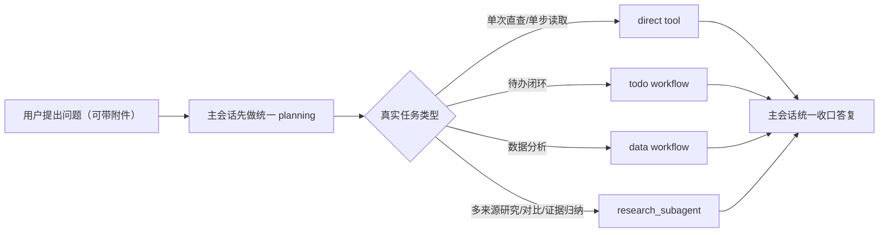

# 统一 `research_subagent` 一期需求

本次要解决的不是“再多造几个 agent”，而是把项目里 `tool / subagent / workflow` 的边界说清楚，并先落一版最小可行的 `research_subagent`。现在做这件事，是因为现有文档已经出现了 `research_subagent` 的目标形态，但什么时候该走它、什么时候不该走它，还没有被写成可执行的需求合同。最直接受影响的是后续所有 AI 方案设计、评审和重构工作；最终受益的是聊天用户，因为多来源知识库与联网研究任务会更干净、更稳，不会把大量中间上下文污染主会话。做完后，用户看到的变化应该是：复杂研究类问题得到更像“结论 + 证据”的回复，而不是一串搜索噪声；同时知识库图文展示能力不能退化，附件也不会因为“带了文件”就被错误送进研究链路。

## 业务流程图



这张图回答的是“附件和研究到底谁先决定谁”。最关键的一步是主会话先做统一 planning，因为附件只是输入工件，不应该天然绑定研究链路；最容易歧义的一步是研究路由触发条件，本次只把“多来源研究/对比/证据归纳”冻结为 `research_subagent` 的首批适用范围。

## 最佳实践核验摘要

本需求基于当前官方或一手资料冻结以下判断：

1. LangChain 官方把 subagent 的主要价值写成上下文隔离，适合把高噪声、长中间过程的任务从主会话中拆出去，避免主链路 context bloat。
2. LangChain 官方同时强调，不是所有能力都该拆成 subagent；简单、原子的一次调用更适合继续保留为 tool。
3. LangGraph 官方把 subgraph 适用场景定义为“有明确局部状态机、可复用流程、需要独立状态边界”的任务，这更接近待办确认、问数澄清、安全校验这类场景。
4. OpenAI 官方在多 agent 编排文档里明确区分了“manager 通过 tool 调用专家完成 bounded task”和“handoff 接管当前会话”两种模式；本需求目标属于前者，不改变主会话 owner。
5. 因此，本项目的 `knowledge + web` 多来源研究任务应优先走统一 `research_subagent`；`todo` 和核心 `data` 继续保留为 workflow，不为了抽象统一而强行 agent 化。

参考来源：

1. LangChain: Multi-agent / Subagents
2. LangGraph: Use subgraphs
3. OpenAI Agents SDK: Multi-agent / Handoffs / Sessions

## requirements_contract

```yaml
topic: unified_research_subagent_phase1
problem_statement:
  - 当前项目已经有“research_subagent”的目标口径，但缺少可执行的需求合同，导致知识库、联网研究、附件与主会话之间的边界仍然容易漂移。
  - knowledge/web 研究类任务会产生大量中间上下文；若直接回灌主会话，容易造成主链路污染、后续任务串味和答复质量不稳定。
business_goals:
  - bg_id: BG-01
    goal: 冻结 `tool / subagent / workflow` 的判定规则，让后续设计和评审不再反复争论边界。
  - bg_id: BG-02
    goal: 落地首批统一 `research_subagent`，只承接 `knowledge + web` 多来源研究任务。
  - bg_id: BG-03
    goal: 保证知识库图文展示能力在引入 `research_subagent` 后不退化。
  - bg_id: BG-04
    goal: 保证附件继续由主会话 planning 决定去向，而不是天然绑定到研究链路。
primary_users:
  - AI 方案设计者
  - 架构与代码评审者
  - 最终聊天用户
success_definition:
  - 团队可以稳定回答“什么时候应该上 subagent，什么时候应该继续留在 tool 或 workflow”。
  - 首批统一 `research_subagent` 的适用范围被明确冻结为 `knowledge + web` 多来源研究。
  - 单次知识库直查和单次联网查询不被误升级为 subagent。
  - 研究类知识库问答中的图片仍能以文图结合方式在 live 与 history 中稳定展示。
  - 附件不会因为“带了文件”就被自动送入 `research_subagent`。
design_source: workdocs/设计/2026-03-13_research-subagent-phase1/design.md
design_approved: true
design_approval_evidence: 2026-03-13 用户确认“继续”，已进入 jjk-plan 并产出 implementation_plan / uat_cases
design_freeze_summary:
  - 一期只引入一个统一的 research_subagent，不拆 knowledge/web/attachment 三个平级研究代理。
  - knowledge/web 的多来源研究任务进入 research_subagent，单次直查继续保留 tool。
  - 附件保持 route-agnostic，继续先由 supervisor planning 决定去向。
  - 知识库图文展示能力不得因 research_subagent 引入而退化，仍复用现有 canonical display pipeline。
clarify_handoff_source: workdocs/设计/2026-03-13_research-subagent-phase1/design.md
clarify_handoff_version: v1
```

## product_contract_matrix

| bg_id | 业务目标 | 当前痛点 | 用户看到的变化 | 成功判定 |
|---|---|---|---|---|
| BG-01 | 冻结能力分层规则 | 团队对 `tool/subagent/workflow` 边界理解不一致 | 新方案不再一会儿把研究写成 tool，一会儿又想把待办改成 subagent | 评审时能用统一口径判断设计是否合理 |
| BG-02 | 落地统一 `research_subagent` | knowledge/web 研究任务会把大量搜索与检索噪声带进主会话 | 多来源研究类回复更像“结论 + 证据”而不是搜索过程直播 | 首批研究任务范围清晰、不会误伤简单查询 |
| BG-03 | 保证图文体验不退化 | 知识库当前有图片展示能力，若只返回纯文本总结会退化 | 用户仍能看到图文结合的知识回答 | live 与 history 均能稳定展示相关图片 |
| BG-04 | 保持附件 route-agnostic | 附件容易被误理解成天然属于 research | 用户上传附件后，系统根据任务目标决定走哪条路，而不是按文件存在与否误路由 | 附件可进入 direct tool、data、todo、research 或 mixed，而不是单一路径 |

## fr_contract_matrix

```yaml
- fr_id: FR-01
  scenario_id: S-01
  user_value: 主会话可以先根据真实任务目标做 planning，而不是因为请求里出现知识库、网页或附件就直接误判执行方式。
  trigger: 用户发起问题，且问题可能包含知识库、联网研究或附件。
  input_contract:
    required_fields: [user_goal]
    optional_fields: [attachments, prior_context]
  output_contract:
    required_fields: [planning_route, planning_reason]
  failure_semantics: 若当前轮缺少足够信息判断路由，系统应继续保持主会话控制，不得草率把任务绑定到 research。
  acceptance_story: 用户上传附件但实际想做待办或数据分析时，系统不会因为“有附件”就错误切进研究链路。
  linked_business_goals: [BG-01, BG-04]

- fr_id: FR-02
  scenario_id: S-02
  user_value: 当任务只是单次知识库直查或单次联网查询时，系统不会为简单请求额外引入 subagent 成本。
  trigger: 用户提出单点查询、单点搜索、单步知识问答请求。
  input_contract:
    required_fields: [user_goal]
    optional_fields: [attachments]
  output_contract:
    required_fields: [route=direct_tool]
  failure_semantics: 不得因为底层能力来自 knowledge 或 web，就默认升级为 research_subagent。
  acceptance_story: 用户问一个单点知识问题时，系统仍走简单能力链路，保持响应简洁直接。
  linked_business_goals: [BG-01, BG-02]

- fr_id: FR-03
  scenario_id: S-03
  user_value: 当任务目标是多来源研究、对比、证据归纳时，系统可以把高噪声研究过程隔离出去，不污染主会话。
  trigger: 用户请求包含多来源研究、对比、归纳、总结等目标。
  input_contract:
    required_fields: [research_task]
    optional_fields: [knowledge_scope, web_scope, attachments]
  output_contract:
    required_fields: [route=research_subagent, research_task_brief]
  failure_semantics: 若无法确认研究目标，系统应回到主会话继续澄清，而不是把普通查询误做成研究任务。
  acceptance_story: 用户提出“综合知识库和网页资料给我做对比结论”时，系统会进入统一 research 路由，而不是把原始搜索过程都塞进主答复。
  linked_business_goals: [BG-02]

- fr_id: FR-04
  scenario_id: S-03
  user_value: `research_subagent` 对主会话返回的是结构化研究结果，而不是大量中间检索过程或原始网页噪声。
  trigger: research_subagent 完成一次研究任务。
  input_contract:
    required_fields: [research_task_brief]
    optional_fields: [selected_sources]
  output_contract:
    required_fields: [summary, evidence, insufficiency]
    optional_fields: [media_refs]
  failure_semantics: 研究失败或证据不足时，必须明确返回不足项；不得伪装成“已经完成”或把原始噪声直接透传给用户。
  acceptance_story: 主会话拿到的是可汇总、可解释、可继续追问的研究结果包，而不是研究 scratchpad。
  linked_business_goals: [BG-02, BG-03]

- fr_id: FR-05
  scenario_id: S-04
  user_value: 带图片的知识库研究任务在切入 research_subagent 后，图文结合展示能力不退化。
  trigger: research_subagent 消费知识库资料，且相关内容包含可展示图片。
  input_contract:
    required_fields: [research_task, knowledge_evidence]
    optional_fields: [image_refs]
  output_contract:
    required_fields: [answer_content]
    optional_fields: [media_refs]
  failure_semantics: 若图片无法展示，系统必须至少保持文本结论与可解释降级，不得静默丢失图片相关信息。
  acceptance_story: 用户在知识库研究类回复中，仍能看到与正文对应的图片内容，而不是只剩文字提及“见下图”。
  linked_business_goals: [BG-03]

- fr_id: FR-06
  scenario_id: S-05
  user_value: 附件仍然是主会话 planning 的输入工件，只有在用户真实目标属于研究任务时，才可被送入 research_subagent。
  trigger: 用户请求包含一个或多个附件。
  input_contract:
    required_fields: [user_goal, attachments]
    optional_fields: [prior_context]
  output_contract:
    required_fields: [selected_route, attachment_roles]
  failure_semantics: 不得把“有附件”误判为“必须 research”；也不得把适合 data/todo 的附件任务硬塞给 research_subagent。
  acceptance_story: 同样是附件输入，系统能根据用户目标把它分到 direct_tool、data、todo、research 或 mixed。
  linked_business_goals: [BG-01, BG-04]

- fr_id: FR-07
  scenario_id: S-06
  user_value: 主会话 owner 保持不变，研究任务完成后仍由主会话统一给用户答复和做后续补问。
  trigger: 任一 research_subagent 任务完成、失败或证据不足。
  input_contract:
    required_fields: [research_result]
    optional_fields: [conversation_context]
  output_contract:
    required_fields: [final_answer_owner=main_conversation]
  failure_semantics: research_subagent 不得直接接管整轮会话，也不得变成新的主答复 owner。
  acceptance_story: 用户感知到的是“主助手完成了一次研究并给出结论”，而不是上下文突然切换到另一个会话 owner。
  linked_business_goals: [BG-01, BG-02]
```

## nfr_contract_matrix

```yaml
- nfr_id: NFR-01
  dimension: 上下文隔离
  requirement: knowledge/web 研究任务的中间搜索结果、网页噪声、长段检索过程不得直接污染主会话上下文。
  observable_signal: 主会话保留的是研究结果摘要与证据，而不是长链中间过程。

- nfr_id: NFR-02
  dimension: 体验一致性
  requirement: 知识库研究任务中的图文展示能力在 live 与 history 两条链路上必须保持同构，不得出现“当轮可见、刷新消失”或“只剩文本不见图”的退化。
  observable_signal: 同一条知识库研究回复在实时对话与历史回放中都能展示相同的图文内容。

- nfr_id: NFR-03
  dimension: 简洁性
  requirement: 一期只允许一个统一 `research_subagent`，不同时拆出 knowledge/web/attachment 三个平级研究代理。
  observable_signal: 需求、设计与评审材料中，研究型能力统一收口为一个首批执行单元。

- nfr_id: NFR-04
  dimension: 路由一致性
  requirement: 附件存在与否不能单独决定是否走 research_subagent，必须与用户真实目标共同决定路由。
  observable_signal: 带附件的 todo/data/tool 场景不会被错误升级为研究任务。

- nfr_id: NFR-05
  dimension: 可解释性
  requirement: research_subagent 必须在证据不足时返回清晰不足项，避免主会话误判任务已完成。
  observable_signal: 用户在研究失败场景下能看到明确的不足说明，而不是空结论或原始噪声。
```

## acceptance_seed_matrix

| acceptance_seed_id | 场景 | 输入种子 | 期望现象 |
|---|---|---|---|
| AS-01 | 单次知识库直查 | “公司请假流程是什么？” | 继续走简单查询路径，不升级为 research_subagent |
| AS-02 | 单次联网搜索 | “今天上海天气怎么样？” | 继续走 direct tool，不升级为 research_subagent |
| AS-03 | 多来源研究 | “综合知识库和网页资料，帮我对比两种报销口径的差异” | 进入统一 research_subagent，主会话只收到结论与证据 |
| AS-04 | 附件不等于研究 | “把这个 Excel 里的贷款余额按分行统计一下” | 附件进入 data 路由，而不是因为有附件就切到 research |
| AS-05 | 附件研究型任务 | “根据这两份 PDF 制度文件，总结差异并给出证据点” | 附件可作为 research 输入，但前提是任务目标本身属于研究 |
| AS-06 | 知识库图文展示 | 知识库研究结果包含图片引用 | 回复仍能以文图结合方式展示，live 与 history 不退化 |
| AS-07 | 证据不足 | “帮我总结某个知识点”，但知识库和网页都缺证据 | 主会话能给出明确不足说明，不把原始噪声直接展示给用户 |

## traceability_seed_matrix

| bg_id | fr_id | scenario_id | acceptance_seed_ids | design_focus |
|---|---|---|---|---|
| BG-01 | FR-01 | S-01 | AS-01, AS-02, AS-04, AS-05 | 如何把“按用户真实目标先做 planning”冻结为统一入口规则 |
| BG-01 | FR-06 | S-05 | AS-04, AS-05 | 如何让附件保持 route-agnostic，而不是天然绑定研究链路 |
| BG-01 | FR-07 | S-06 | AS-03, AS-07 | 如何保持主会话 owner 稳定，不让研究任务接管整轮对话 |
| BG-02 | FR-02 | S-02 | AS-01, AS-02 | 如何明确 simple query 与 research query 的升级门槛 |
| BG-02 | FR-03 | S-03 | AS-03 | 如何定义首批统一 research_subagent 的适用条件 |
| BG-02 | FR-04 | S-03 | AS-03, AS-07 | research 返回合同应该如何既干净又可解释 |
| BG-03 | FR-05 | S-04 | AS-06 | 如何保证知识库图片在 research 场景下不退化为纯文本体验 |
| BG-04 | FR-01 | S-01 | AS-04, AS-05 | 如何把附件存在与任务真实目标解耦 |

## 7. traceability_matrix（设计 -> FR -> Feature -> Task -> TC）

```yaml
traceability_matrix:
  - design_item: D-01-research-goal-bucket
    fr_id: FR-01
    feature_id: RS-01
    task_id: T-01
    tc_id: TC-RS-01
    acceptance_cmd_ref: bash scripts/pytest_targeted.sh tests/unit/test_research_goal_resolver.py tests/unit/test_intent_layer_boundary.py -q
    evidence_entry: workdocs/任务拆解/2026-03-13_research-subagent-phase1/contracts/implementation_plan.md
  - design_item: D-01-research-goal-bucket
    fr_id: FR-02
    feature_id: RS-01
    task_id: T-01
    tc_id: TC-RS-01
    acceptance_cmd_ref: bash scripts/pytest_targeted.sh tests/unit/test_research_goal_resolver.py tests/unit/test_intent_layer_boundary.py -q
    evidence_entry: workdocs/任务拆解/2026-03-13_research-subagent-phase1/contracts/implementation_plan.md
  - design_item: D-02-unified-research-subagent
    fr_id: FR-03
    feature_id: RS-02
    task_id: T-02
    tc_id: TC-RS-02
    acceptance_cmd_ref: bash scripts/pytest_targeted.sh tests/unit/test_research_subagent.py tests/unit/test_ragflow_tool.py tests/unit/test_research_dispatch_contract.py -q
    evidence_entry: workdocs/任务拆解/2026-03-13_research-subagent-phase1/contracts/implementation_plan.md
  - design_item: D-02-unified-research-subagent
    fr_id: FR-04
    feature_id: RS-02
    task_id: T-02
    tc_id: TC-RS-05
    acceptance_cmd_ref: bash scripts/pytest_targeted.sh tests/unit/test_research_subagent.py tests/unit/test_ragflow_tool.py tests/unit/test_research_dispatch_contract.py -q
    evidence_entry: workdocs/任务拆解/2026-03-13_research-subagent-phase1/contracts/implementation_plan.md
  - design_item: D-05-research-media-preservation
    fr_id: FR-05
    feature_id: RS-05
    task_id: T-05
    tc_id: TC-RS-04
    acceptance_cmd_ref: bash scripts/pytest_targeted.sh tests/unit/test_message_display_blocks.py tests/unit/test_chat_service_done_payload.py tests/unit/test_chat_repo_serialization.py tests/api/test_chat_api.py -q
    evidence_entry: workdocs/任务拆解/2026-03-13_research-subagent-phase1/contracts/implementation_plan.md
  - design_item: D-04-attachment-route-agnostic
    fr_id: FR-06
    feature_id: RS-04
    task_id: T-04
    tc_id: TC-RS-03
    acceptance_cmd_ref: bash scripts/pytest_targeted.sh tests/unit/test_multi_agent_streaming_helpers.py tests/unit/test_chat_service_human_attachment_persistence.py -q
    evidence_entry: workdocs/任务拆解/2026-03-13_research-subagent-phase1/contracts/implementation_plan.md
  - design_item: D-03-supervisor-surface-cleanup
    fr_id: FR-07
    feature_id: RS-03
    task_id: T-03
    tc_id: TC-RS-02
    acceptance_cmd_ref: bash scripts/pytest_targeted.sh tests/unit/test_research_dispatch_contract.py tests/unit/test_multi_agent_tool_governance_runtime.py -q
    evidence_entry: workdocs/任务拆解/2026-03-13_research-subagent-phase1/contracts/implementation_plan.md
```

## out_of_scope

1. 本次不把 `todo` workflow 改造成 subagent。
2. 本次不把核心 `data` workflow 整体改造成 subagent。
3. 本次不同时拆分 `knowledge/web/attachment` 三个独立 research 代理。
4. 本次不直接定义实现步骤、内部文件改动、类名函数名或协议字段写法。
5. 本次不把所有附件场景都纳入 research_subagent 首批交付范围。
6. 本次不改变对外聊天 API 与前端交互入口。

## constraints_and_assumptions

1. 项目尚未上线，优先级是边界清晰和长期可维护，而不是兼容历史模糊口径。
2. 一期统一 `research_subagent` 的首批核心范围仅冻结为 `knowledge + web` 多来源研究任务。
3. 附件系统与 `research_subagent` 解耦；附件始终先作为 planning 输入，再决定去向。
4. 知识库图文展示能力属于一等体验约束；即使研究链路重构，也不能接受“只剩文本总结”的退化。
5. 单次知识库直查、单次联网查询、单步文件读取等简单任务，默认继续保留为 tool。
6. `todo` 和核心 `data` 继续视为 workflow，因为它们本质上是有局部状态机的业务闭环。
7. exact 的研究结果承载方式、媒体引用格式和展示协议，留待后续设计阶段确定；需求阶段只冻结“不退化”和“必须可解释”的结果目标。

## approval

```yaml
status: draft
owner: AI collaboration / product clarification
approved: false
next_step: jjk-imp
approval_notes:
  - 已冻结一期统一 research_subagent 的首批范围为 knowledge + web。
  - 已冻结附件 route-agnostic，不天然归属 research。
  - 已冻结知识库图文展示不得因为 research_subagent 引入而退化。
  - 2026-03-13 已补 design 与 implementation plan，可进入 jjk-imp。
```
