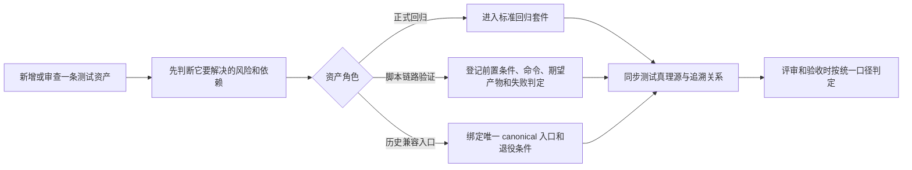

# 测试资产治理与单元测试收口需求

这次要解决的不是“把测试数量简单砍掉”，而是把仓库里的测试资产重新说清楚：哪些是正式回归，哪些是脚本型链路验证，哪些只是历史兼容入口。现在做这件事，是因为当前测试目录、测试文档和执行口径之间已经出现了混用，导致评审、验收和后续重构都容易把“能跑一下”误当成“门禁已经覆盖”。最直接受影响的是开发、评审和维护测试的人；最终受益的是所有后续迭代，因为团队能更快判断一条测试到底该保留、迁移、重写还是退役。做完后，大家看到的变化应该是：正式回归入口更清楚，脚本验证不再伪装成单元测试，文档引用和真实执行口径能够对齐。

## 业务流程图



这张图回答的是“同一条测试资产到底该进入哪条治理链路”。最关键的一步是先判断资产角色，因为它直接决定后续是否进入正式门禁；最容易歧义的一步是“脚本能跑”与“正式回归可放行”的边界，本次需求要把这条线冻结清楚。

## 最佳实践核验摘要

本需求基于当前官方或一手资料冻结以下判断：

1. pytest 的发现机制会从配置好的测试入口递归收集符合命名约定的文件、类和函数，因此“文件名像测试”本身就会影响测试资产边界，不能再把脚本和正式回归混放。
2. pytest 官方把“测试应通过 `assert` 表达失败语义”作为基础用法；仅打印日志、返回布尔值或返回非空对象，不等于形成可靠回归。
3. pytest 官方建议新项目优先使用更稳定的导入模式，减少通过修改 `sys.path` 维持测试可运行的隐性耦合。
4. pytest 官方也明确区分了“放在应用包外的测试目录”和“随包内联测试”两种布局；前者更适合作为常规回归主入口，后者只有在确有紧耦合理由时才适合保留。
5. 因此，本项目的治理目标不应是单纯减少 case 数量，而应是先把“正式回归 / 脚本型链路验证 / 历史兼容入口”三类角色分清，再决定哪些资产需要迁移、重写或退役。

参考来源：

1. pytest documentation: Good Integration Practices
2. pytest documentation: Conventions for Python test discovery
3. pytest documentation: Returning non-None value in test functions

## requirements_contract

```yaml
topic: test_asset_governance_and_suite_right_sizing
problem_statement:
  - 当前仓库中同时存在正式 pytest 回归、脚本型链路验证和历史兼容入口，但它们在目录命名、文档引用和执行口径上没有被稳定区分。
  - 一部分资产虽然名义上属于测试，却没有形成可靠的失败语义，导致“数量很多”和“风险真的被约束”之间出现错觉。
  - 测试真理源文档已经引用了部分脚本或历史入口，若不先冻结治理口径，后续收口会继续出现文档与执行脱节。
business_goals:
  - bg_id: BG-01
    goal: 冻结测试资产分类规则，让团队能稳定区分正式回归、脚本链路验证和兼容入口。
  - bg_id: BG-02
    goal: 让正式回归只保留有明确失败语义、可进入门禁的测试资产。
  - bg_id: BG-03
    goal: 让脚本型链路验证继续保留业务价值，但不再伪装成普通单元测试。
  - bg_id: BG-04
    goal: 让测试文档、需求追溯和真实执行入口重新对齐，减少历史引用漂移。
primary_users:
  - 后端开发者
  - 测试与验收执行者
  - 代码评审者
  - 后续接手仓库的维护者
success_definition:
  - 团队可以稳定回答“一条测试资产为什么属于正式回归，而不是脚本验证或兼容入口”。
  - 正式回归不再包含只打印日志、只返回布尔值或依赖人工目测结果的资产。
  - 脚本型链路验证仍可保留，但每条都能说清前置条件、执行命令、期望产物和失败判定。
  - 历史兼容入口若暂时保留，也能明确唯一 canonical 入口和失效条件，不再形成重复计数。
  - 测试文档中的有效入口与仓库内当前实际执行口径保持一致。
design_source: workdocs/设计/2026-03-13_test-asset-governance-and-right-sizing/design.md
design_approved: false
design_approval_evidence: draft_created_2026-03-13_pending_user_review
design_freeze_summary:
  - 正式回归 canonical 主入口收敛到 tests/，不再长期维持 app/tests 与 tests 双主入口。
  - 脚本型链路验证迁出默认 pytest 发现路径，由脚本链路证据注册表和独立命令承接。
  - 历史兼容入口只允许薄壳存在，必须绑定唯一 owner 和退役条件。
  - 文档同步以测试用例库、测试指南和受影响产品文档为主，不再让旧文件路径长期占据 canonical 位置。
clarify_handoff_source: workdocs/需求/2026-03-13_test-asset-governance-and-right-sizing/requirements.md
clarify_handoff_version: v1
```

## product_contract_matrix

| bg_id | 业务目标 | 当前痛点 | 用户看到的变化 | 成功判定 |
|---|---|---|---|---|
| BG-01 | 冻结测试资产分类规则 | 同一类资产有人当正式回归，有人当脚本验证 | 团队讨论测试时先说资产角色，不再先争目录或文件名 | 同一条资产的角色判断基本一致 |
| BG-02 | 正式回归只保留可靠测试 | 一部分测试能跑但没有清晰失败语义 | 门禁结果更可信，失败时知道到底坏了什么 | 正式回归结果可以直接用于放行判断 |
| BG-03 | 保留脚本验证但去伪装 | 真实模型、真实数据库、真实外部依赖脚本混进普通测试目录 | 大家知道哪些是联机探针，哪些是稳定回归 | 脚本验证和正式门禁不会再混淆 |
| BG-04 | 文档与执行入口对齐 | 文档引用、需求追溯和仓库入口已经出现漂移 | 查文档时能找到真实入口，不需要靠口头补充解释 | 文档中的 canonical 入口与实际执行一致 |

## fr_contract_matrix

```yaml
- fr_id: FR-01
  scenario_id: S-01
  user_value: 每条测试资产在进入仓库长期维护前，都有明确角色，不再长期处于“看起来像测试，但不知道算哪类”的状态。
  trigger: 新增测试资产、修改现有测试资产，或审查历史测试资产时。
  input_contract:
    required_fields: [risk_target, dependency_profile]
    optional_fields: [execution_frequency, historical_reference]
  output_contract:
    required_fields: [asset_role, canonical_execution_lane]
  failure_semantics: 若资产角色无法明确，则该资产不能被默认纳入正式回归。
  acceptance_story: 评审者看到一条测试资产后，能直接判断它是正式回归、脚本型链路验证还是历史兼容入口。
  linked_business_goals: [BG-01, BG-04]

- fr_id: FR-02
  scenario_id: S-02
  user_value: 正式回归中的每条测试都能真实表达失败语义，而不是靠人工看日志补判断。
  trigger: 某条测试资产被标记为正式回归时。
  input_contract:
    required_fields: [expected_behavior]
    optional_fields: [error_contract, side_effect_contract]
  output_contract:
    required_fields: [machine_observable_pass_fail]
  failure_semantics: 只打印日志、只返回布尔值、只靠人工目测结果的资产不能被视为正式回归通过。
  acceptance_story: 当行为退化时，测试会以显式失败暴露问题，而不是看起来“跑完了但没人知道算不算过”。
  linked_business_goals: [BG-02]

- fr_id: FR-03
  scenario_id: S-03
  user_value: 依赖真实模型、真实数据库、真实对象存储或真实服务链路的验证资产，仍能保留业务价值，但不会继续污染正式回归集合。
  trigger: 某条测试资产需要真实外部依赖或重前置环境。
  input_contract:
    required_fields: [preconditions, command, expected_artifact]
    optional_fields: [environment_owner, skip_reason]
  output_contract:
    required_fields: [scripted_flow_registration]
  failure_semantics: 若缺少前置条件、期望产物或失败判定，脚本型链路验证不能被宣称为可追溯资产。
  acceptance_story: 团队在需要做联机探针时，能快速知道怎么跑、跑完看什么、失败代表什么。
  linked_business_goals: [BG-03, BG-04]

- fr_id: FR-04
  scenario_id: S-04
  user_value: 历史兼容入口可以短期保留，但不会继续制造重复收集、重复计数或多入口并存的混乱。
  trigger: 某条历史入口仍被文档、流程或旧命令依赖时。
  input_contract:
    required_fields: [canonical_owner, retained_reason]
    optional_fields: [retirement_condition, retained_window]
  output_contract:
    required_fields: [single_entry_owner]
  failure_semantics: 若兼容入口没有唯一 owner 或没有失效条件，则不能长期保留为活跃资产。
  acceptance_story: 即使暂时保留兼容壳，团队也知道真正以哪一个入口为准，以及什么时候删掉壳。
  linked_business_goals: [BG-01, BG-04]

- fr_id: FR-05
  scenario_id: S-05
  user_value: 测试真理源文档与实际执行入口保持一致，减少“文档说一套、仓库跑另一套”的情况。
  trigger: 测试资产发生迁移、退役、改类或 canonical 入口切换时。
  input_contract:
    required_fields: [updated_asset_role, canonical_entry]
    optional_fields: [legacy_reference]
  output_contract:
    required_fields: [synced_truth_source]
  failure_semantics: 若资产角色已变但真理源未同步，需求和验收材料不能宣称该治理动作完成。
  acceptance_story: 读文档的人可以直接找到当前有效入口，而不需要再去问“这个文件现在还算不算数”。
  linked_business_goals: [BG-04]

- fr_id: FR-06
  scenario_id: S-06
  user_value: 正式回归入口默认收敛，不再长期把同一层级的稳定回归分散在多个平行承载位置。
  trigger: 规划或调整正式回归承载方式时。
  input_contract:
    required_fields: [suite_role, stability_expectation]
    optional_fields: [package_coupling_reason]
  output_contract:
    required_fields: [canonical_suite_group]
  failure_semantics: 若没有明确保留理由，同一语义层级的稳定回归不应长期平行分散。
  acceptance_story: 团队知道正式回归默认该进哪里，只有确有强耦合理由时才允许例外。
  linked_business_goals: [BG-01, BG-02]

- fr_id: FR-07
  scenario_id: S-07
  user_value: 评审和验收时可以一眼区分“阻断放行的正式回归”与“提供补充证据的脚本验证”。
  trigger: 评审测试方案、执行验收或汇总证据时。
  input_contract:
    required_fields: [asset_role, execution_result]
    optional_fields: [residual_risk]
  output_contract:
    required_fields: [gate_decision_context]
  failure_semantics: 若无法区分门禁资产与观察性资产，则评审结论不能稳定复用。
  acceptance_story: 验收报告能明确写出哪些结果决定放行，哪些只是补充证据，不再混成一个“都跑过了”的口径。
  linked_business_goals: [BG-02, BG-03, BG-04]
```

## nfr_contract_matrix

```yaml
- nfr_id: NFR-01
  dimension: 分类清晰度
  requirement: 活跃测试资产的角色标注覆盖率必须等于 100%，不得存在长期未分类的活跃测试资产。
  observable_signal: 测试真理源和验收材料中，每条活跃资产都能看到明确角色。

- nfr_id: NFR-02
  dimension: 失败语义
  requirement: 正式回归中的活跃测试资产，其可观察失败语义覆盖率必须等于 100%；日志驱动、返回布尔值驱动和人工目测驱动的正式回归数量必须等于 0。
  observable_signal: 正式回归失败时，评审者无需再人工解释“这算不算失败”。

- nfr_id: NFR-03
  dimension: 重复收集控制
  requirement: 未声明唯一 owner 的正式回归重复入口数量必须等于 0。
  observable_signal: 同一条活跃测试目标不会同时被多个入口重复计数，除非文档已明确例外与角色差异。

- nfr_id: NFR-04
  dimension: 文档一致性
  requirement: 活跃测试资产发生角色或入口变化后，真理源文档同步完整率必须等于 100%。
  observable_signal: 需求、测试案例文档和执行指南引用的都是当前 canonical 入口。

- nfr_id: NFR-05
  dimension: 可执行性
  requirement: 脚本型链路验证的前置条件、执行命令、期望产物和失败判定完整率必须等于 100%。
  observable_signal: 执行者不需要额外口头补充，就能知道脚本怎么跑、跑完看什么。

- nfr_id: NFR-06
  dimension: 简洁性
  requirement: 稳定正式回归的承载入口应保持收敛；若出现平行入口，必须能明确说清唯一保留理由和失效条件。
  observable_signal: 团队能用一句人话解释“为什么这条正式回归不能进入默认主入口”。
```

## acceptance_seed_matrix

| acceptance_seed_id | 场景 | 输入种子 | 期望现象 |
|---|---|---|---|
| AS-01 | 新增稳定回归 | “新增一条只依赖本地构造数据的行为回归” | 该资产被标记为正式回归，并具备清晰失败语义 |
| AS-02 | 联机探针 | “需要真实数据库和真实模型一起验证” | 该资产被标记为脚本型链路验证，并登记前置条件、命令、期望产物和失败判定 |
| AS-03 | 弱断言资产 | “测试只打印日志并返回 True/False” | 该资产不能被认定为正式回归通过 |
| AS-04 | 历史兼容入口 | “旧入口还被文档引用，但已有新的 canonical 入口” | 文档标明唯一 owner 和退役条件，不再把两个入口都当活跃正式回归 |
| AS-05 | 目录收敛 | “同一层级稳定回归分散在多个平行承载位置” | 需求与后续设计能给出默认主入口和例外条件 |
| AS-06 | 文档同步 | “某条测试资产完成迁移或改类” | 真理源文档与需求追溯中的入口同步更新 |
| AS-07 | 验收汇总 | “一组结果同时包含正式回归和脚本验证” | 报告能明确写出哪些结果决定放行，哪些只是补充证据 |

## traceability_seed_matrix

| bg_id | fr_id | scenario_id | acceptance_seed_ids | design_focus |
|---|---|---|---|---|
| BG-01 | FR-01 | S-01 | AS-01, AS-02, AS-04 | 如何把测试资产分类规则固化成稳定的准入判断，而不是口头经验 |
| BG-01 | FR-04 | S-04 | AS-04 | 如何给历史兼容入口定义唯一 owner、保留理由和退役条件 |
| BG-01 | FR-06 | S-06 | AS-05 | 如何让正式回归入口默认收敛，并为例外建立最小且可验证的条件 |
| BG-02 | FR-02 | S-02 | AS-01, AS-03 | 如何把“有明确失败语义”落成可执行门禁，而不是继续接受弱断言 |
| BG-02 | FR-07 | S-07 | AS-07 | 如何在评审和验收阶段区分门禁资产与观察性资产 |
| BG-03 | FR-03 | S-03 | AS-02 | 如何保留脚本型链路验证的业务价值，同时避免其污染正式回归集合 |
| BG-04 | FR-05 | S-05 | AS-06 | 如何让测试真理源、执行指南和需求追溯在入口变化后保持同步 |
| BG-04 | FR-07 | S-07 | AS-06, AS-07 | 如何让报告口径和文档口径对齐，避免“都跑过了”的模糊结论 |

## process_bundle_links

| 过程产物 | 路径 | 角色 |
|---|---|---|
| 需求真理源 | `workdocs/需求/2026-03-13_test-asset-governance-and-right-sizing/requirements.md` | 当前需求合同 |
| 设计文档 | `workdocs/设计/2026-03-13_test-asset-governance-and-right-sizing/design.md` | 单方案技术设计 |
| implementation_plan | `workdocs/任务拆解/2026-03-13_test-asset-governance-and-right-sizing/contracts/implementation_plan.md` | 可执行任务拆解 |
| uat_cases | `workdocs/任务拆解/2026-03-13_test-asset-governance-and-right-sizing/contracts/uat_cases.md` | 最小验收矩阵 |

## traceability_matrix

| fr_id | design_item | feature_id | task_id | tc_id | acceptance_cmd_ref |
|---|---|---|---|---|---|
| FR-01 | D-01 | TEST-GOV-01 | T-01 | TC-01 | `T-01.acceptance_cmds[0]` |
| FR-01 | D-03 | TEST-GOV-03 | T-03 | TC-03 | `T-03.acceptance_cmds[1]` |
| FR-02 | D-04 | TEST-GOV-04 | T-04 | TC-04 | `T-04.acceptance_cmds[1]` |
| FR-02 | D-05 | TEST-GOV-05 | T-05 | TC-05 | `T-05.acceptance_cmds[0]` |
| FR-03 | D-02 | TEST-GOV-02 | T-02 | TC-02 | `T-02.acceptance_cmds[0]` |
| FR-04 | D-04 | TEST-GOV-04 | T-04 | TC-04 | `T-04.acceptance_cmds[0]` |
| FR-05 | D-01 | TEST-GOV-01 | T-01 | TC-01 | `T-01.acceptance_cmds[1]` |
| FR-05 | D-02 | TEST-GOV-02 | T-02 | TC-02 | `T-02.acceptance_cmds[0]` |
| FR-06 | D-03 | TEST-GOV-03 | T-03 | TC-03 | `T-03.acceptance_cmds[1]` |
| FR-06 | D-05 | TEST-GOV-05 | T-05 | TC-05 | `T-05.acceptance_cmds[1]` |
| FR-07 | D-01 | TEST-GOV-01 | T-01 | TC-01 | `T-01.acceptance_cmds[0]` |
| FR-07 | D-05 | TEST-GOV-05 | T-05 | TC-05 | `T-05.acceptance_cmds[0]` |

## out_of_scope

1. 本次不直接决定具体测试文件怎么迁移，也不产出文件级实现步骤。
2. 本次不重构前端 E2E 目录和浏览器自动化资产，只聚焦后端 pytest 套件及相邻脚本型测试资产。
3. 本次不直接提高或下调覆盖率阈值，也不把覆盖率指标本身当作主要交付目标。
4. 本次不进入具体生产代码逻辑修复，不以“为了让测试变绿”反向驱动业务逻辑修改。
5. 本次不承诺一次性消灭所有历史测试债务，只先冻结治理口径与后续设计输入。

## constraints_and_assumptions

1. 当前项目未上线，默认优先选择结构清晰、职责单一和长期维护成本更低的方案，而不是维持历史混用口径。
2. 本次需求默认聚焦后端 pytest 套件、脚本型链路验证资产及对应测试真理源，不把前端 E2E 重构一起纳入。
3. 脚本型链路验证不是要被全部删除；它们仍然有价值，但需要从“伪装成正式回归”改为“被显式登记的补充证据”。
4. 部分历史文档当前仍引用旧入口；需求阶段先冻结“必须同步”的规则，具体同步顺序留待后续设计阶段展开。
5. 最佳实践当前以 pytest 官方文档为主要依据；若官方建议发生明显变化，需要重新校验本需求中的默认判断。
6. 本次默认接受短期兼容壳存在，但前提是它不能长期拥有与 canonical 入口同级的正式地位。

## approval

```yaml
status: draft
owner: AI collaboration / requirements clarification
approved: false
next_step: jjk-design
approval_notes:
  - 当前按“后端 pytest 套件 + 脚本型链路验证资产治理”冻结范围，前端 E2E 暂不纳入。
  - 当前默认保留脚本型链路验证，但要求从正式回归集合中显式分离。
  - 待在设计阶段继续明确：正式回归主入口的最终收敛方式、历史兼容入口的退役策略、文档同步顺序。
```
